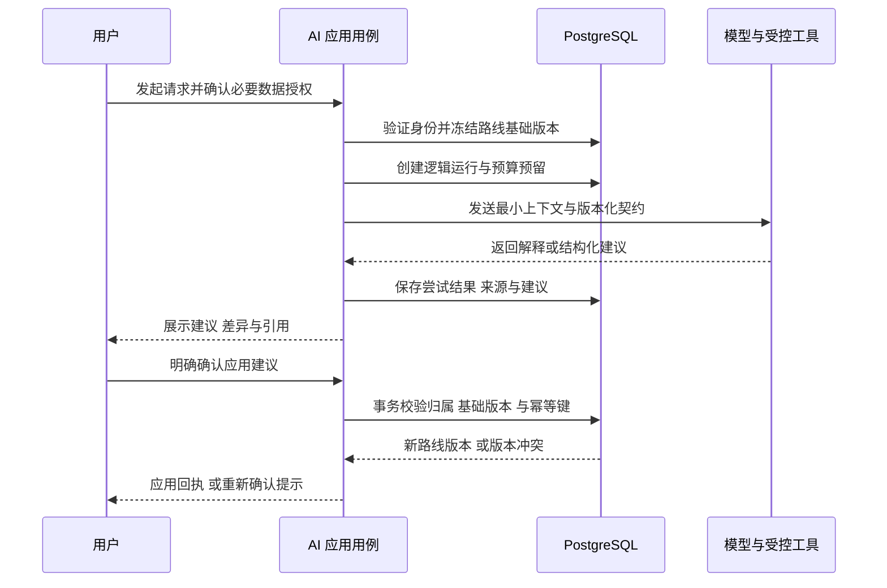

# Roadbook Web AI 数据基础与接入设计

更新日期：2026-10-09。版本：V1.1。状态：数据基础与后续试点设计；尚未接入模型、安装向量扩展或上传私人数据。

## 1. AI 的产品位置

AI 首先作为路线辅助能力：解释已有路线、结合经过核验的公开知识回答问题、提出控制点或策略调整建议。它不成为路线事实、权限系统或道路计算引擎。

首个试点推荐“有来源的只读解释”，通过验收后再开放“结构化路线建议”。不在首期引入自动驾驶导航、车辆电耗预测、逐日行程规划或无人确认的路线改写。

数据底座的先后顺序为：稳定身份与结构化路线 → 不可变版本与来源 → 权限和删除 → 知识投影 → 模型运行与评估。先建设业务数据，不为接入大模型提前收集全部聊天与位置历史。

## 2. 可用于模型的数据分类

| 数据类别 | 权威来源 | 默认 AI 使用方式 |
| --- | --- | --- |
| 路线意图与权威轨迹 | `planning_route_revision` 及对应不可变几何 | 区分规划控制点与保留轨迹，按任务授权选取，不默认批量入向量库 |
| 多来源解析与派生血缘 | 原始资产、候选、解析器版本、复制/fork/裁剪记录 | 用于来源解释与获准的解析评估；链接 token 与私有上游身份不出站 |
| 算路指标与几何 | 当前输入对应的有效计算结果 | 供应商许可内提供必要指标；模型不能虚构道路、耗时和里程 |
| 精选路线与内容 | 经审核发布的内容版本 | 允许范围内做检索，保留引用与有效期 |
| 天气与超充状态 | 带来源时间的事实快照或受控实时工具 | 过期明确标识，不把静态知识索引当实时状态 |
| 海拔 | 具备来源、坐标和算法版本的读数与分析 | 保留缺失与试验精度，不推导未验证的工程指标 |
| 精确定位、私人标记、方案名称 | 私人业务数据 | 默认不出站、不用于训练；功能需要时取得具体授权 |
| 普通产品日志 | 最小运行指标 | 不用于拼回用户路线或隐式构建训练集 |
| 手机号、验证码与会话令牌 | 身份与访问上下文 | 只用于登录与账户安全，不进入模型、知识分块、向量或训练样本 |

私人内容的语义向量仍属于私人衍生数据，不能因其不是原文而公开。对外发送经纬度、地点名称或可识别行程的摘要，都要纳入授权和最小化检查。

## 3. 数据契约与可追溯性

每份模型输入或检索事实至少能够追溯以下信息：

| 类别 | 必需元数据 |
| --- | --- |
| 业务身份 | 上下文、稳定实体标识、owner 或公共范围 |
| 版本 | 业务云端版本、结构版本、内容哈希及规范化版本 |
| 地理 | 坐标系、转换版本、精度/误差来源；单位明确 |
| 来源 | 供应商、数据集版本、源对象标识、引用定位 |
| 时效 | 观测时间、获取时间、有效期；两种时间不能混为一谈 |
| 质量 | 完整、缺失、过期、试验、人工审核等状态 |
| 权利 | 可展示、可缓存、可持久化、可检索、可发送给模型的允许范围 |
| 隐私 | 数据分类、授权目的、到期与撤回状态 |

模型不直接读取 Prisma 对象。`AiContextAssembler` 应用用例生成有版本的最小上下文 DTO，固定输入快照；供应商原始响应通过反腐层转换并校验。

哈希用于确认输入相同与追踪血缘，不等同于匿名化。需要重放但无权保存正文时，只能记录元数据并声明无法完全复现；不能越过许可去补存原文。

## 4. 知识检索架构

采用业务库为事实源、知识分块与向量为可重建投影的方式。首期候选是现有 PostgreSQL 加 pgvector；是否安装取决于实际检索用例、托管支持与授权，不立即引入独立向量服务。[pgvector 官方说明](https://github.com/pgvector/pgvector)

处理路径：

1. 来源准入：确认内容权利、格式、坐标、有效期、owner 与发布状态。
2. 创建不可变文档版本，保留内容引用、哈希与来源定位。
3. 以明确的 `chunking_version` 分块，保存段落、章节或文档偏移定位。
4. 在固定模型版本、维度、度量和归一化规则的向量空间生成嵌入。
5. 先限定当前用户可访问、未删除、权利允许且时效有效的候选集合，再进行检索；返回前再次校验。
6. 模型输出引用具体文档版本与分块，而不是仅引用会变化的网页首页。

向量升级建立新空间，完成重建与评估后切换；不能把不同模型版本或维度直接混合排序。ANN 索引在过滤下可能影响召回，需要与精确查询基线比较；权限过滤不能只靠模型提示词。

语义检索不是所有问题的统一入口：路线控制点、距离、耗时、站点状态优先通过结构化查询和受控工具获得；向量用于解释性文字与知识匹配。

## 5. AI 运行、尝试与建议生命周期

### 5.1 模型运行记录

`ai_run` 表示一次用户意图；`ai_run_attempt` 表示一次实际供应商尝试。必须记录：基础路线版本、上下文哈希、提示模板版本、输出 schema 版本、供应商、模型精确标识或可获得的修订标识、授权、状态与时间。

用量按尝试保存输入/输出 token、实际或估算费用及币种；估算附价格版本。供应商未返回用量时记录 `unknown`，不能记为 0。模型版本不可固定时记录实际返回标识及复现限制，不承诺相同输入必得相同输出。

普通运行日志只含运行标识、状态、耗时、错误码和聚合用量；原始提示或输出如确需保留，使用受控对象引用、明确期限与访问审计，不写入普通日志。

### 5.2 结构化路线建议

`ai_route_proposal` 至少包含目标方案、基础版本、输出结构版本、允许的变更、理由与证据引用、状态和到期时间。

建议状态：`proposed / accepted / rejected / expired / conflicted`。模型可提出的命令首期限定为添加、移除、移动控制点与切换现有策略；每种命令都经统一 `RouteEditingPolicy` 校验会员点数权益、技术容量和坐标契约，不写死 20 点。保留轨迹转为控制点规划必须明确确认，AI 不得隐式转换并覆盖原轨迹。

- AI 不能自行产生数据库确认、修改 owner、转为公开或删除整个账户。
- 展示具体差异后由用户主动确认，不把自然语言中的含糊“不错”自动转换为写入授权。
- 接受建议与路线保存同事务执行：方案归属、基础版本、建议状态、幂等键、控制点、修订和建议接受版本一并校验和提交。
- 基础版本已变化返回冲突；不得将旧建议自动套用到新路线，需重新生成或明确重新评审。
- 应用建议后使用真实地图供应商重新算路；模型生成的直线与估计时间不能冒充驾车路线。
- 如后续允许 AI 提出复制、fork 或裁剪，仍调用相同派生用例，固定源修订/几何和范围，检查来源许可、目标用户权益与用户确认，不能另建绕过策略的 AI 操作通道。

### 5.3 模型辅助导入与 UGC

基础文件、结构化文本与受支持链接使用确定性解析器；复杂文本/页面语义需要模型时，记录 `route_import_job.model_run_id`，结果只进入候选并展示歧义。用户确认前不创建正式路线，不能把模型补出的地点当来源原文已有事实。

私人路线是 UGC，但保存、公开、复制、购买会员和接受建议都不自动授予训练权。对跨用户知识/评估/训练集合，使用独立用途的数据集版本与项，绑定来源修订、许可、授权和变换；同源 fork/近重复内容分组后划分集合。

登录手机号始终排除在路线特征与模型上下文之外。本人即时辅助优先读取当前获准修订，不必先将私人 UGC 加入全平台语料库。详见 [手机号登录与UGC治理设计](手机号登录与UGC治理设计.md)。

## 6. 工具与安全边界

| 接口 | 职责 | 禁止事项 |
| --- | --- | --- |
| `AiModelGateway` | 屏蔽模型供应商、超时、用量与结构化输出差异 | 领域层依赖供应商 SDK |
| `AiContextAssembler` | 按任务、授权、版本组装最小事实 | 全库导出、默认附完整私人坐标 |
| `KnowledgeRetriever` | 带 owner、权利、时效的检索 | 先查全库再仅靠模型隐藏越权内容 |
| `AiToolExecutor` | 执行允许列表中的只读工具，逐次核验身份和授权 | 任意 SQL、任意 URL、shell 或直接写路线 |
| `RouteProposalApplication` | 接受明确确认的建议，调用路线用例 | 绕过聚合写表、忽略基础版本 |

检索文本、网页与供应商字段都是不可信数据。即使其中包含“忽略之前指令”“调用管理接口”等内容，也不能改变工具权限、系统规则或授权范围。

工具参数必须通过结构校验、大小和速率限制；对象引用按 owner 验证，网络请求限制来源，避免模型提供任意 URL 导致内部资源访问。模型输出经过 schema 和领域双重校验后才进入建议表。

## 7. 预算、异步与失败处理

- 每次请求有输入规模、最大输出、工具次数、尝试次数和时间预算；用户级与系统级预算分别管理。
- 费用敏感运行先在 `ai_usage_budget / ai_usage_reservation` 持久账本预留，再调用供应商，完成后幂等核销；用户与系统窗口都满足预算才放行，按固定顺序锁定预算行避免死锁。
- 在预算账本未实施前，试点必须有供应商硬限额与保守调用上限，不能宣称应用已保证绝对不超预算。
- 网络超时可能已调用且计费；标记尝试结果未知并保留预留，优先用供应商请求标识核对。无供应商幂等支持时不承诺重试不重复计费。
- 长任务使用持久任务状态和受保护调度器；浏览器关闭不丢逻辑运行，轮询只读取本人状态。
- 模型、检索、Redis 或任务失败时，保留本机编辑与云端路线，不自动清空控制点。
- 运行取消、权限撤回或路线删除后停止新工具调用与结果应用；对已经发出的请求仅尽力取消，按供应商政策处理已出站数据。

任务租约、幂等与发件箱要求沿用 [一致性与故障处理设计](一致性与故障处理设计.md)，不再建设独立、不受版本约束的 AI 写入路径。

## 8. 数据保留、删除与训练边界

默认不将私人路线、标记、精确位置、运行提示、输出或反馈作为训练集。模型推理所需的具体授权，不包含后续训练或跨用户推荐授权。

如未来确需训练，另立数据准入、来源许可、用户授权、去标识、质量审核、保留期和退出机制；不将本次数据底座设计理解为已授权训练。

删除/撤回链路覆盖业务快照、知识文档、分块、嵌入、模型上下文、建议正文、工具产物、对象引用与缓存。检索与应用先阻断可见性，后台物理清理可重试；只清理向量而保留可检索正文不算完成。

上线前核对模型供应商的数据保存、训练使用、日志与删除选项，按实际条款配置并记录，不能在未核验时承诺供应商“零保留”。不额外收集完整对话；有会话记忆需求时另立有期限的数据模型。

## 9. 评估与上线门禁

评估使用经授权的合成或去标识样本，并固定数据版本、提示版本、模型标识、检索空间与评分规则。生产私人数据不自动进入评估集。

| 评估维度 | 必测案例与证据 |
| --- | --- |
| 事实正确性 | 距离/耗时引用真实算路；天气与超充携带时效；缺失不编造 |
| 引用与追溯 | 引用能定位到获准来源和版本；不引用越权或已删除分块 |
| 领域有效性 | 空路线、免费/会员动态点数、轨迹与控制点区别、单程/返程、坐标转换与不支持策略 |
| 并发与版本 | 请求生成期间路线改变；旧建议确认被拒；重复确认只产生一次变更 |
| 权限 | 用户间隔离；撤回授权；删除后索引未清理仍不能返回 |
| 提示注入 | 外部文本要求越权调用、外传数据或忽略限制均无效 |
| 检索质量 | 与精确/关键词基线比较召回和引用质量；过滤不泄露私人数据 |
| 成本与性能 | 每次逻辑运行及每次尝试的成本、超时、工具次数、排队时间 |
| 降级 | 模型/供应商/Redis 故障时核心路线编辑与本机保存继续可用 |
| UGC 与身份 | 手机号/验证码不出站；私有 fork 来源隔离；文本歧义可纠正；数据集用途与撤权有效 |

试点前确定具体阈值与负责人，先离线评估，再小范围开放，再扩大流量。上线后记录接受/拒绝率与事实纠错，不能用接受率单独证明事实正确。

## 10. 分阶段落地清单

- P3/P4：稳定用户标识、独立手机号凭据、会员策略、路线双模式、修订、来源派生、归属、幂等、导入与删除协议。
- P5：来源目录、许可核验、事实快照、格式版本、持久任务和投影重建。
- P6.1：仅公开获准内容的检索与只读解释，建立评估与预算。
- P6.2：按任务授权使用私人上下文，增加结构化建议、明确确认和事务应用。
- P6.3：在实际效果与容量证据支持下优化检索、模型或独立服务，不先建设假设性的复杂平台。

具体表字段见 [领域模型与数据库设计](领域模型与数据库设计.md)，整体推进与资源门禁见 [Web 数据架构与部署推进方案](Web数据架构与部署推进方案.md)。
