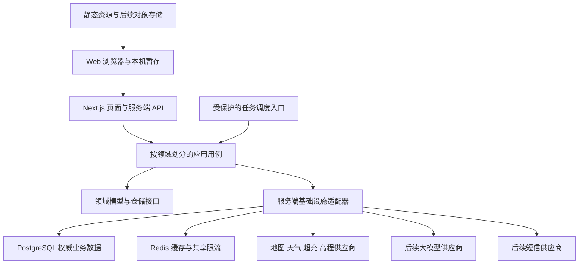

# Roadbook Web 数据架构与部署推进方案

| 项目 | 内容 |
| --- | --- |
| 版本 | V1.4 |
| 更新日期 | 2026-10-09 |
| 状态 | 设计提案；文档已落盘，服务与数据库改造尚未实施 |
| 范围 | 仅 Web；数据服务、多来源路线导入与派生、会员、未来短信登录与 AI |
| 原则 | DDD、单一职责、数据可追溯、渐进上线、故障行为明确 |

## 1. 目标与边界

建立可扩展的 Web 数据底座，支撑用户路线导入、解析、保存、复制、fork 和自由裁剪，再为知识检索与 AI 路线辅助提供结构化事实、稳定标识、版本、来源和权限。

用户已明确未来同时支持文件、链接、文本三类导入，将放开当前 20 控制点限制作为会员能力，并考虑手机号短信登录。路线属于 UGC，通过稳定用户主键关联；手机号、会员身份和路线公开/AI 授权分别管理。

本阶段采用模块化单体，不为未来假设提前拆服务、建设独立向量数据库、引入全量事件溯源或多地域双主写入。DDD 是业务职责划分方法，不等同于微服务；CAP 是网络分区时的取舍，不是建表后即可同时满足的三项指标。

账户、云端保存、路线派生、会员与 AI 能力是分阶段新增范围。仍保持“规划路线，不编排逐日行程”，不自动公开私人路线，不因接入 AI 增加车辆电耗、续航或工程级坡度承诺。

## 2. 已核实的现状

| 能力 | 当前事实 | 与目标的差距 |
| --- | --- | --- |
| Web | Next.js App Router；地图、天气、超充、高程已有服务端接口 | 尚未接入数据库、Redis 和 Web 账户 |
| 私人路线 | `RoutePlan` 保存控制点、策略、修订号、缩略图；本机 `localStorage` | 无权威导入轨迹、派生血缘、云端版本与多设备冲突协议 |
| 点数与会员 | 当前实现固定 20 控制点，尚无会员权益 | 需要业务权益与技术容量分离，数据库不能写死 20 |
| 账户与短信 | Web 尚无手机号登录、验证码或会员订阅 | 先以稳定 user_id 建模，再适配短信供应商 |
| 仓储契约 | `list/load/save/delete/clearAll` 均为同步接口；暂存模块同步获取保存结果 | 不能直接换成返回 Promise 的网络实现 |
| 热门专题 | 静态仓储与 JSON 几何；个人标记单独保存在本机 | 不需要为了上线立即入库 |
| 数据库 | Prisma＋PostgreSQL；现有六个模型与三组迁移 | `Route` 为公开内容模型；`User.openid` 绑定旧身份设计 |
| Redis | 现有 NestJS 使用 `ioredis` 管理刷新令牌 | Web 尚无客户端；共享缓存与限流未落地 |
| 外部数据 | 天气使用 Next 缓存；超充与公共高程有进程内状态 | 多实例无法共享额度计数和请求合并 |
| 高程 | 生产默认关闭公共试验源 | 来源、共享限流与正式精度验收未完成 |
| 营地脚本 | 当前阶段不写 PostgreSQL、不导入 POI | 不能当作已建立的生产 POI 数据源 |

此处来自代码与版本化文档检查，不代表真实数据库记录数、线上资源或供应商额度已经核实。忽略的环境文件和数据目录未读取。

源码依据：[路线模型](../../roadbook-web/domain/route-planning/model.ts)、[本地仓储接口](../../roadbook-web/domain/route-planning/repository.ts)、[暂存流程](../../roadbook-web/application/route-plan/route-plan-persistence.ts)、[数据库模型](../../../packages/db/prisma/schema.prisma)、[营地脚本说明](../../../scripts/camp-import/README.md)。

## 3. 目标架构

- Next.js 是首期唯一部署的应用服务；现有 NestJS 不作为 Web 上线前置条件。
- PostgreSQL、Redis 使用托管服务，不能依赖应用实例本地文件或内存持久化。
- 路线文件/链接快照/文本及权威几何采用私有对象存储，作为导入能力上线前置条件；现有公共专题几何继续静态分发。
- `apps/backend/docs` 只承担方案归档；生产代码优先在 `apps/roadbook-web` 现有领域目录内组织，数据库适配放在 `packages/db`。
- 不将旧 NestJS 模块整体搬入 Next.js；只迁移已经确认需要的 Web 用例。

Vercel 支持 monorepo；构建应限定 Web 及其依赖，不运行包含无关应用的根目录全量构建。数据库与 Redis 可通过外部托管服务或 Marketplace 接入。[官方 monorepo 说明](https://vercel.com/docs/monorepos)、[存储集成说明](https://vercel.com/docs/marketplace-storage)

## 4. 限界上下文与依赖

| 上下文 | 聚合或核心对象 | 所有权与协作 |
| --- | --- | --- |
| 身份与访问 `identity-access` | 用户、手机号凭据、短信挑战、外部身份、会话、数据授权 | 登录项可更换；其他上下文使用稳定 `user_id` |
| 会员权益 `membership-entitlement` | 档位版本、订阅、操作权益决策 | 决定业务额度，不管理路线正文或代替内容授权 |
| 路线导入 `route-ingestion` | 原始资产、解析任务、候选路线 | 文件/链接/文本统一输出候选；确认后调用路线创建用例 |
| 私人路线 `route-planning` | 路线方案、控制点或权威轨迹、修订与派生血缘 | 唯一负责路线保存、复制、fork 与裁剪提交；算路与 AI 读取快照 |
| 路线计算 `route-calculation` | 计算任务、派生结果 | 读取路线意图；不得反向修改控制点 |
| 精选路线 `featured-driving-route` | 专题版本、个人标记 | 公共专题只读；个人标记独立归属用户 |
| 外部事实 `external-facts` | 来源、快照、同步批次 | 经适配器归一化；不把供应商 DTO 当领域模型 |
| AI 辅助 `ai-assistance` | 模型运行、工具调用、建议、反馈 | 只提出建议；确认后调用路线应用用例 |
| 知识检索 `knowledge-retrieval` | 文档版本、分块、嵌入 | 生成可重建投影，不拥有业务事实 |
| UGC 治理 `ugc-governance` | 固定版本发布、用途授权关联、语料版本 | 不另建独立变化的路线正文，不把私人保存等同公开或训练授权 |

事务发件箱、幂等记录、后台任务是支撑机制，不建立可随意写入全部领域表的“通用数据服务”。每个环境使用一个 Web 业务数据库，库内按上下文分 schema，保留领域表前缀；跨 schema 的必要原子操作使用同库事务。生产资源与非生产隔离，初期不按上下文拆独立数据库、不分片；完整表归属与拆库准入见 [数据库分库分表与建表规范](数据库分库分表与建表规范.md)。

## 5. 分层与落地目录

| 层级 | 推荐位置 | 约束 |
| --- | --- | --- |
| HTTP 适配 | `apps/roadbook-web/app/api/<domain>/` | 认证、请求校验、调用用例、错误映射；不写业务 SQL |
| 应用层 | `apps/roadbook-web/application/<domain>/` | 权限、事务边界、幂等、领域编排；服务端用例显式隔离客户端 |
| 领域层 | `apps/roadbook-web/domain/<domain>/` | 聚合、不变量、值对象、接口；不导入 React、Next、Prisma、Redis |
| 基础设施 | `apps/roadbook-web/infrastructure/<domain>/` | HTTP 仓储、PostgreSQL 仓储、外部服务适配；服务端模块标记 `server-only` |
| 数据库实现 | `packages/db` | Prisma schema、迁移、连接管理；不承担页面与供应商业务编排 |

客户端 HTTP 仓储与服务端 PostgreSQL 仓储分别实现适用的异步契约，禁止客户端间接打包 Prisma 或服务端密钥。不要因复用目录而跨越运行环境边界。

## 6. 推进阶段与退出条件

| 阶段 | 交付范围 | 进入下一阶段的条件 | 相对成本 |
| --- | --- | --- | --- |
| P0：设计收敛 | 审核表结构、分库建表规范、环境/旧库依赖清单、短信身份方向、会员策略、导入来源、裁剪语义与部署区域 | 核心表设计卡完成；未决项有负责人；首期来源清单、权益、数据分类与恢复目标确定 | 低 |
| P1：Web 部署准备 | 构建配置、环境变量清单、地图 Key 来源限制、本机导出导入、接口保护方案 | 最小构建通过；预览部署获授权后验证地图核心流程 | 中 |
| P2：共享基础设施 | Redis 共享限流、缓存、熔断与指标 | 多实例额度测试通过；Redis 故障行为符合设计；高程仍默认关闭 | 中 |
| P3：身份与核心数据库 | 多 schema 映射、增量迁移与运行权限；稳定用户主键、路线双模式、修订与幂等；预留手机号和会员结构 | 空库/旧结构迁移与权限演练通过；旧表保持；号码不作外键，控制点不写死 20 | 高 |
| P4.1：云同步闭环 | 本机/云端状态、异步仓储、冲突、备份与恢复 | 断网、未知提交结果、跨设备冲突与恢复验收通过 | 高 |
| P4.2：导入保存 | 私有对象存储、最低持久任务机制、文件/链接/文本解析、候选与确认入库 | 多来源/多分段/坐标契约、重复确认和孤儿清理通过 | 高 |
| P4.3：派生与会员 | 保存、复制、fork、自由裁剪、权益策略；跨用户 fork 需授权表 | 内容独立、源删除、裁剪边界、会员到期和高点数容量通过 | 高 |
| P5：事实与任务治理 | 来源目录、允许持久化的事实快照、任务、发件箱、删除清理 | 可重放、可追溯；过期任务与重复消息不会破坏数据 | 中至高 |
| P6：AI 小范围试点 | 经许可的知识检索、结构化建议、版本校验、预算、评估 | 有引用与权限；建议需确认；质量与成本达到试点目标 | 高 |

P1 可先发布本机版；P3 与 P4.1 完成前不得宣传云端保存。导入在 P4.2 提前需要持久任务与对象存储，不等待 P5 才建设其最低机制。短信登录可按账户方案启用，会员上线前必须完成权益核验；公开 UGC 与跨用户语料按需启用，不在 P3 一次建齐全部未来表。成本为工作量级别，尚非工期或报价。

## 7. 部署与运维准备

1. 选择托管 PostgreSQL、Redis 和函数区域，以 Web 用户网络和供应商连通性实测决定；候选区域不构成性能保证。
2. 开发、预览、生产数据库隔离，Redis 至少隔离凭据与命名空间；预览不读取生产私人数据。
3. 固定兼容的 Node、pnpm 版本；核对 Prisma generate、共享包构建、环境变量及 Turbo 缓存输入。新增依赖必须另行取得安装授权。
4. 运行连接采用供应商支持的池化方式；迁移连接按供应商要求单独配置。连接总预算考虑实例扩容与部署重叠，不能把 `globalThis` 当作全局连接池。
5. 数据库迁移作为独立受控发布步骤，生产使用 `migrate:deploy`，不运行 `migrate:dev`，不自动执行演示 seed。
6. 先扩展后切换再收缩：兼容旧读写、回填核验、切换后观察；应用回滚不等于数据库自动回滚。
7. 任务由受保护的调度入口按批领取；不依赖函数内永久循环、定时器或响应结束后无托管的 Promise。
8. 云端同步、数据库与 AI 不进入首屏关键路径；保留地图稳定占位，分别测 LCP、CLS 与首次地图可用时间。

建表与迁移必须完成专项规范中的表设计卡和门禁；规范落盘不等于迁移执行授权。当前 Prisma 尚未配置 DDD 多 schema，不能只改变旧模型的 `@@schema` 后自动上线。

连接预算与空闲连接释放参照 [Vercel 连接池指南](https://vercel.com/kb/guide/connection-pooling-with-functions)。函数时长与资源限制需按实施时的套餐核实，不将长任务默认放进一次 HTTP 请求。[函数限制](https://vercel.com/docs/functions/limitations)

## 8. 当前卡点与处理顺序

| 优先级 | 卡点 | 处理方案 |
| --- | --- | --- |
| 上线前 | 地图等公网代理缺少统一共享额度保护 | P1 定义保护，P2 以原子限流落地；没有共享保护时不开放高成本新能力 |
| 云保存前 | 用户模型要求 `openid`，Web 尚无登录 | 新建 Web 身份上下文；不伪造微信标识、不自动关联旧账户 |
| 云保存前 | 公开 `Route` 与私人 `RoutePlan` 语义不同 | 独立聚合与表，不能直接映射填空字段 |
| 云同步前 | 同步仓储接口与网络调用不兼容 | 保留本机暂存，增加异步云同步用例与独立回执 |
| 导入前 | 仅控制点模型不能保留密集轨迹 | 区分规划与保留轨迹；原始输入、候选、几何与正式方案分表 |
| 派生前 | 原始几何与显示抽稀、供应商缓存容易混淆 | 不可变几何、原始边序号裁剪、独立目标内容、版本级血缘 |
| 会员前 | 20 点当前为固定实现约束 | 统一权益策略与技术硬上限；过期不截断已有路线 |
| 短信前 | 号码可变且发送有费用 | 稳定用户关联、验证凭据、一次性挑战、限流与发送回执 |
| 多实例前 | 高程限流与超充缓存只在单进程生效 | 共享原子额度与有界缓存；缓存锁不承担业务一致性 |
| AI 前 | 来源许可、版本、授权和删除链路不足 | 先建治理，再建立索引和模型运行 |

旧后端的行政区同步接口缺少鉴权、刷新令牌消费非原子，属于历史风险；本方案不部署它们。只有迁移这些能力时才纳入 Web 入口并修复，禁止直接暴露旧接口。

## 9. 资源与授权边界

- 月费由函数、地图调用、数据库计算与备份、Redis、对象存储、短信和模型调用共同决定；没有实际访问量前不承诺免费或固定月费。
- 优先统计地图请求、超充详情轮询、缓存命中率、数据库连接峰值和每次 AI 运行成本，再确定资源规格。
- 本次只写文档。安装、付费资源开通、真实数据导入、数据库迁移执行、部署、删除旧数据和 Git push 均不在本次授权范围。

## 10. 未决项

| 决策 | 推荐方向 | 决策时点 |
| --- | --- | --- |
| Web 登录与短信 | 已预留手机号登录；供应商、支持地区、会话与换号恢复规则需确认 | P0/P3 或短信启用前 |
| 会员规则 | 免费初始额度可沿用 20，会员更高或解除业务上限；具体档位与技术容量待确认 | 会员能力启用前 |
| 导入支持清单 | 文件、链接、文本均需要；具体格式版本、分享供应商与文本语法待确认 | P4.2 前 |
| UGC 与 AI 用途 | 私人默认，公开、推理/索引、评估、训练分别授权 | 对应能力启用前 |
| 数据库与 Redis 供应商 | 先核对区域、连接方式、扩展、备份、预算；Neon 与 Upstash 为候选 | P2/P3 前 |
| 删除与备份保留期 | 短期墓碑防同步复活，之后清理正文；期限需产品确认 | P3 前 |
| 恢复目标 | 按业务损失容忍度确认 RPO/RTO，不能以有备份代替演练 | 生产云保存前 |
| AI 功能 | 先做有来源的只读解释与路线建议 | P6 前 |
| AI 数据出站 | 默认不发送私人精确位置；按具体功能最小授权 | P6 前 |

详细表结构见[领域模型与数据库设计](领域模型与数据库设计.md)，操作见[路线导入与派生操作设计](路线导入与派生操作设计.md)，账户与内容治理见[手机号登录与UGC治理设计](手机号登录与UGC治理设计.md)，异常行为见[一致性与故障处理设计](一致性与故障处理设计.md)，AI 接入见[AI 数据基础与接入设计](AI数据基础与接入设计.md)。
