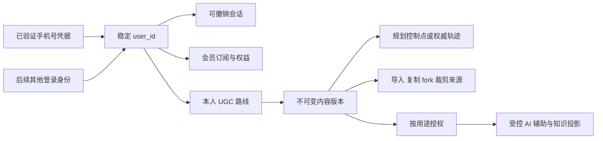

# Roadbook Web 手机号登录与 UGC 治理设计

更新日期：2026-10-09。版本：V1.0。状态：未来能力设计，未开通短信、修改用户表或处理真实手机号。

## 1. 用户、登录凭据与内容的关联

手机号是登录项，`user_id` 是身份主键，`owner_id` 是路线归属外键。不能以手机号串联路线，也不能在换号时批量更新路线、会员和 AI 运行记录。

私人路线本身就是用户生成内容，既包括手工规划，也包括用户获准导入、复制、fork 与裁剪后的路线。内容可追溯并不代表平台已经取得公开或训练权。

## 2. 短信登录状态机

### 2.1 请求验证码

解析并规范化手机号 → 校验用途与共享限流 → 创建短期 challenge → 通过短信适配器发送 → 保存供应商回执或未知状态。

挑战绑定具体号码、用途和有效期，验证码存带服务端密钥的摘要。普通日志不包含手机号全文、验证码或短信密钥；响应不暴露号码是否已注册。

短信发送会产生真实费用，实施前需要确定供应商、模板、支持地区、预算与单号/来源/全局额度。应用超时可能已经发送成功，不能无限重发；供应商回调须校验真实性并幂等更新。

### 2.2 验证与创建会话

锁定 challenge → 检查用途、到期和尝试数 → 验证摘要 → 原子消费 → 查找当前已验证号码凭据 → 创建/恢复对应用户会话。

验证码只消费一次。首次登录创建用户与凭据同事务处理，数据库唯一约束避免并发创建两个用户。会话签发失败需要可追踪的结果或重新发起验证，不能把同一验证码当作无限签发令牌。

号码格式检查不证明归属；可达性和控制权通过验证建立。[libphonenumber 官方说明](https://github.com/google/libphonenumber/blob/master/FAQ.md)

### 2.3 绑定、换号与恢复

- 绑定已有登录账户：验证当前会话，再验证新号码，不自动合并另一个已绑定用户。
- 换号：重新验证当前账户及新号码，事务内替换凭据，撤销受影响会话；所有 UGC 仍关联原 `user_id`。
- 旧号码不可用：走单独恢复流程，不能仅输入一个新号码就接管旧路线。
- 手机号回收、SIM 更换和高风险登录需要额外风险处理或恢复因素；短信验证码本身不能证明历史身份连续性。[NIST 身份验证指南](https://pages.nist.gov/800-63-4/sp800-63b.html)
- 账户删除：撤销凭据和会话，按保留政策清理私人内容及衍生数据；相同号码日后重新注册不能自动恢复已删除账户。

具体供应商和账户恢复策略在能力启用前确认；本次不选定付费套餐，不发送短信。

## 3. 号码保存与访问

使用 `identity_phone_credential` 保存规范化号码的密文和查找 HMAC，用户表只保留稳定身份与资料。账号页面可显示掩码，授权登录服务才具备解密和发送能力。

数据库、缓存、导入任务、公开 UGC、模型提示、向量、评估样本不能到处复制手机号。HMAC 仍是受保护的关联标识，不作为匿名身份公开。

唯一性针对当前有效号码凭据建立，不用软删除后仍永久占用号码阻止合法换绑；历史号码的再绑定与账户恢复必须按验证策略处理，不能仅靠数据库去重做身份决策。密钥轮换时保持新旧索引的一致唯一性。

## 4. UGC 生命周期与所有权

| 阶段 | 权威记录 | 默认行为 |
| --- | --- | --- |
| 提交输入 | 导入资产与解析任务 | 私人，未成为正式路线 |
| 确认保存 | 路线聚合与首版修订 | 本人持有，可独立读取和编辑 |
| 编辑、裁剪、恢复 | 新修订、几何与血缘 | 历史不改写，数据保留有期限 |
| 复制/fork | 目标用户新方案与来源版本 | 目标独立，上游数据仍按来源权限保护 |
| 公开发布，未来按需 | 固定修订的 publication | 必须主动发布并符合来源许可，编辑不自动发布 |
| AI 使用 | 用途授权与运行/知识版本 | 只在允许的资源、目的和期限内使用 |
| 删除、撤回 | 墓碑、撤权与清理任务 | 先阻断访问，再清理正文与衍生投影 |

当前没有公开 UGC 产品流程，预留发布表不等于默认公开。fork 的目标创建者是当前用户，原始内容贡献者通过受保护来源血缘追溯；不能把 fork 次数当作原作者许可已转移。

## 5. AI 能从 UGC 获得什么

| 数据基础 | 可能用途 | 前置条件 |
| --- | --- | --- |
| 控制点、策略与保存版本 | 理解当前用户路线意图、生成可评审建议 | 当前用户的任务授权与有效基础版本 |
| 导入原始语义、解析警告与纠正 | 评估解析质量，改进文本提取 | 明确用途授权；手机号与来源 token 排除 |
| 权威轨迹、裁剪范围、坐标与质量 | 路段解释与几何工具输入 | 坐标契约、计算精度、来源持久化许可 |
| 来源、作者血缘与许可 | 检索引用、去重、贡献溯源 | 当前访问权，来源不因复制自动变为公开 |
| 建议接受/拒绝与明确纠错 | 评估输出是否有用及哪里出错 | 反馈目的明确，不自动扩大为训练授权 |
| 经授权的公开路线版本 | 构建可引用知识检索内容 | 发布审核、时效、版权与 AI 用途核验 |

UGC 的价值来自结构化事实、版本和经核实反馈，不来自收集更多手机号。手机号只服务登录与账户安全，不能作为路线偏好特征或默认发送给模型。

用户保存、复制或接受建议只表达当次产品行为，不等同于内容正确，也不代表用户已允许训练。导入轨迹可能来自外部平台或包含他人活动信息，仍需来源许可与隐私判断。

## 6. 四类权限分别管理

1. 私人保存与查看：属于用户使用产品，不自动跨用户可见。
2. 分享、复制和 fork：指定对象与动作的访问授权，明确独立副本语义。
3. AI 推理、索引与评估：按目的、资源版本与期限授权，模型出站数据最小化。
4. 模型训练：独立用途、明确准入与退出机制；默认关闭。

使用 `identity_data_grant` 表达用途授权，scope 指向具体路线/修订或明确集合，policy 版本说明目的与保留规则。来源许可可能比用户授权更严格，两者都要满足。会员订阅不代替任何内容使用授权。

知识索引和数据集都以修订为输入，并重新检查当前撤权状态。仅有历史授权快照不能在用户撤回后继续加入新训练集或模型上下文。

## 7. 数据集与评估血缘

未来需要跨用户知识语料、评估或训练时，使用 `ugc_dataset_version / ugc_dataset_item` 固定目的、成员、来源修订、授权、变换与质量规则；不直接扫生产路线表拼成训练集。

- 检索、评估、训练数据集分用途，不原地把检索集合变成训练集合。
- 同源复制、fork、近重复轨迹按血缘分组，不能把相同路线分别放进训练与测试后宣称泛化提升。
- 去标识处理不能保证位置数据匿名；地址、轨迹、时间与罕见路线仍可能识别个人，需要按具体用途减少精度和字段。
- 删除与撤权传播到对象、数据集项、知识分块、向量、运行上下文与缓存；已进行的外部训练无法仅靠删除数据库行逆转，训练功能必须先确定退出和下游处理机制。

本人的即时 AI 辅助不需要把私人路线加入跨用户语料库；优先采用结构化上下文和受控工具。

## 8. 实施门禁

用户与路线关联在 P3 一并建立。短信能力可以后续接入，但不能先用手机号充当业务主键。高点数会员、公开 UGC、语料集和训练均按实际阶段启用。

验收覆盖：同号码并发注册、验证码重复/过期/猜测、发送超时与回调重复、换号与号码冲突、会话撤销、账户删除后同号码注册、跨用户路线读取、手机号进入日志/模型的检查、公开固定版本、fork 来源隔离、数据集撤权与删除传播。

表字段见 [领域模型与数据库设计](领域模型与数据库设计.md)，路线派生见 [路线导入与派生操作设计](路线导入与派生操作设计.md)，AI 运行与评估见 [AI 数据基础与接入设计](AI数据基础与接入设计.md)。
