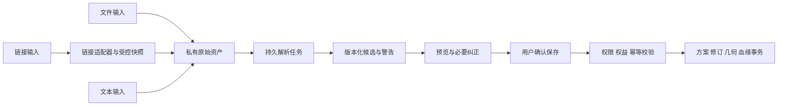

# Roadbook Web 路线导入与派生操作设计

| 项目 | 内容 |
| --- | --- |
| 版本 | V1.1 |
| 更新日期 | 2026-10-09 |
| 状态 | 设计提案；表结构与操作协议尚未实施 |
| 已确认范围 | 文件、链接、文本导入；解析落库；保存、复制、fork、自由裁剪；会员放开控制点业务上限 |
| 当前边界 | 不修改现有应用、Prisma schema 或当前 20 点运行限制；不执行真实链接抓取或模型请求 |

## 1. 核心决策

1. 同一私人路线聚合支持 `control_points` 与 `preserved_track` 两种内容模式。前者表达重新算路的意图，后者保留用户导入或确认后的路径本身。
2. 权威几何不可变，按分段/分块持久化；裁剪生成新几何，保存生成新修订，不破坏原始数据。
3. 导入输入、解析候选、已保存路线分开建模。用户上传或提交文本后可以先预览，不因此自动创建正式路线。
4. 复制、fork 都生成独立用户方案；fork 保留来源版本血缘，不自动跟随或合并上游。
5. 当前 20 控制点未来成为可配置会员权益；采样顶点、导入体积与供应商调用使用各自的技术容量策略。

## 2. 业务操作语义

| 操作 | 来源 | 结果 | 对原路线的影响 |
| --- | --- | --- | --- |
| 导入解析 | 文件、分享链接、文本 | 私有原始资产、解析任务、一个或多个候选 | 不创建或覆盖已有路线 |
| 保存候选 | 明确选择的 ready 候选 | 本人新方案，云端版本 1 | 候选记录接受映射；源资产不变 |
| 保存编辑 | 本人当前方案与基础版本 | 同方案新修订 | 历史不可变，可恢复 |
| 复制 | 有复制权的固定源版本 | 本人独立方案，版本 1 | 源不变；内部保留必要审计与署名 |
| fork | 有 fork 权的固定源版本 | 本人独立方案，版本 1，加来源血缘 | 源不变；不继承源编辑权 |
| 裁剪并保存 | 本人固定版本及固定源几何 | 同方案新版本与新几何 | 旧版本与旧几何保留至保留期 |
| 裁剪并另存 | 有派生权的源版本 | 本人新方案、版本 1 与新几何 | 源不变，保留裁剪血缘 |
| 历史恢复 | 本人可访问的历史修订 | 新版本引用恢复内容 | 不能回退版本号或删除后续历史 |

“保存到我的路线”默认创建本人可独立管理的内容；只收藏源链接是另一个未来用例，不拿收藏引用代替用户已保存的路线。

## 3. 三类输入的统一管道

三类入口均纳入首批业务设计，不把链接和文本推迟为没有契约的占位。具体供应商分享链接与文件版本支持清单，在实施前逐项核实，不能承诺任意网站链接都能解析。

### 3.1 文件

候选格式为 GPX、KML、GeoJSON；按格式版本声明支持能力，不能仅按扩展名判定。

- GPX 包含独立航点、路线点和分段轨迹，采用 WGS84；三者不能全部当导航控制点。[GPX 1.1 规范](https://www.topografix.com/GPX/1/1/)
- GeoJSON 区分 LineString、MultiLineString 与集合，坐标顺序为经度、纬度；不猜测成地图供应商坐标。[RFC 7946](https://www.rfc-editor.org/rfc/rfc7946.html)
- KML 需保留多几何与高度模式差异；来源高度不能不经判断就当绝对海拔。[KML 参考](https://developers.google.com/kml/documentation/kmlreference)

保存原文件供经授权的重解析，保留原始顺序、分段、高程/时间有效性、解析器版本和警告。源包含很多路线点时先保留完整路径或源属性，不按免费额度自动截断或当作全部可通行道路。

安全解析禁用 XML 外部实体和网络资源加载；KMZ/压缩格式仅在显式支持后启用解压大小与层级限制。KML 网络链接、HTML 描述、脚本和设备扩展都属于非可信输入，不能直接执行或变成任意外部请求。

### 3.2 分享链接

通过 `RouteLinkResolver` 按供应商识别受支持的分享格式，使用许可内的接口或页面数据生成受控快照，再走统一解析。

- URL 本身和返回内容都纳入来源版本；短链接重定向有次数、域名、响应类型、体积和超时上限。
- 校验每次跳转及实际连接目标，阻止访问内网、回环、云元数据地址及 DNS 重绑定；不能让客户端指定任意服务器文件或对象存储路径。
- 链接中的令牌、Cookie 和私有来源不写普通日志；如需用户授权才能读取，通过明确的授权适配器实现，不绕过供应商访问限制。
- 只能解析到起终点或途经地时，产出 `planning_intent` 候选并说明信息缺失，不用直线冒充原始道路。
- 链接后续变化不自动修改已保存路线。重新解析得到新任务/候选，用户明确选择更新或另存。
- 链接失效但已有获准保存的完整快照时，仍可查看本人已保存内容；只有链接而无内容的候选不能宣称已完成落库。

### 3.3 文本

通过 `RouteTextParser` 支持有序地点清单、带明确坐标系的坐标序列、结构化路线描述；自由自然语言可以由后续模型辅助，但不以模型接入作为基础文本导入的唯一条件。

- “从 A 经 B 到 C”主要提取规划意图；文本中明确提供的路径坐标可以形成保留轨迹候选，两者语义不同。
- 地址解析保留候选匹配与不确定性，不将同名城市/道路自动确定成唯一坐标；必要时要求用户纠正。
- 没有声明坐标系的坐标文本进入待确认状态，禁止静默假设 WGS84 或 GCJ-02。
- 模型提取结果按结构与领域规则验证，并追踪模型运行、输入版本与输出 schema；私人文本出站仍遵守 AI 授权。
- 高程、经过时间、交通耗时等缺失就保持缺失，不能让模型填出“原始轨迹事实”。

### 3.4 候选纠正与确认

展示内容模式、路线条数、分段断点、来源坐标系、数据缺口、需要的点数权益与解析警告。改变坐标判断或解析选项产生新候选版本，不改写旧候选。

导入任务失败不得清空当前活动方案。确认单个候选创建路线时，以候选 ID、内容哈希、解析版本和幂等键锁定输入；同候选重复确认返回原映射。批量确认可按候选逐项提交并分别回执，不声称跨全部路线与对象存储原子成功。

## 4. 几何与控制点分离

| 数据 | 角色 | 数量规则 |
| --- | --- | --- |
| 控制点 | 用户表达途经顺序并请求地图算路 | 按当前会员权益和统一技术硬上限判断 |
| 轨迹采样顶点 | 描述导入/裁剪后路径 | 独立点数、体积、分段和处理时限，不使用 20 控制点规则 |
| 显示抽稀顶点 | 减少传输与绘制成本 | 可重建投影，不作为裁剪或原始内容的权威索引 |
| 原始航点与标注 | 来源中的地点、时间、设备或说明信息 | 按解析契约存附属属性，不自动全部变为导航控制点 |

以 `preserved_track` 保存的路线始终按源顺序显示。转换成可重新规划路线时，用户确认一组控制点，系统按会员策略校验，再真实算路；结果不能覆盖原轨迹与历史修订。

对已有规划路线进行任意道路位置裁剪，需要固定有效的算路结果，验证其对应基础路线输入且允许持久化，再物化源几何并进行裁剪。精确保留道路形状的结果进入 `preserved_track` 模式。若用户选择重新生成控制点规划，作为另一个显式转换操作处理，允许道路变化但必须说明。

## 5. 自由裁剪的边界模型

### 5.1 稳定位置

每个选择端点使用：`sourceGeometryId + sourceSegmentId + edgeIndex + fraction`。

- `edgeIndex` 是源分段内原始顶点序列的边号，范围 `[0, pointCount - 2]`。
- `fraction` 是该原边的参数，范围 `[0,1]`；不是全程里程比例。末顶点统一表示为末边的比例 1。
- 固定端点规范化规则：相邻边共享顶点优先表示为后一边比例 0，末顶点例外；这样相同裁剪请求有稳定哈希。
- 坐标相同但出现次序不同的位置不等价。闭环、自交、往返重叠路段必须带边号，不能用最近坐标推断用户选择。
- 前端若使用抽稀图形选择，必须解析回原几何边号；服务端再次校验，不能直接把显示点号当原始序号。

### 5.2 可表达的操作

保留一个区间、删除前段/后段、删除中段、保留多个不连续区间都可表达为有序范围列表。地图框选/多边形选择也需要先在固定源几何上解析成范围；界面选法不改变持久化协议。

每个范围属于一个源连续分段；跨段选择拆成多个范围。保留顺序默认沿源方向，反向必须明确 `direction`，不能悄悄按经纬度排序。

中间被删掉后保留断点，不画直线填洞。若要将剩余部分连起来，单独发起真实连接规划并确认结果。闭环跨起点范围拆成明确的有序范围，不自动补末点到起点的连接。

### 5.3 插值与重算

边内裁剪采用有版本的源坐标空间插值规则；WGS84 经度跨经线时先展开经度再插值。坐标转换、插值规则、范围与输出哈希进入操作记录；不能用屏幕像素直接保存新端点。

高程/时间仅在邻点有效且对应规则允许时插值，并标记插值来源；时间倒序或缺失保持警告，不补造速度。重新计算分段数量、点数、长度、边界与可用统计，不将原全程指标直接乘比例。重新生成缩略图与分析投影，不继承旧输入的天气、耗时或坡段结果。

范围重叠、重复、倒序、越界、零长度与全删空结果都必须有明确策略。建议首期拒绝重叠/重复和零长度，允许明确的反向范围；“全部删除”走单独清空/删除确认，不能返回空成功来冒充有效裁剪。

## 6. 复制与 fork 的内容独立性

源版本在请求中固定，不从“最新版本”异步读取。提交时验证读取与持久派生权限、会员权益、源删除状态及几何 ready 状态。

- 目标方案拥有自己的主键、owner、版本序列与内容引用；不得引用对方可撤回访问的私人对象作为唯一正文。
- 同一用户可以在可靠引用管理下复用不可变块；首期跨用户派生生成目标用户有权独立保留的内容副本，不为节约空间默认共享私人对象访问权。
- 内容相同不意味着访问权限相同；内容哈希不是访问凭据，不能靠猜哈希下载别人的轨迹。
- 原方案更新不会改变目标；fork 编辑不会反向更新上游。合并、跟踪上游与冲突解决不是本期承诺。
- 最低需要记录源版本/哈希、派生类型、许可快照、算法版本及目标版本；源作者、名称与链接仅在当前权限允许时展示。
- 私人路线默认禁止他人查看、复制和 fork；本人操作直接走 owner 校验，跨用户前启用明确访问授权。

只有明确允许持久派生的来源才能复制/fork。建议将其语义定义为创建时获得独立副本：源后续普通撤权阻止新派生，不自动销毁已有合法副本；如来源政策要求持续撤回全部衍生内容，应在准入时禁止独立派生或建立单独可撤回模型，不能混用两种承诺。

源被删除时保留目标自有内容，源关联按清理策略置空/脱敏，不级联删除目标。来源法规、许可或隐私清理义务仍须满足，不能借 fork 绕过删除要求。

## 7. 跨 PostgreSQL 与对象存储的提交

大几何不在一次数据库事务中上传；使用以下状态机：

1. 验证输入、来源权限和处理容量，创建幂等操作与 staging 资源。
2. 私有对象存储上传原始资产或生成目标分块，以不可变对象版本与校验哈希登记。
3. 校验清单、块完整性、分段顺序、点数、统计和来源，把几何置为 ready。
4. 短数据库事务重新校验源版本/授权、当前目标基础版本及有效权益决策；写方案/修订、几何引用、候选接受映射、血缘、裁剪范围、回执和必要发件箱。
5. 提交后才确认路线保存成功。失败时保留源方案，staging 孤儿资源由后台按期限清理。

对象存储 ready 不等于业务已提交；数据库提交成功但回执丢失，通过原幂等键查询。禁止以“数据库事务回滚”推断对象上传也被回滚。

原始资产、候选、修订、几何清单和块的保留分别管理。垃圾回收从当前方案、有效历史修订、已受理任务与目标自有资源追踪引用；不能仅凭源路线删除就清理 fork 使用的块。回收与新增引用通过数据库状态和锁协调，禁止边裁剪边删除源块。

## 8. 会员点数策略

统一 `RouteEditingPolicy` 至少包含：权益策略版本、业务点数上限、技术点数上限、到期时间、允许的超额存量操作。

| 场景 | 判定 |
| --- | --- |
| 免费用户创建控制点规划 | 按免费额度配置，初始可沿用现有 20 |
| 会员创建控制点规划 | 更高额度或解除业务点数上限，仍受技术资源上限 |
| 导入大量轨迹采样点 | 使用轨迹容量规则，不误报“超过 20 个控制点” |
| 导入文本解析出很多途经点 | 确认保存前按控制点权益提示；不默默截断文本 |
| 复制/fork 超额控制点方案 | 对新方案检查目标用户权益，不能借副本绕过会员限制 |
| 会员到期后的超额路线 | 不丢数据；读、导出和减少点数按存量策略保留 |
| 裁剪为新控制点方案或恢复历史高点数版本 | 检查目标内容与当前权益；裁剪为保留轨迹则按轨迹容量 |
| 高点数驾车重算 | 同时检查权益、供应商 QPS、总调用预算和任务容量 |

订阅状态由服务端验证；客户端显示只作引导，数据库表不硬编码 20。不能通过分批追加、重复导入或 AI 建议绕过最终聚合数量判定。会员档位、价格和具体技术上限由实施前确认。

## 9. 表结构清单与关联

| 职责 | 表 |
| --- | --- |
| 原始输入、解析与候选 | `route_import_asset / route_import_job / route_import_candidate` |
| 本人保存与版本 | `planning_route_plan / planning_control_point / planning_route_revision` |
| 权威轨迹 | `planning_route_geometry / planning_geometry_segment / planning_geometry_chunk` |
| 复制、fork 与裁剪血缘 | `planning_route_derivation / planning_derivation_range` |
| 跨用户派生权限 | `planning_route_access_grant`，该能力开启前建立 |
| 会员权益 | `membership_tier_version / membership_subscription / membership_entitlement_decision` |
| 本机旧方案迁移 | `planning_import_receipt`，独立于文件/链接/文本解析 |
| 可靠处理 | `platform_idempotency_record / platform_background_job / platform_outbox_event` |

字段、类型、索引和 FK 详见 [领域模型与数据库设计](领域模型与数据库设计.md)。源引用按来源种类使用互斥 FK；静态专题尚未入库时通过稳定专题键/内容版本记录，不能强造指向不存在数据行的外键。

## 10. 推进与验收

- P0：确认首批格式版本、链接供应商、文本语法、数据许可、会员存量规则、技术容量与裁剪边界。
- P3：提前建立内容模式、可扩展控制点序号、不可变修订、归属和幂等；使后续扩展不需要把公开 Route 表推倒重来。
- P4.1：先完成云同步基础、异步仓储与冲突协议。
- P4.2：对象存储与持久解析任务；文件/链接/文本适配、候选预览与确认保存；大输入不依赖函数永久进程。
- P4.3：复制、fork、自由裁剪，先本人派生，再在明确授权模型下开放跨用户派生；会员高点数能力需权益与容量验收。
- P5：派生内容清理、来源追踪、几何投影重建与恢复演练。
- P6：模型辅助文本提取与有来源解释；AI 也使用相同权益、内容与版本协议。

必测：多轨迹/多分段输入、坐标系未知、含敏感 token 的链接、文本同名地点、解析版本升级、重复确认、相同源多次显式复制、上游更新/删除/撤权、会员到期、超额副本、闭环/自交/重叠路径、块边界与边内裁剪、切除中段、对象上传后数据库失败、垃圾回收竞争、响应丢失、跨用户引用越权。

以上均为验收要求，尚未执行对应实现测试。完整操作一致性见 [一致性与故障处理设计](一致性与故障处理设计.md)，AI 来源与数据授权见 [AI 数据基础与接入设计](AI数据基础与接入设计.md)。
