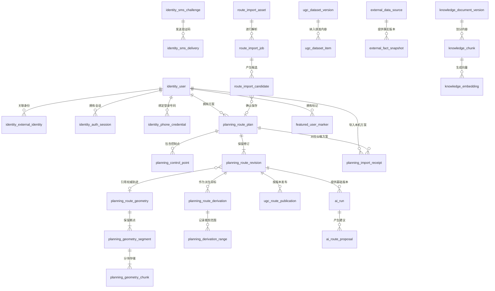

# Roadbook Web 领域模型与数据库设计

更新日期：2026-10-09。版本：V1.4，补充数据库物理归属与建表准入，覆盖多来源导入、路线派生、会员权益、手机号登录与 UGC 治理。状态：拟议逻辑与物理模型；尚未修改 Prisma schema 或执行迁移。

## 1. 建模原则

1. 私人路线内容、导入解析、供应商计算结果、公共精选内容、AI 建议分属不同上下文，不共用一张万能路线表。
2. 高频检索、权限、顺序与关联字段关系化；版本化快照和供应商扩展使用有契约的 JSONB。
3. 当前聚合是写入权威，不可变修订用于冲突核对、审计与 AI 输入；不实施全量事件溯源。
4. 供应商算路几何、缩略图、向量是派生数据；用户导入或裁剪确认的轨迹几何则是权威路线内容，必须持久保留，不能当缓存删除。
5. 表结构按阶段启用；未来表的设计不代表首期全部建表。
6. 每环境一个 Web 业务数据库，按上下文分 schema，保留本文表前缀；本文短表名是逻辑名称，实际全名与完整归属见 [数据库分库分表与建表规范](数据库分库分表与建表规范.md)。例如 `planning.planning_route_plan` 引用 `identity.identity_user`，必要跨上下文操作保持同库事务。

## 2. 统一语言

| 术语 | 定义 | 禁止混用 |
| --- | --- | --- |
| 路线方案 `RoutePlan` | 用户拥有的可编辑路线聚合；支持控制点规划、保留轨迹两种内容模式 | 不是已发布路线，不是逐日行程 |
| 控制点 `ControlPoint` | 带稳定标识、顺序、坐标、名称和地址的路线意图 | 不是供应商道路采样点 |
| 云端版本 `version` | 服务端每次接受聚合变更递增的整数 | 不是浏览器现有 `revision` |
| 本机修订 `localRevision` | 当前浏览器编辑序列，保持已有产品语义 | 不能用来决定不同设备谁更新 |
| 数据结构版本 `schemaVersion` | 快照格式版本 | 不是业务云端版本 |
| 路线内容输入哈希 `intentHash` | 按内容模式计算：规划模式包含有序控制点与策略；轨迹模式包含不可变几何内容哈希与分段顺序 | 不包含名称、地址、编辑时间；不在轨迹变化后保持旧值 |
| 导入候选 `RouteImportCandidate` | 一次解析产生的一条可预览、确认保存的候选路线 | 上传成功、解析成功都不等于已保存路线 |
| 权威轨迹 `RouteGeometry` | 用户导入或确认裁剪后保存的不可变有序路径及分段 | 不是地图匹配、抽稀展示或道路计算缓存 |
| 复制 `CopyRoutePlan` | 以明确源版本创建独立私人方案 | 不是收藏源对象，不跟随源更新 |
| fork `ForkRoutePlan` | 创建独立私人方案，并保留可授权展示的来源版本血缘 | 不自动合并上游、不继承上游编辑权限 |
| 裁剪 `TrimRouteContent` | 从固定几何的有序位置范围生成新几何，保存为新版本或新方案 | 不只靠起终点坐标匹配，不修改原几何 |
| 算路结果 `RouteCalculationResult` | 针对输入、供应商、计算范围的道路几何和指标 | 不作为用户控制点事实 |
| 专题版本 `FeaturedRouteVersion` | 人工维护的只读公共内容版本 | 不进入私人 `RoutePlan` 写模型 |
| AI 建议 `RouteProposal` | 针对明确基础版本提出的结构化变更 | 不等于已接受的路线事实 |

名称、地址变更仍增加云端版本以进行并发保护，但不改变 `intentHash`，不无故触发算路。控制点规划模式的去程、返程范围属于派生请求；导入轨迹先按原顺序展示，不能自动闭环或覆盖成重算道路。两种模式的转换需要单独确认并保留原版本。

## 3. 公共字段、类型与安全边界

| 项目 | 约定 |
| --- | --- |
| 服务端实体主键 | PostgreSQL `uuid`；由可信服务端生成 |
| 本机原有标识 | 不假设是 UUID，通过导入映射关联；不直接强制转换 |
| 时间 | `timestamptz`，服务端 UTC；客户端时间仅作来源信息，不参与覆盖判定 |
| 坐标 | `numeric(9,6)`，显式坐标系；纬度 `[-90,90]`、经度 `[-180,180]` |
| 坐标精度 | 六位小数是存储精度，不代表来源测量精度；可单独记录误差米数 |
| 几何坐标精度 | 对象载荷保留解析后的来源精度、坐标系与可选高程/时间；不套用控制点六位小数去截断全部轨迹 |
| 单位 | 里程统一米，时长统一秒，高程统一米；字段名写出单位 |
| 云端版本 | 正整数，初始接受版本为 1；超过安全范围时返回字符串或升级协议，禁止精度丢失 |
| 状态与策略 | 有界枚举或 `CHECK`；接口使用允许列表，不接受任意状态字符串 |
| JSONB | 必须有 `schema_version`、大小上限和服务端结构校验；不用 JSON 存全部权限或核心关联 |
| 哈希 | 带算法与规范化版本；不将无盐位置哈希当作匿名化 |
| 敏感令牌 | 只存不可逆摘要，密钥在服务端环境管理；不存明文会话或刷新令牌 |
| 用户归属 | 每次读写在服务端从会话取得 `user_id`；禁止信任请求正文中的 owner |

初期以 PostgreSQL 单主写入为基线。空间检索规模达到实测瓶颈后再评估 PostGIS 与空间索引；不提前把普通经纬度 B-tree 当成空间索引，也不将 GCJ-02 点直接当 WGS84 geography 计算距离。

## 4. 聚合与关联总览

该图表示主要关联；可选功能按阶段启用。关联不允许跨用户读写，派生结果和个人标记均不得隐式公开。

## 5. 身份与访问上下文：P3

### 5.1 `identity_user`：用户聚合

| 字段 | 类型 | 约束与用途 |
| --- | --- | --- |
| `id` | uuid | 主键，其他上下文的稳定身份 |
| `display_name` | varchar(100) | 显示名称；不能用于账户匹配 |
| `status` | varchar(24) | `active / suspended / deletion_pending / deleted` |
| `created_at / updated_at` | timestamptz | 服务端管理 |
| `deleted_at` | timestamptz，可空 | 删除状态；清除个人资料不等于立即清除所有墓碑 |

不要求微信 `openid`，也不以手机号作用户主键。路线、会员、任务和 UGC 始终关联稳定 `user_id`；换号只变更登录凭据。旧用户不能仅凭同名、邮箱字符串或其他未验证属性自动合并。

### 5.2 `identity_external_identity`：外部身份关联

字段：`id uuid PK`、`user_id uuid FK`、`provider varchar(64)`、`issuer varchar(255)`、`subject varchar(255)`、`created_at`。

- 唯一约束：`(provider, issuer, subject)`；索引：`user_id`。
- 外部凭据须经供应商验证；绑定另一身份要求当前有效登录与对新身份的验证。
- 不存供应商密码；邮箱不是主键，确需邮箱时另行定义验证状态与最小保存范围。

### 5.3 `identity_auth_session`：可撤销会话

字段：`id uuid PK`、`user_id uuid FK`、`token_hash varchar(128) UNIQUE`、`expires_at`、`revoked_at`、`created_at`、`last_seen_at`。

索引：`(user_id, expires_at)`、过期清理索引。会话有效性以权威会话状态和用户状态为准，Redis 只可加速。浏览器使用受保护 Cookie 时配置 HttpOnly、Secure、合适的 SameSite，并对写操作实施 CSRF 保护。

若最终选择完全由认证供应商管理会话，该表可由适配器替代，不重复建设两套令牌系统；可撤销性与故障关闭要求不变。

### 5.4 `identity_data_grant`：能力授权，P6 前启用

字段：`id uuid PK`、`user_id uuid FK`、`purpose varchar(64)`、`scope_schema_version int`、`scope jsonb`、`policy_version varchar(64)`、`granted_at`、`expires_at`、`revoked_at`。

`scope` 只包含经校验的资源标识、精度等级与使用范围；不得混入令牌。授权出站处理不代表允许训练。撤回授权后阻止新出站请求，并启动已保存衍生数据的清理流程。

### 5.5 手机号与短信验证：未来登录能力

| 表 | 关键字段 | 约束与用途 |
| --- | --- | --- |
| `identity_phone_credential` | `id uuid PK, user_id FK, phone_ciphertext bytea, encryption_key_version, phone_lookup_hmac varchar(128), lookup_key_version, masked_phone, verified_at, last_authenticated_at, revoked_at, created_at` | 当前有效号码摘要的部分唯一索引；当前有效 `user_id` 的部分唯一索引，首期一人一个主登录号码 |
| `identity_sms_challenge` | `id uuid PK, user_id FK 可空, purpose, phone_ciphertext, phone_lookup_hmac, code_digest, digest_key_version, status, attempt_count, max_attempts, expires_at, consumed_at, created_at` | 验证用途、目标号码、有效期与一次性消费绑定；索引 `(phone_lookup_hmac, purpose, created_at DESC)`；失败尝试也原子计数 |
| `identity_sms_delivery` | `id uuid PK, challenge_id FK, provider, template_version, idempotency_key, provider_request_id 可空, status, attempt_number, sent_at 可空, delivered_at 可空, error_code 可空` | 唯一 `(challenge_id, attempt_number)` 与 `(provider, idempotency_key)`；发送超时标未知，不能等同未发送 |

号码按明确地区解析并规范化为 E.164 后加密保存，使用独立服务端 HMAC 查找与唯一约束，不用可枚举的普通手机号哈希。格式校验不能证明当前号码可达或属于某人，必须完成短信验证。[号码校验说明](https://github.com/google/libphonenumber/blob/master/FAQ.md)

号码查找密钥轮换使用受控回填或双索引迁移并保持跨版本唯一校验；不能简单把 `(lookup_key_version, hash)` 作为唯一键后允许同一号码绑定两个账户。普通接口仅返回掩码；手机号不进入路线快照、分享响应、向量或模型上下文。

短信验证码不存明文，使用带 challenge 标识、用途和服务端密钥的摘要，验证时锁定 challenge，原子更新尝试次数/消费状态。`login / bind_phone / change_phone / recovery` 用途隔离，不允许登录码替代换号确认；重复消费不得签发新的独立会话。

首次验证后创建用户与凭据使用同一事务，号码唯一冲突时重新核对身份而非自动合并。换号需要当前账户的重新验证和新号码验证，同事务替换凭据，随后撤销相关会话；用户、路线和会员的主键不变。

短信供应商由 `SmsDeliveryGateway` 适配；限流按号码、请求来源、用途和全局预算共享。数据库/限流不可用时不放行验证码猜测与新发送。手机号回收、SIM 更换与账户恢复需要风险策略，短信收到不等于证明同一历史自然人；具体恢复流程在启用前评审。

## 5A. 会员权益上下文：高点数能力启用前

会员权益独立于身份、路线和后续支付适配。用户明确要求未来将放开 20 控制点作为会员能力，因此不能把 20 写成数据库跨版本不变量，也不能在组件、领域规则和 AI 校验中分别硬编码。

| 表 | 关键字段 | 约束与用途 |
| --- | --- | --- |
| `membership_tier_version` | `id uuid PK, tier_code, version, schema_version, max_control_points bigint 可空, feature_rules jsonb, status, effective_from, created_at` | 唯一 `(tier_code, version)`；已发布策略不可原地改写；非空点数必须为正 |
| `membership_subscription` | `id uuid PK, owner_id FK, tier_version_id FK, status, starts_at, ends_at, revoked_at, external_reference 可空, created_at, updated_at` | 索引 `(owner_id, status, ends_at)`；权益有效性由服务端时间与状态判定，不信任客户端会员标记 |
| `membership_entitlement_decision` | `id uuid PK, owner_id FK, operation_key, feature_key, tier_version_id FK, subscription_id FK 可空, requested_value bigint, business_limit bigint 可空, technical_limit bigint, decision, policy_version, evaluated_at, valid_until` | 唯一 `(owner_id, operation_key, feature_key)`；记录具体操作的权益快照，不当作永久访问令牌 |

- 当前 20 点是现有实现上限；未来免费方案可将其作为初始配置，会员支持更高额度或 `max_control_points = NULL` 表示无业务点数上限。具体档位、数值、有效期和售价不在本次设定。
- 业务权益上限与技术硬上限分离：`technical_limit` 来自有版本的系统容量策略，所有用户仍受请求大小、供应商额度、解析/算路成本和安全容量约束；NULL 不能解释为无限 CPU、存储或供应商调用。
- 路线领域只接收应用层计算的 `RouteEditingPolicy` 值对象，不依赖会员表或支付 SDK。新增方案、导入为规划、复制、fork、裁剪另存、添加控制点与高点数算路都走统一权益判定。
- 轨迹采样点不是控制点，不消耗“控制点个数”权益；文件字节数、轨迹点数、存储与算路调用是其他资源维度，不能混用 20 点规则。
- 不因会员到期删除、截断或自动抽稀已保存内容。建议允许读取、导出、重命名、删除和减少点数；超额方案新增点、创建同等超额副本及高成本重算需当前权益。坐标编辑、历史恢复和同点数重算的具体体验在上线前确认，不能静默放行或丢弃编辑。
- 降级后逐步减少超额点数可以保存，即使一次尚未降到免费额度；不得用“必须立即少于 20 点”阻止用户保留减少后的工作。
- 数据库不可用或权益无法核验时，不确认新的高点数云端操作；仍保留本机编辑。已受理的长任务使用有期限的权益决策快照，避免正常到期导致中途丢结果；撤销/退款等强制终止规则单独定义。
- 本设计预留会员与订阅关系，不代表本次接入支付、开通会员或变更当前运行中的 20 点限制。

## 6. 私人路线聚合：P3/P4

### 6.1 `planning_route_plan`：当前方案聚合根

| 字段 | 类型 | 约束与用途 |
| --- | --- | --- |
| `id` | uuid | 主键 |
| `owner_id` | uuid | FK → `identity_user.id`；首期不支持转移归属 |
| `name` | varchar(200) | 允许默认“未命名路线”，服务端校验长度 |
| `strategy` | varchar(32) | 当前仅 `highway / avoid-highway` |
| `version` | bigint | `CHECK version >= 1`；并发控制 |
| `intent_hash` | varchar(128) | 含哈希算法及规范化版本的输入身份 |
| `content_mode` | varchar(24) | `control_points / preserved_track`；服务端校验对应内容契约 |
| `active_geometry_id` | uuid，可空 | 轨迹模式引用本人 `planning_route_geometry`；规划模式为空 |
| `origin_kind` | varchar(24) | `manual / local_import / source_import / copy / fork / trim`，由服务端设置，表示方案创建来源 |
| `created_at / updated_at` | timestamptz | 业务内容变更时间；派生缩略图更新不改变它 |
| `deleted_at` | timestamptz，可空 | 删除墓碑，防离线旧副本复活 |

索引：活动方案 `(owner_id, updated_at DESC, id)` 的部分索引，及删除清理索引；增加 `(id, owner_id)` 复合唯一约束供带归属的外键使用。目录使用稳定游标分页，权限字段在查询条件内检查。

`(active_geometry_id, owner_id)` 复合 FK 保证当前轨迹属于该用户。通过 `CHECK` 强制规划模式几何引用为空、轨迹模式引用非空；引用对象是否 ready 和模式切换由事务用例校验，不使用跨表 CHECK。`origin_kind` 不随每次修改改变，具体修改来源记录在修订和派生记录中。

### 6.2 `planning_control_point`：聚合内实体

| 字段 | 类型 | 约束与用途 |
| --- | --- | --- |
| `plan_id` | uuid | FK → `planning_route_plan.id` |
| `point_id` | varchar(128) | 聚合内稳定标识；保留导入的控制点身份 |
| `position` | integer | 从 0 开始，`CHECK position >= 0`；不在数据库写死会员业务额度 |
| `name / address` | varchar(200) / varchar(1000) | 用户元数据，非供应商原始响应 |
| `latitude / longitude` | numeric(9,6) | 范围约束 |
| `coordinate_system` | varchar(16) | 首期 Web 契约为 `gcj02`；其他来源入站时显式转换 |
| `source_provider / source_place_id` | varchar，可空 | 经许可可保存的来源标识 |

- 主键：`(plan_id, point_id)`；唯一：`(plan_id, position)`。
- 位置连续性、当前会员权益与技术硬上限由锁定聚合根后的事务验证；普通行级 `CHECK` 不能校验跨行数量与连续性。
- 排序可以在同一事务中删除并重建当前控制点，或使用延迟唯一约束；不能逐行更新产生临时位置冲突。
- 子表不提供绕开聚合根的公开增删接口，任何改动与根版本、修订写入同一事务。
- 点数权益仅限制参与地图规划的控制点，不限制导入轨迹采样点；轨迹模式的源路点、标签与时间保存在几何载荷和解析附属数据中，不能强制塞进该表。

### 6.3 `planning_route_revision`：不可变修订快照

字段：`id uuid PK`、`plan_id uuid FK`、`owner_id uuid FK`、`version bigint`、`schema_version int`、`snapshot jsonb`、`snapshot_hash varchar(128)`、`intent_hash varchar(128)`、`geometry_id uuid 可空`、`entitlement_decision_id uuid FK 可空`、`change_source varchar(32)`、`created_at timestamptz`。

- 唯一：`(plan_id, version)`；索引：`(plan_id, created_at DESC)`。
- 增加 `(id, owner_id)` 复合唯一键；通过复合 FK 约束修订、方案和几何的 owner 一致。删除修订可不引用几何。
- `change_source`：`user / local_import / source_import / copy / fork / trim / content_conversion / restore / ai_accepted / deletion`；是服务端写入的来源，不由客户端任意指定。
- 快照包含内容模式、规划意图或不可变权威几何引用及内容哈希，不把完整轨迹点阵、地图响应、天气或聊天记录塞进修订 JSONB。
- 已提交修订不可改写；恢复历史修订必须生成新的云端版本。
- 删除修订保留最小删除标记；其他历史正文按保留政策清理。修订不可变不代表永久保存私人数据。
- 主表、模式对应的控制点或权威几何引用是当前写模型，修订是同事务的历史记录；不允许两个渠道独立更新各自内容。

### 6.4 `planning_import_receipt`：本机导入映射

字段：`id uuid PK`、`owner_id uuid FK`、`installation_id varchar(128)`、`local_plan_id varchar(128)`、`source_snapshot_hash varchar(128)`、`source_schema_version int`、`cloud_plan_id uuid FK`、`imported_at`。

唯一：`(owner_id, installation_id, local_plan_id)`。导入时服务端生成云端 UUID，在同一事务创建方案、首版修订与回执。

相同来源和内容重复导入返回原映射；内容改变则返回差异并进入显式同步/冲突流程，不能直接当作全新方案，也不能依据本机修订覆盖云端版本。`installation_id` 仅作幂等命名空间，不能认证用户。

### 6.5 方案删除、导入与所有权

- 删除也需要基础云端版本；删除事务递增版本、设置墓碑并生成删除修订。
- 所有导入映射必须验证 `cloud_plan_id` 属于 `owner_id`，并通过 `(cloud_plan_id, owner_id)` 指向方案 `(id, owner_id)` 的复合 FK 强制约束；应用校验不能替代该关联约束。
- 墓碑保留期与离线同步支持窗口绑定。窗口外的客户端不得自动重放，必须完整重新同步并由用户选择导入为新方案。
- 账户删除后旧会话失效，本机操作不能恢复已删除账户的云端数据。

### 6.6 `planning_route_geometry`：不可变权威几何

| 字段 | 类型 | 约束与用途 |
| --- | --- | --- |
| `id / owner_id` | uuid / uuid FK | 主键；增加 `(id, owner_id)` 唯一键供归属校验 |
| `geometry_kind` | varchar(24) | `imported / trimmed / copied / forked / confirmed_path` |
| `coordinate_system` | varchar(16) | 如 `wgs84 / gcj02`；未知坐标系不得默认为某一种 |
| `schema_version / normalization_version` | int / varchar(64) | 几何载荷契约及规范化算法版本 |
| `content_hash` | varchar(128) | 有序点、断点、坐标系、有效附属属性的哈希 |
| `segment_count / point_count` | int / bigint | 不将断点计为可直连路段 |
| `length_meters` | numeric(14,3)，可空 | 仅有效分段内的几何长度；不是驾车导航里程 |
| `length_algorithm_version` | varchar(64)，可空 | 长度测量的坐标转换和算法依据 |
| `recorded_duration_seconds` | numeric，可空 | 来源含有效时间时才计算；不是预测驾驶时间 |
| `manifest_ref / manifest_hash` | varchar | 私有不可变对象清单及校验值 |
| `status` | varchar(24) | `staging / ready / deletion_pending / deleted` |
| `created_at / ready_at` | timestamptz | 不修改 ready 几何的内容，变更生成新 ID |

几何是有归属、可授权访问的业务资源；采用数据库头信息＋分段/分块元数据＋私有对象正文，不为每个轨迹顶点建高开销业务行。小载荷也使用同一契约，禁止随文件大小切换语义。首期不跨用户以内容哈希暴露去重关系。

### 6.7 `planning_geometry_segment`：有序连续分段

字段：`geometry_id uuid`、`segment_id uuid`、`owner_id uuid FK`、`ordinal int`、`point_count int`、`length_meters numeric 可空`、`bounds jsonb`、`source_segment_key varchar 可空`。

主键 `(geometry_id, segment_id)`；唯一 `(geometry_id, ordinal)` 与 `(geometry_id, segment_id, owner_id)`；复合 FK 指向几何 `(id, owner_id)`。至少两点才构成可裁剪线段；单点来源保留为解析标记并提示，不伪造路径。bbox 仅用于预筛选，契约要注明坐标系与跨经线规则，不能充当空间索引。

### 6.8 `planning_geometry_chunk`：几何分块引用

字段：`geometry_id`、`segment_id`、`owner_id`、`chunk_ordinal int`、`first_vertex_index bigint`、`point_count int`、`object_ref`、`object_version`、`payload_hash`、`byte_size bigint`、`encoding_version`。

主键 `(geometry_id, segment_id, chunk_ordinal)`；复合 FK 验证段和 owner；唯一 `(geometry_id, segment_id, first_vertex_index)`。全局顶点序号按分段连续，不随客户端显示抽稀改变。分块不重复持久化边界顶点，渲染跨块时读取相邻顶点；由清单校验无缺块、重叠和乱序。块大小、上传大小、点数、段数与解析时限在 P0 基准测试后确定硬上限，不把“自由裁剪”理解为无限资源。

### 6.9 `planning_route_derivation`：版本级血缘

字段：`id uuid PK`、`operation_id uuid`、`source_ordinal int`、`target_plan_id uuid`、`target_version bigint`、`target_owner_id uuid FK`、`source_kind varchar(24)`、`source_revision_id uuid 可空`、`source_featured_version_id uuid 可空`、`source_candidate_id uuid 可空`、`source_content_hash varchar(128)`、`derivation_kind varchar(24)`、`algorithm_version varchar(64)`、`rights_snapshot jsonb`、`created_at`。

- 唯一 `(operation_id, source_ordinal)`；目标通过 `(target_plan_id, target_version)` FK 关联修订，并通过目标修订复合约束验证 target owner；源引用按种类选择一个，源被清理后可为空，但保留最小且有期限的来源标记。
- `derivation_kind` 为 `source_import / copy / fork / trim / content_conversion`。复制也保留内部审计及必要署名，fork 额外以权限允许的方式展示上游血缘；均不依赖源内容未来持续可见。
- 本期每个操作只有一个来源；`source_ordinal` 为未来多源组合预留，不在本期实现合并。
- 源必须是已存在的不可变修订、专题版本或 ready 导入候选；目标仅在生成新修订时写血缘，禁止随后指向任意“最新版本”或回填循环引用。
- `rights_snapshot` 是创建时的许可审计，不代替当前访问权限；包含政策版本、允许派生与署名要求，不复制对方会话或全部个人资料。
- 源引用不能使用级联删除目标路线；来源查询先鉴权，不能通过血缘接口泄露私人名称、作者与几何。

### 6.10 `planning_derivation_range`：可重现的裁剪范围

字段：`derivation_id uuid FK`、`range_ordinal int`、`source_geometry_id uuid 可空`、`source_segment_id uuid 可空`、`start_edge_index bigint`、`start_fraction numeric(12,9)`、`end_edge_index bigint`、`end_fraction numeric(12,9)`、`direction varchar(16)`、`target_segment_ordinal int`、`selection_schema_version int`。

主键 `(derivation_id, range_ordinal)`。边序号与 `[0,1]` 比例共同表示连续路径上的位置；验证范围顺序、段内界限、目标分段和来源版本，不用易歧义的经纬度或抽稀后的点号作唯一裁剪依据。几何引用有效时通过复合 FK 验证源段；清理源时允许同时清空源引用，不把本行当成唯一内容存储。

一个操作可保留多个不连续范围；切除中段后保持分段断点。实际裁剪结果物化成目标用户自己的 ready 几何，不能只有范围引用而在原路线删除后失效。操作与边界规则见 [路线导入与派生操作设计](路线导入与派生操作设计.md)。

### 6.11 `planning_route_access_grant`：跨用户 fork 前按需启用

字段：`id uuid PK`、`plan_id uuid FK`、`grantor_id uuid FK`、`grantee_id uuid FK`、`permissions jsonb`、`policy_version varchar(64)`、`version bigint`、`expires_at`、`revoked_at`、`created_at`。

唯一 `(plan_id, grantee_id)`，通过复合 FK 验证 grantor 为方案 owner。允许列表分开定义 `view / copy / fork`，`copy/fork` 必须同时允许读取对应版本并明确持久派生权；默认私人路线没有任何他人授权。后续恢复授权更新授权版本，派生命令在提交前校验并锁定许可状态。公开发布或匿名分享不是启用该表的默认行为。

## 6A. 路线导入解析上下文：P3/P4 前置设计

本机方案迁移的 `planning_import_receipt` 与外部路线来源解析分开，不能把所有导入压成一张映射表。

导入必须覆盖用户指定的文件、分享链接与文本。统一将每种输入保存为私有原始资产，再由对应解析适配器输出候选；`asset` 不限定为上传文件。

| 表 | 关键字段 | 约束与用途 |
| --- | --- | --- |
| `route_import_asset` | `id uuid PK, owner_id FK, object_ref, object_version, original_filename 可空, byte_size, content_hash, declared_media_type 可空, detected_format, source_kind, source_locator_ref 可空, status, created_at, expires_at` | `(id, owner_id)` 唯一；`source_kind=file/link/text`；原文件、文本正文或受控链接抓取快照私有保存；URL 含 token 时只存受控引用 |
| `route_import_job` | `id uuid PK, owner_id FK, asset_id, resolver_name 可空, resolver_version 可空, parser_name, parser_version, model_run_id 可空, options_hash, detected_coordinate_system, coordinate_system_decision, status, lease_token, lease_until, warning_summary jsonb, error_code, created_at, finished_at` | 复合 FK 校验 asset owner；唯一 `(owner_id, asset_id, parser_name, parser_version, options_hash)`；options 哈希包含解析/链接适配/可选模型版本；受持久任务租约驱动 |
| `route_import_candidate` | `id uuid PK, owner_id FK, job_id, ordinal, suggested_name, source_semantics, content_mode, normalized_geometry_id 可空, suggested_control_points jsonb, annotation_ref 可空, schema_version, content_hash, status, accepted_plan_id 可空, accepted_version 可空, created_at` | 唯一 `(job_id, ordinal)`，增加 `(id, owner_id)` 唯一；job/geometry/accepted plan 均约束 owner；确认保存与接受映射同事务 |

候选内容 ready 后不可原地改变；更换解析器、链接适配器、模型或坐标判断创建新 job/candidate，旧候选明确失效或保留待选，不自动重写已经保存的方案。`source_semantics` 区分 `recorded_track / route_points / polyline / planning_intent`，不把记录轨迹称为当前可通行道路。

文件、分享链接或文本都可以产生多条候选路线。用户分别确认需要保存的候选；同候选重试确认返回原方案映射，明确“再复制一份”则走复制命令，不通过重复上传制造副本。模型仅在需要时辅助提取文本或页面语义，确定性格式解析不依赖大模型。

只有 ready 几何与有效候选才能被路线引用。未确认候选与失败/过期上传按期限清理；已接受路线使用的几何不能随导入候选过期清理。原始文件与轨迹中的时间、位置和设备扩展均按私人数据处理。

## 7. 精选路线与个人标记

### 7.1 `featured_user_marker`：P4 按需求启用

字段：`id uuid PK`、`owner_id uuid FK`、`featured_route_key varchar(128)`、`featured_version varchar(128)`、`name`、`address`、`latitude`、`longitude`、`coordinate_system`、`version bigint`、`created_at / updated_at / deleted_at`。

索引：活动记录 `(owner_id, featured_route_key, updated_at DESC, id)`。写入验证专题允许列表与坐标；标记由所属用户单独管理，不成为私人路线控制点。

专题仍是静态资源时，用稳定专题标识和内容版本关联，由应用层验证，不创建指向不存在数据库表的 FK。专题未来入库时再建立 `featured_route_version` 与完整迁移映射。

当前静态几何的 `schemaVersion` 只表示格式，不能充当内容版本；入云前以构建清单或内容哈希确定专题内容版本，保持已有浏览器格式兼容。

### 7.2 `featured_route_version`：P5 或内容运营需要时

字段：`id uuid PK`、`route_key`、`version`、`title`、`coordinate_system`、`geometry_ref`、`content_hash`、`source_refs jsonb`、`publication_status`、`published_at`。

唯一：`(route_key, version)`。已发布版本不可变，几何通过静态资源或对象引用分发，不能把全国道路坐标堆入私人方案表。当前黄金大环线先保留已有 JSON/CDN 方案。

## 8. 外部事实与计算投影：P5

| 表 | 关键字段 | 约束与用途 |
| --- | --- | --- |
| `external_data_source` | `id uuid PK, provider, dataset_key, dataset_version, coordinate_system, license_ref, retention_policy, permitted_uses jsonb, reviewed_at, status` | 唯一 `(provider, dataset_key, dataset_version)`；记录缓存、持久化、展示、AI 出站与检索的许可范围 |
| `external_fact_snapshot` | `id uuid PK, source_id FK, entity_key, observed_at, fetched_at, expires_at, schema_version, content_hash, payload_ref, payload_size_bytes, quality_status` | 唯一 `(source_id, entity_key, content_hash)`；索引 `(source_id, entity_key, observed_at DESC)`；大正文引用有访问控制的对象，不存无界 JSON |
| `calculation_route_result` | `id uuid PK, owner_id FK, plan_id, based_on_version, intent_hash, calculation_key, provider, provider_version, scope, distance_meters, duration_seconds, geometry_ref, source_id FK, computed_at, expires_at, quality_status` | 唯一 `(owner_id, calculation_key)`；依据修订关联与复合归属约束；是可清理投影 |

来源不允许保存原始正文时，只保留获准的元数据或短期缓存；`payload_ref` 可空并明确不可离线复现。不得以“未来训练需要”为由扩大供应商许可。

计算键至少包含规范化版本、`intentHash`、地图供应商及契约版本、去程/往返范围；高程与分析另加来源、插值、采样和分析算法版本。用户修改意图后旧结果不得绑定新输入。

首次设计按用户隔离计算结果与位置类缓存；不为提高命中率跨用户共享私人路线几何。天气或公共站点事实可按许可共享，必须携带查询时间、有效期与过期标识。

海拔缺失值保持 `null`，不补零；坐标系、地表来源、采样与转换版本均须可追溯，不将地表采样表述为生产道路实测。

## 8A. 用户生成内容与 AI 语料治理

用户创建、导入、保存、复制、fork 和裁剪的私人路线都属于 UGC，权威内容仍由私人路线上下文持有；不另复制一张与路线表独立变化的“UGC 路线正文表”。UGC 治理通过稳定用户、不可变修订、来源与许可关联。

| 表 | 关键字段 | 约束与启用时点 |
| --- | --- | --- |
| `ugc_route_publication` | `id uuid PK, plan_id, revision_id, owner_id FK, publication_version bigint, status, review_status, rights_policy_version, published_at 可空, withdrawn_at 可空, created_at` | 唯一 `(plan_id, publication_version)`；每个 plan 只有一个 active published 版本的部分唯一索引；通过 `(revision_id, plan_id, owner_id)` 复合 FK 验证归属；公开 UGC 功能实施时启用 |
| `ugc_dataset_version` | `id uuid PK, dataset_key, version, purpose, schema_version, rights_policy_version, manifest_ref, content_hash, status, expires_at, created_at` | 唯一 `(dataset_key, version)`；purpose 区分 `retrieval / evaluation / training`；目的不能原地更改；P6 按需求启用 |
| `ugc_dataset_item` | `id uuid PK, dataset_version_id FK, source_revision_id 可空, owner_id FK, grant_id FK, source_content_hash, lineage_group_key, transform_version, content_ref, quality_status, split, deleted_at` | 唯一 `(dataset_version_id, source_content_hash, transform_version)`；验证来源归属与用途授权；派生样本需保留来源权利；P6 按需求启用 |

为复合 FK 增加修订 `(id, plan_id, owner_id)` 唯一约束。发布固定修订，私人新编辑不会自动发布；撤回发布先停止读取与检索，再清理公共投影，不能公开手机号或非公开来源信息。

上述语料表不默认启用训练。数据集项需要有效的用途授权和来源许可，不能依据“用户注册”“路线公开”“购买会员”自动推定 AI 训练授权。共享原文和相似 fork 路线按血缘分组后划分评估/训练集合，防止重复内容造成评估泄漏。

本人的即时 AI 辅助可以按具体请求读取获准的结构化修订，不必先创建跨用户语料集。数据集撤权与删除还要使对应分块、向量和样本失效，不能只删除当前路线表。详见 [手机号登录与UGC治理设计](手机号登录与UGC治理设计.md)。

## 9. 可靠性支撑表

| 表与阶段 | 关键字段 | 约束与责任 |
| --- | --- | --- |
| `platform_idempotency_record`，P3 | `id uuid PK, actor_id FK, operation, idempotency_key, request_hash, status, response_code, result_ref, created_at, expires_at` | 唯一 `(actor_id, operation, idempotency_key)`；与业务写入同事务完成；只保存最小回执 |
| `platform_outbox_event`，P5 | `id uuid PK, aggregate_type, aggregate_id, aggregate_version, event_type, schema_version, payload jsonb, occurred_at, available_at, status, attempts, lease_token, lease_until, published_at` | 索引 `(status, available_at)`；与业务变更同事务插入；正文最小化 |
| `platform_consumer_receipt`，P5 | `consumer_name, event_id, processed_at` | 联合主键；与消费者投影更新同事务提交，防重复消费 |
| `platform_background_job`，P5 | `id uuid PK, owner_id FK 可空, job_type, deduplication_key, payload_ref, status, attempts, max_attempts, available_at, lease_token, lease_until, result_ref, last_error_code, created_at, updated_at` | 唯一 `(job_type, deduplication_key)`；索引 `(status, available_at)`；数据库负责领取和完成校验 |

状态至少区分待处理、执行中、成功、失败和取消；未知外部调用结果按 AI 运行设计单独处理。私有任务必须有 owner，公共同步任务使用明确服务主体与管理员权限，不能通过 owner 为空绕过检查。

首期幂等保存不依赖后台工作进程；发件箱与任务表在出现异步投影或外部作业时引入。领域事件不把完整路线复制到普通日志与每个消费者。

## 10. AI 与知识表：P6 按用例启用

这些表的完整行为见 [AI 数据基础与接入设计](AI数据基础与接入设计.md)。

| 表 | 关键字段 | 核心约束 |
| --- | --- | --- |
| `knowledge_document_version` | `id uuid PK, document_key, version, source_id FK 可空, owner_id FK 可空, visibility, content_ref, content_hash, schema_version, valid_from, valid_until, rights_status, created_at, deleted_at` | 唯一 `(document_key, version)`；公共记录无 owner，私人记录必须有 owner；来源权利与访问范围明确 |
| `knowledge_chunk` | `id uuid PK, document_version_id FK, ordinal, text_ref, content_hash, chunking_version, token_count, citation_locator` | 唯一 `(document_version_id, chunking_version, ordinal)`；归属从文档关联取得 |
| `knowledge_embedding_space` | `id uuid PK, provider, model_revision, dimensions, distance_metric, normalization_version, created_at` | 同一空间固定模型版本、维度与度量；升级新建空间 |
| `knowledge_embedding` | `chunk_id FK, space_id FK, input_hash, embedding, embedded_at` | 唯一 `(chunk_id, space_id)`；维度受约束；不同空间不能混检 |
| `ai_run` | `id uuid PK, owner_id FK, plan_id 可空, base_version 可空, input_snapshot_hash, prompt_template_id, prompt_version, output_schema_version, provider, model_revision, grant_id FK 可空, status, created_at, finished_at` | 路线任务通过 `(plan_id, base_version)` 引用不可变修订；验证归属；不复制整段私人对话 |
| `ai_run_attempt` | `id uuid PK, run_id FK, attempt_number, provider_request_id 可空, status, input_tokens 可空, output_tokens 可空, usage_status, cost_amount 可空, currency 可空, started_at, finished_at` | 唯一 `(run_id, attempt_number)`；未知用量不是零；重试仍归同一逻辑运行 |
| `ai_tool_call` | `id uuid PK, run_id FK, attempt_id FK, sequence, tool_name, tool_version, arguments_ref, input_hash, result_ref, source_refs jsonb, status, started_at, finished_at` | 唯一 `(attempt_id, sequence)`；参数与结果最小保存，工具允许列表 |
| `ai_route_proposal` | `id uuid PK, run_id FK, plan_id, base_version, proposal_schema_version, patch jsonb, evidence_refs jsonb, status, accepted_version 可空, created_at, expires_at` | 基础版本引用修订；接受必须事务验证原版本；`accepted_version` 指向同方案新修订 |
| `ai_feedback` | `id uuid PK, run_id FK, owner_id FK, feedback_kind, reason_code 可空, created_at` | 验证运行归属；默认不收集自由文本中的位置与个人资料 |
| `ai_usage_budget` | `id uuid PK, owner_id FK 可空, service_scope, window_start, window_end, currency, limit_amount numeric(20,8), reserved_amount numeric(20,8), settled_amount numeric(20,8), status` | 明确用户或系统预算作用域；金额非负，窗口有效；相同作用域与窗口唯一 |
| `ai_usage_reservation` | `id uuid PK, budget_id FK, attempt_id FK, reserved_amount numeric(20,8), actual_amount numeric(20,8) 可空, status, price_version, created_at, settled_at 可空` | 唯一 `(budget_id, attempt_id)`；一个尝试可以同时占用用户与系统预算；未知结果保留预留 |

`knowledge_embedding` 是逻辑表。实施时选用托管 PostgreSQL 支持的 pgvector，并采用固定维度物理表或明确的分空间索引；需要 SQL 约束验证实际维度，不只依赖 `dimensions` 元数据。模型维度未确定前不创建向量列或 ANN 索引，不提前安装扩展。[pgvector 官方说明](https://github.com/pgvector/pgvector)

预算归属采用两个部分唯一索引覆盖“有 owner 的用户窗口”和“无 owner 的系统窗口”，不依赖含 NULL 的普通唯一键去重。领取预算时按固定顺序锁定预算行，检查已结算＋预留＋本次上限不超过额度，同事务插入预留并增加预留金额；核销与释放也必须幂等。上限依据固定价格版本、输入和最大输出、工具次数计算；无法限定的供应商能力不进入自动试点。账本保护预算预留，不能替代供应商账单核对或硬限额。

## 11. 约束、索引与数据访问准入

- 新表先完成数据库规范中的表设计卡；表、字段、约束与索引名称、复合归属 FK、权限、保留政策和迁移策略必须可审查。未有实测依据不分区、不分片。
- Prisma schema 表达实体和关系；部分索引、复杂 `CHECK`、延迟约束、向量类型等以对应版本支持情况选择显式 SQL 迁移，不能遗漏后仅靠 TypeScript 类型兜底。
- 每个外键按查询需要建立索引；大 JSON/正文不默认加 GIN。所有列表有分页上限。
- 详情读取聚合根与控制点时使用同一一致快照或单条聚合查询，避免读到不同版本；见一致性设计。
- 跨用户关联用复合 FK 或同等数据库约束防护；应用服务始终验证会话、归属、删除状态和资源版本。
- RLS 可作为纵深防御，但必须实际配置用户上下文与策略；不能宣称使用 PostgreSQL 就自动具备行级隔离。
- 数据库角色区分运行、迁移与运维权限；运行角色不具备 DDL 权限。模型角色不能直连数据库执行任意 SQL。

## 12. 现有表与迁移策略

| 现有模型 | 处理方向 |
| --- | --- |
| `User` | 保留旧表，Web 使用独立身份模型；仅在身份验证与迁移规则确定后显式映射 |
| `Route` | 保留公开路线语义，不重命名覆盖为私人方案；需要公共内容时通过适配器读取 |
| `RouteCollection` | 公开路线收藏，不能当私人方案列表 |
| `POI / AdministrativeDivision` | 经来源、许可与坐标契约核验后复用或迁移；不直接交给模型作为无来源事实 |
| `Article` | 后续经内容权利、版本与审核确认后可作为知识来源；不默认入向量库 |

执行路径：增量建表 → 隔离环境迁移演练 → 合法样本导入与数量/哈希核验 → 受控切换 → 观察 → 另行评审旧结构收缩。

现有模型保留真实物理归属；新增多 schema 配置时必须检查生成 SQL，禁止用旧模型 schema 变更触发删除/重建。一个业务库只有一条受控迁移历史，运行角色不具备 DDL 权限；具体规则见 [迁移与建表规范](数据库分库分表与建表规范.md)。

本机数据仅在用户主动登录并确认导入时上传。预览域名、正式域名与 localhost 的存储彼此隔离；应先提供导出导入能力，不能承诺服务端能直接读取另一域名的 localStorage。

## 13. 容量与保留政策

- 路线控制点由统一会员权益策略限制，当前运行版本仍为 20；未来会员可以放开业务额度，数据库不写死 20。名称、地址、几何、快照、AI 输入和工具输出仍配置独立技术容量上限。
- 修订在一次接受的保存命令后生成，不按每个键盘事件入库；保存节流不改变最终回执准确性。
- 当前用户数量、方案量、修订频率和请求量尚未测量；索引、连接池与容量以采样结果调整。
- 私人正文、修订、授权、AI 输入、派生几何、向量、对象、任务引用和备份均进入删除清单。
- 保留期限与 RPO/RTO 在生产云保存前确认；不以不可变修订为由无限保留私人位置。

一致性、幂等与删除失败补偿规则见 [一致性与故障处理设计](一致性与故障处理设计.md)。
