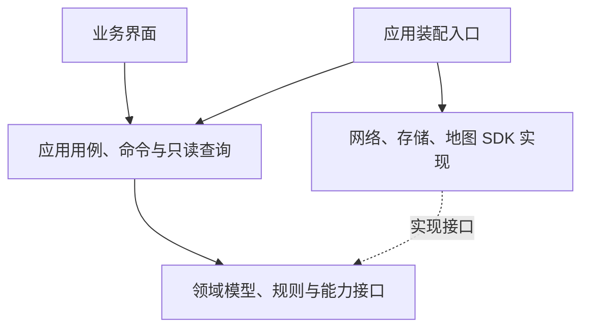

# Roadbook Web 职责边界与状态架构重构方案

| 项目     | 内容                                                                                |
| -------- | ----------------------------------------------------------------------------------- |
| 方案版本 | V1.0                                                                                |
| 记录日期 | 2026-10-07                                                                          |
| 范围     | 整个 `apps/roadbook-web`                                                            |
| 状态     | 用户已确认技术方案；尚未实施项目重构                                                |
| 本次交付 | 记录职责、依赖、状态归属、用例协作与后续验收标准                                    |
| 授权边界 | 本轮仅修改方案文档与工作入口；不迁移代码、不安装工具或依赖、不提交、不 push、不部署 |

## 1. 目标与范围

讨论整个 Web 项目的可维护性与单一职责。在确认职责与依赖关系后，要求将技术重构方案写入迭代记录。

目标是让每个模块围绕同一种原因发生变化，使业务规则、状态所有者和完整操作入口可以被明确定位。判断维护性的依据是：一次业务变化需要理解多少无关模块、一份状态是否只有一个负责人、一个业务操作是否有清楚的入口。

方案覆盖路线方案、路线计算、地图平台、搜索发现、热门路线专题、天气、沿途充电、高程分析、工作台导航，以及客户端展示、服务端接口、公共控件和样式。保持现有 MVP 产品边界，不新增账户、云同步、逐日行程、实时导航或车辆能耗预测。

相关现行基线：

- [Web 工作入口](../../AGENTS.md)
- [MVP 产品需求](../refel/自驾环线路线规划工具_产品需求文档_V0.3.md)
- [UI 设计规范](../UI规范/UI设计规范.md)
- [组件设计与实现规范](../组件规范/组件设计与实现规范.md)

本文件记录已确认的目标架构，不表示现有源码已经达到这些边界；当前运行行为与已验证结果仍以现行规范、源码和对应实现记录为准。

## 2. 现状、问题与根因

讨论期间进行了全项目源码清点、静态导入检查和核心入口的只读检查。以下为当时的观察快照，后续代码变化应重新核对；文件长度用于定位检查重点，不作为机械拆分阈值。

| 核心入口                                                                   | 观察快照              | 已识别的职责混合                                                       |
| -------------------------------------------------------------------------- | --------------------- | ---------------------------------------------------------------------- |
| [工作台组件](../../components/route-planning/route-planning-workspace.tsx) | 756 行，10 个本地状态 | 页面组合、场景切换、天气目标、删除确认、快捷键、地图及其他业务联动     |
| [工作台 Hook](../../hooks/use-route-planning-workspace.ts)                 | 728 行，23 个本地状态 | 方案目录、编辑、保存、撤销、地图连接、路线计算、返程、选择及聚焦请求   |
| [全局搜索](../../components/map-search/global-search.tsx)                  | 516 行，8 个本地状态  | 搜索、历史、专题预览、URL 同步、焦点及展示；直接创建历史仓储           |
| [地图展示](../../components/route-presentation/route-map.tsx)              | 568 行，20 个 Effect  | SDK 生命周期与多个业务图层、位置提示、路线插入和视野策略的同步入口集中 |

项目已经有领域、基础设施与业务组件目录，但应用用例边界没有同步收敛。新增功能持续接入工作台组件和大 Hook，形成多种变化原因汇聚到同一模块的结构。

主要问题：

- 加载、重置、取消等操作重复清理多组状态，维护者需要理解清理顺序和遗漏风险。
- 多个查询 Hook 分别构造上下文标识、维护取消与过期判断，缺少一致契约。
- 部分组件直接创建基础设施实现，展示、依赖装配和业务操作混合。
- UI 入口移除后，状态、操作接口或样式仍可能遗留；海拔精简中已观察到此类问题。
- 全局样式与业务样式并存，后续追加覆盖容易扩大修改影响范围。

本轮没有完成全部源码的逐行审查，上述结论不等于所有模块都存在相同问题，也不将 Effect 数量本身视为错误。

## 3. 业务职责边界

| 模块         | 核心职责                                               | 对外提供                         | 明确边界                                             |
| ------------ | ------------------------------------------------------ | -------------------------------- | ---------------------------------------------------- |
| 路线方案     | 创建、加载、重命名、删除、控制点编辑、策略、修订、撤销 | 当前方案、目录摘要、编辑命令     | 不承担算路、天气、高程或地图绘制                     |
| 路线计算     | 根据方案版本计算单程与返程，管理取消、重试、有效结果   | 有效路线、计算状态与错误         | 不修改方案控制点，不绘制地图                         |
| 地图平台     | 供应商连接与切换、定位、实例和图层生命周期             | 地图能力接口、连接状态、交互结果 | 不决定业务方案的修改与存储                           |
| 搜索发现     | 地点查询、历史、推荐与专题检索                         | 搜索结果、用户选择结果           | 选择结果交给对应应用用例，不直接操作其他业务内部状态 |
| 热门路线专题 | 只读专题数据、专题浏览、专题内个人标记                 | 专题展示数据、标记命令           | 与个人路线方案保持独立                               |
| 天气         | 指定地点的天气查询、缓存、失败恢复                     | 地点天气结果与状态               | 输入地点目标，不订阅整份路线方案                     |
| 沿途充电     | 当前有效路线附近站点、单站详情及刷新                   | 站点集合、站点详情与状态         | 加入途经点由路线编辑用例完成                         |
| 高程分析     | 有效路线的高程查询、质量与地形分析                     | 剖面、分析结果与状态             | 不修改控制点、不重新算路、不预测能耗                 |
| 工作台导航   | 规划与专题场景、当前任务、详情目标、面板层级           | 界面上下文、导航命令             | 不持有各业务查询结果或执行供应商请求                 |

路线方案是用户的可编辑意图；路线结果对应特定方案修订、供应商和单程／往返范围。两者分别管理，不能用展示路线反向修改用户方案。

热门路线本体与个人方案保持独立。只有明确的跨业务用例可以将专题内容转成个人方案；普通浏览不触发这种转换。

## 4. 分层与依赖方向

| 层次       | 职责                                                       | 依赖约束                                                                        |
| ---------- | ---------------------------------------------------------- | ------------------------------------------------------------------------------- |
| 展示层     | 渲染、收集用户意图、焦点和局部交互                         | 读取公开查询，发送业务命令；可使用公开数据契约，不创建仓储或供应商客户端        |
| 应用层     | 完成加载方案、增加途经点、切换往返等用例，管理流程与副作用 | 依赖领域规则与能力接口；通过注入取得实现                                        |
| 领域层     | 数据含义、不变量、修订、返程拼接、坡段等业务规则           | 不依赖 React、DOM、网络和供应商 SDK；共享地图包的纯数据／能力契约按既有规范使用 |
| 基础设施层 | HTTP、缓存、本地存储、SDK 适配与资源释放                   | 实现能力接口，不决定界面层级或用户业务意图                                      |
| 装配入口   | 创建实现、注入应用能力、管理应用级实例                     | 不承载业务规则，不成为新的大协调器                                              |

工作台渲染外壳只组合场景与业务视图。跨业务操作分别定义应用用例，避免把现有大 Hook 的所有代码搬入一个新的“协调器”。

业务模块通过公开契约协作，不读取对方内部 Store、不调用对方内部 setter、不依赖对方的私有文件。公开契约需要有明确输入、输出、错误与上下文语义，不强制为每个小函数建立包装层。

当前已有目录可以作为演进基础；具体目录布局、文件命名和拆分尺度在实施设计阶段确定，本轮不规定机械行数上限或按库名称分割业务。

## 5. 状态归属与技术方向

采用 XState、Zustand、Immer 的职责分工方向；每份状态必须有唯一所有者。具体版本、依赖安装和生命周期实现尚未完成验证，本次记录不包含安装授权。

| 状态类型                             | 建议所有者                                       | 规则                                                                               |
| ------------------------------------ | ------------------------------------------------ | ---------------------------------------------------------------------------------- |
| 可编辑方案、修订、撤销历史           | 路线方案 Zustand Store；复杂不可变更新使用 Immer | 修订与领域不变量通过业务动作统一维护                                               |
| 算路、返程、保存、地图连接等异步流程 | 各业务的 XState actor                            | 请求状态、事件与有效结果由对应流程拥有，不在其他 Store 中重复维护                  |
| 高程、天气、站点查询结果             | 各业务查询流程与缓存                             | actor 管理当前查询生命周期；缓存管理复用与过期，明确当前结果的权威来源             |
| 当前场景、任务、详情目标             | 工作台导航模块                                   | 使用明确状态表达互斥关系，其他界面从中派生；具体采用 actor 或 Store 待状态模型确定 |
| 悬停、输入草稿、焦点、拖动预览       | 对应界面或交互控制器                             | 局部交互保持局部，不无条件提升为全局状态                                           |
| SDK 实例、计时器、取消控制器         | 对应资源生命周期管理器                           | 不作为可持久化业务数据，不写入方案快照                                             |
| 里程摘要、可见图层、格式化文字       | 只读派生查询                                     | 从权威状态计算，不重复保存                                                         |

算路请求状态和有效路线结果不能同时复制到 actor、Zustand 和组件本地状态。业务组件直接订阅公开查询或流程快照；订阅适配 Hook 保持轻量，不重新承载完整业务流程。

方案持久化与流程实例分别处理，不能将整个运行时状态写入 `localStorage`。地图对象、取消控制器、临时浏览位置及请求中的状态不进入持久化方案。

## 6. 上下文与跨业务协作

路线相关计算采用统一上下文契约：

`方案 ID + 修订版本 + 地图供应商 + 单程／往返范围 + 路线几何版本`

该标识用于区分当前请求与结果。数据来源、算法版本、采样策略等业务专属信息继续由对应模块纳入自己的缓存键，不丢失现有正确的失效条件。

### 6.1 修改控制点

1. 路线方案模块完成编辑，产生新修订。
2. 编辑用例通知保存与路线计算流程。
3. 路线计算取消旧任务，将旧结果标记为更新中；旧显示可按产品规范保留，但不能作为新修订的有效结果。
4. 新有效路线发布后，地图、高程和沿途充电接收新上下文。
5. 各模块判断当前是否启用、是否命中缓存以及是否需要请求。

编辑用例不实现高程采样、站点筛选或地图绘制。领域规则留在业务模块内部。

### 6.2 切换往返

用户意图进入路线计算流程。返程未完成时保留单程，成功后发布完整往返路线；失败、取消和恢复单程具有明确转换。地图、指标、高程、沿途充电消费同一有效路线上下文，不由组件分别调用多个 setter 拼接状态。

### 6.3 加载方案或切换地图供应商

加载方案和切换供应商各有明确用例，负责发出上下文变化及必要的取消指令；每个模块负责自身结果失效与资源清理。精确定位授权、本地方案保存、控制点编号和单程／往返产品规则保持现有约定。

### 6.4 地点详情与站点加入

天气只接收地点目标，站点详情只接收站点目标。站点加入路线通过路线编辑命令完成，不允许充电模块修改方案 Store 的内部字段。详情目标与地图选择若表达同一事实，应确定一个权威来源，其他视图派生。

上述协作优先采用有类型的命令、调用或明确 actor 消息。事件生产者、消费者与生命周期必须可定位，不引入任意字符串广播的全局事件总线。

## 7. 地图、API 与样式职责

- 地图 SDK 生命周期、实例、图层与事件清理由地图平台及适配器承担；供应商类型不泄漏到业务组件。
- 地图的选点、选段、插入结果转换为业务意图，交给应用用例；绘制与视野行为通过地图能力契约完成。
- API 路由负责参数检查和响应组织；供应商访问、字段归一化、限流及服务端缓存进入服务实现。密钥和签名保持服务端边界。
- 客户端模块不能导入仅服务端的供应商实现；可共享纯数据契约和无平台副作用的领域规则。
- 公共 UI 组件不依赖任何路线、天气、充电或高程业务。
- 全局样式保留基础样式、视觉 Token、共同材质与必要全局规则；业务样式随业务组件归属，减少跨业务后代选择器和追加覆盖。
- 地图容器、任务面板及异步区域保持稳定尺寸；懒加载、按需请求与高频图层增量更新继续作为性能约束，目标 LCP 无回退、CLS 为 0。

## 8. 后续实施顺序与成本边界

本节是后续工作建议，不是已执行的迁移计划。

| 阶段             | 需要形成的可审阅结果                                             | 风险与成本控制                                 |
| ---------------- | ---------------------------------------------------------------- | ---------------------------------------------- |
| 职责设计         | 方案、路线结果、工作台导航的状态归属；公开命令与查询清单         | 先解决权威来源，避免双向同步和新大协调器       |
| 流程设计         | 加载方案、编辑、单程／返程、取消、供应商切换的状态转换与失效规则 | 复核现有产品行为，明确异步竞态和资源释放       |
| 单个完整用例实现 | 一个操作从组件到业务结果的完整边界与测试证据                     | 控制变更范围；未授权前不安装或迁移             |
| 配套业务接入     | 搜索、专题、天气、充电、高程通过稳定输入／输出接入               | 不让配套业务反向操作核心状态                   |
| 展示与样式收敛   | 薄工作台、局部样式归属、遗留代码清单                             | 功能入口、状态、事件、样式、测试、文档一起检查 |
| 独立验收         | 数据保留、异步转换、浏览器与性能证据                             | 最小充分验证；无新变化不重复长构建或大测试     |

实施前应按仓库约定汇报影响与成本，并取得对应授权。安装工具／依赖、提交、合并、tag、push、历史重写与部署继续遵守用户门禁，不能从本方案记录推导为已授权。

## 9. 风险与降级策略

- 最主要风险是重构期间出现双重状态来源、异步旧结果回写、方案持久化变化或地图生命周期重复。每个阶段先确定权威来源和转换规则。
- 地图和基础路线编辑继续可用；天气、充电、高程失败只影响各自能力，不导致方案或控制点丢失。
- 当前浏览器本地方案格式与主动加载规则保持兼容。任何格式变更必须单独设计、验证并记录。
- 一个用例的边界与回归未完成时，不以“已引入三个库”宣称架构重构完成，也不扩散到全项目。
- 不删除用户方案，不用重建地图或重新初始化全部业务作为通用恢复手段。
- 若阶段验证失败，停止扩大改动，定位根因，再决定修正或恢复该阶段行为；不得无分析重复失败命令。

## 10. 后续验收标准

| 项目       | 通过条件                                                                                       |
| ---------- | ---------------------------------------------------------------------------------------------- |
| 单一职责   | 模块有明确变化原因；调整保存、算法或视觉时可以定位对应责任模块                                 |
| 状态归属   | 每份业务状态只有一个权威写入者；派生数据不重复存储，无需维护 actor／Store／组件之间的镜像同步  |
| 依赖方向   | 组件不创建基础设施，领域无 React／DOM／SDK 副作用依赖，业务间只通过公开契约协作                |
| 完整操作   | 加载、编辑、切换往返等操作有清楚用例入口，组件不自行组合多组状态清理                           |
| 异步一致性 | 取消、迟到响应、方案修订、供应商及范围切换不会提交旧结果或保留旧联动                           |
| 数据保留   | 本地方案读取、暂存、修订、撤销与用户主动加载行为无回退                                         |
| 地图行为   | 实例与图层正确释放，路线更新采用增量同步，选点、选段、插入与视野规则无回退                     |
| 配套业务   | 天气、充电、高程独立降级；未启用能力不查询，不阻塞主流程                                       |
| 性能与布局 | 记录相同设备、网络与构建条件下的前后证据；LCP 无回退、CLS 目标为 0，高频交互不重渲染整个工作台 |
| 遗留清理   | 删除功能时同步检查状态、事件、样式、测试和文档，未用代码不会继续扩大核心入口                   |
| 可独立验证 | 领域规则与流程转换可独立检查；测试覆盖关键业务转换，不以复制实现细节充当验证                   |

## 11. 本次验证与已知边界

- 已进行源码清点、静态导入关系检查和关键组件／Hook 的只读检查，形成职责混合的具体依据。
- 用户已确认职责与依赖方案，本次仅记录方案并增加 Web 工作入口导航。
- 文档交付检查包括 Markdown 格式、本地链接与差异空白；检查结果在本轮交付前确认。
- 本次没有安装 XState、Zustand 或 Immer，没有迁移或修改应用源码；不运行应用构建和浏览器回归来证明尚未实施的架构。
- 技术版本、具体目录设计、完整流程状态图、所有模块的逐行审查和重构后的性能证据仍待后续工作。
- 既有未提交修改保持原状；其他功能此前的测试结果不能代替本方案未来实施后的验收。

后续建议首先补齐方案、路线结果和工作台导航的状态归属表与命令契约，再进入具体实施讨论。本迭代当前状态为“方案已记录，重构未实施”。
