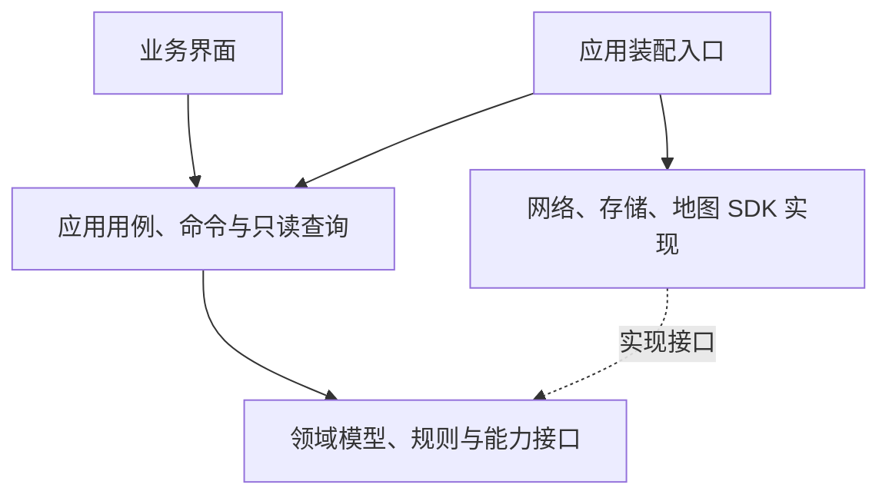

# Roadbook Web 职责边界与状态架构重构方案

| 项目     | 内容                                                                                |
| -------- | ----------------------------------------------------------------------------------- |
| 方案版本 | V1.4                                                                                |
| 记录日期 | 2026-10-07                                                                          |
| 更新日期 | 2026-10-08                                                                          |
| 范围     | 整个 `apps/roadbook-web`                                                            |
| 状态     | 核心链路试点已实施；外围迁移、正式性能与完整地图回归待完成                           |
| 本次交付 | 核心状态架构试点及测试工具链安装；旧测试保留，后续新增测试使用新工具链               |
| 授权边界 | 架构试点使用现有依赖；后续用户明确授权安装测试依赖、不迁移测试；未提交、push 或部署   |

## 1. 目标与范围

讨论整个 Web 项目的可维护性与单一职责。在确认职责与依赖关系后，要求将技术重构方案写入迭代记录。

目标是让每个模块围绕同一种原因发生变化，使业务规则、状态所有者和完整操作入口可以被明确定位。判断维护性的依据是：一次业务变化需要理解多少无关模块、一份状态是否只有一个负责人、一个业务操作是否有清楚的入口。

方案覆盖路线方案、路线计算、地图平台、搜索发现、热门路线专题、天气、沿途充电、高程分析、工作台导航，以及客户端展示、服务端接口、公共控件和样式。保持现有 MVP 产品边界，不新增账户、云同步、逐日行程、实时导航或车辆能耗预测。

上述范围用于说明长期职责归属。近期投入优先解决核心编辑链路的正确性和扩展成本，各阶段应能独立交付与停止；无需一次完成所有模块迁移。收益以新增功能需要修改的无关模块、重复请求、状态同步和回归范围是否减少来判断。

相关现行基线：

- [Web 工作入口](../../AGENTS.md)
- [MVP 产品需求](../refel/自驾环线路线规划工具_产品需求文档_V0.3.md)
- [UI 设计规范](../UI规范/UI设计规范.md)
- [组件设计与实现规范](../组件规范/组件设计与实现规范.md)

本文件前 11 节记录目标架构与原审核结论，第 12 节记录核心试点实现及验证。尚未迁移的模块不视为已经达到目标边界；当前行为以实现记录、正式规范及源码证据共同判断。

## 2. 现状、问题与根因

讨论期间进行了全项目源码清点、静态导入检查和核心入口的只读检查。以下为当时的观察快照，后续代码变化应重新核对；文件长度用于定位检查重点，不作为机械拆分阈值。

| 核心入口                                                                   | 观察快照              | 已识别的职责混合                                                       |
| -------------------------------------------------------------------------- | --------------------- | ---------------------------------------------------------------------- |
| [工作台组件](../../components/route-planning/route-planning-workspace.tsx) | 756 行，10 个本地状态 | 页面组合、场景切换、天气目标、删除确认、快捷键、地图及其他业务联动     |
| [工作台 Hook](../../hooks/use-route-planning-workspace.ts)                 | 728 行，23 个本地状态 | 方案目录、编辑、保存、撤销、地图连接、路线计算、返程、选择及聚焦请求   |
| [全局搜索](../../components/map-search/global-search.tsx)                  | 516 行，8 个本地状态  | 搜索、历史、专题预览、URL 同步、焦点及展示；直接创建历史仓储           |
| [地图展示](../../components/route-presentation/route-map.tsx)              | 568 行，20 个 Effect  | SDK 生命周期与多个业务图层、位置提示、路线插入和视野策略的同步入口集中 |

项目已经有领域、基础设施与业务组件目录，但应用用例边界没有同步收敛。新增功能持续接入工作台组件和大 Hook，形成多种变化原因汇聚到同一模块的结构。

主要问题：

- 加载、重置、取消等操作重复清理多组状态，维护者需要理解清理顺序和遗漏风险。
- 多个查询 Hook 分别构造上下文标识、维护取消与过期判断，缺少一致契约。
- 部分组件直接创建基础设施实现，展示、依赖装配和业务操作混合。
- UI 入口移除后，状态、操作接口或样式仍可能遗留；海拔精简中已观察到此类问题。
- 全局样式与业务样式并存，后续追加覆盖容易扩大修改影响范围。

本轮没有完成全部源码的逐行审查，上述结论不等于所有模块都存在相同问题，也不将 Effect 数量本身视为错误。

### 2.1 2026-10-08 审核补充

- [路线方案模型](../../domain/route-planning/model.ts)中的修订随方案更新递增；[工作台 Hook](../../hooks/use-route-planning-workspace.ts)的重命名、逆地址补全也走修订更新，现有算路依赖键则只读取方案、控制点 ID／坐标／顺序、策略与供应商。保存变化与算路输入变化已经存在差异，重构应保留这一能力。
- 当前撤销从历史快照生成修订，可能出现不同内容复用同一修订号；现有算路另有输入键与请求令牌保护，不能据此断言当前结果已经发生串写。后续统一上下文时，需要明确撤销与请求身份的语义。
- 当前自动暂存依赖活动方案的 360ms 定时器，活动方案变化会清理旧定时器；加载另一方案前没有显式交接待保存快照。静态分析存在“编辑后立即切换方案，最后一次待保存被取消”的路径，尚未运行时复现。[现有流程测试](../../hooks/use-route-planning-workspace.test.mjs)将保存替换为空实现，不能证明该路径已受到保护。
- 天气、充电和高程已有查询隔离、缓存与按需加载资产。后续优先复用这些能力，避免把核心边界收敛扩展为外围查询的全量重写。

## 3. 业务职责边界

| 模块         | 核心职责                                               | 对外提供                         | 明确边界                                             |
| ------------ | ------------------------------------------------------ | -------------------------------- | ---------------------------------------------------- |
| 路线方案     | 创建、加载、重命名、删除、控制点编辑、策略、修订、撤销 | 当前方案、目录摘要、编辑命令     | 不承担算路、天气、高程或地图绘制                     |
| 路线计算     | 根据方案版本计算单程与返程，管理取消、重试、有效结果   | 有效路线、计算状态与错误         | 不修改方案控制点，不绘制地图                         |
| 地图平台     | 供应商连接与切换、定位、实例和图层生命周期             | 地图能力接口、连接状态、交互结果 | 不决定业务方案的修改与存储                           |
| 搜索发现     | 地点查询、历史、推荐与专题检索                         | 搜索结果、用户选择结果           | 选择结果交给对应应用用例，不直接操作其他业务内部状态 |
| 热门路线专题 | 只读专题数据、专题浏览、专题内个人标记                 | 专题展示数据、标记命令           | 与个人路线方案保持独立                               |
| 天气         | 指定地点的天气查询、缓存、失败恢复                     | 地点天气结果与状态               | 输入地点目标，不订阅整份路线方案                     |
| 沿途充电     | 当前有效路线附近站点、单站详情及刷新                   | 站点集合、站点详情与状态         | 加入途经点由路线编辑用例完成                         |
| 高程分析     | 有效路线的高程查询、质量与地形分析                     | 剖面、分析结果与状态             | 不修改控制点、不重新算路、不预测能耗                 |
| 工作台导航   | 规划与专题场景、当前任务、详情目标、面板层级           | 界面上下文、导航命令             | 不持有各业务查询结果或执行供应商请求                 |

路线方案是用户的可编辑意图；路线结果关联来源方案修订、算路输入、供应商和单程／往返范围。两者分别管理，不能用展示路线反向修改用户方案。结果是否仍适用于当前方案，按第 6 节的真实输入依赖判断。

热门路线本体与个人方案保持独立。只有明确的跨业务用例可以将专题内容转成个人方案；普通浏览不触发这种转换。

## 4. 分层与依赖方向

| 层次       | 职责                                                       | 依赖约束                                                                        |
| ---------- | ---------------------------------------------------------- | ------------------------------------------------------------------------------- |
| 展示层     | 渲染、收集用户意图、焦点和局部交互                         | 读取公开查询，发送业务命令；可使用公开数据契约，不创建仓储或供应商客户端        |
| 应用层     | 完成加载方案、增加途经点、切换往返等用例，管理流程与副作用 | 依赖领域规则与能力接口；通过注入取得实现                                        |
| 领域层     | 数据含义、不变量、修订、返程拼接、坡段等业务规则           | 不依赖 React、DOM、网络和供应商 SDK；共享地图包的纯数据／能力契约按既有规范使用 |
| 基础设施层 | HTTP、缓存、本地存储、SDK 适配与资源释放                   | 实现能力接口，不决定界面层级或用户业务意图                                      |
| 装配入口   | 创建实现、注入应用能力、管理应用级实例                     | 不承载业务规则，不成为新的大协调器                                              |

工作台渲染外壳只组合场景与业务视图。跨业务操作分别定义应用用例，避免把现有大 Hook 的所有代码搬入一个新的“协调器”。

业务模块通过公开契约协作，不读取对方内部 Store、不调用对方内部 setter、不依赖对方的私有文件。公开契约需要有明确输入、输出、错误与上下文语义，不强制为每个小函数建立包装层。

当前已有目录可以作为演进基础；具体目录布局、文件命名和拆分尺度在实施设计阶段确定，本轮不规定机械行数上限或按库名称分割业务。

## 5. 状态归属与技术方向

保留 XState、Zustand、Immer 的职责分工方向；每份状态必须有唯一所有者，按流程复杂度与试点收益逐步引入。具体版本适用性、依赖使用范围和生命周期实现尚未完成验证，本次记录不包含新增依赖安装授权。

| 状态类型                             | 建议所有者                                       | 规则                                                                               |
| ------------------------------------ | ------------------------------------------------ | ---------------------------------------------------------------------------------- |
| 可编辑方案、修订、撤销历史           | 路线方案 Zustand Store；复杂不可变更新使用 Immer | 修订与领域不变量通过业务动作统一维护                                               |
| 算路、返程、取消与重试等复杂异步流程 | 优先由对应业务的 XState actor 管理               | 请求状态、事件与有效结果由对应流程拥有，不在其他 Store 中重复维护                  |
| 保存、地图连接等生命周期             | 对应业务流程；是否使用 actor 按转换复杂度确定    | 保存遵守第 6.5 节交接规则，资源生命周期和状态保持唯一所有者                         |
| 高程、天气、站点查询结果             | 各业务既有查询流程与缓存                         | 查询流程管理当前生命周期；缓存管理复用与过期，复杂转换有收益时再采用 actor         |
| 当前场景、任务、详情目标             | 工作台导航模块                                   | 使用明确状态表达互斥关系，其他界面从中派生；具体采用 actor 或 Store 待状态模型确定 |
| 悬停、输入草稿、焦点、拖动预览       | 对应界面或交互控制器                             | 局部交互保持局部，不无条件提升为全局状态                                           |
| SDK 实例、计时器、取消控制器         | 对应资源生命周期管理器                           | 不作为可持久化业务数据，不写入方案快照                                             |
| 里程摘要、可见图层、格式化文字       | 只读派生查询                                     | 从权威状态计算，不重复保存                                                         |

算路请求状态和有效路线结果不能同时复制到 actor、Zustand 和组件本地状态。业务组件直接订阅公开查询或流程快照；订阅适配 Hook 保持轻量，不重新承载完整业务流程。

方案持久化与流程实例分别处理，不能将整个运行时状态写入 `localStorage`。地图对象、取消控制器、临时浏览位置及请求中的状态不进入持久化方案。

### 5.1 工具使用与既有能力复用

- XState 优先用于算路、返程、取消、重试及上下文切换等存在多种有效转换的流程。简单查询通过公开输入／输出接入，不要求为了统一工具而改成 actor。
- Zustand 承接确实需要跨组件共享的可编辑方案与业务动作；局部交互保持局部。Immer 仅用于确实复杂的不可变更新，不改写已清楚的领域纯函数。
- 保留天气按地点坐标缓存、高程按来源与精确坐标复用原始读数及按几何／算法缓存分析、充电查询合并在途请求等既有语义。取消当前订阅和取消共享底层请求分别管理，退出一个流程不得破坏其他消费者仍需要的请求。
- 保留天气与海拔等能力的懒加载、启用条件和独立降级。是否继续迁移外围业务，由核心试点是否降低扩展与验证成本决定。

## 6. 上下文与跨业务协作

路线相关计算采用统一的上下文语义，各业务按真实依赖选择身份与失效条件：

| 概念 | 负责区分 | 使用规则 |
| --- | --- | --- |
| 方案 ID 与保存修订 | 哪份可编辑方案及哪次应保存的内容 | 名称、地址等元数据变化也产生保存修订；保存回执只确认对应快照 |
| 算路输入身份 | 哪组输入决定路线计算 | 由控制点 ID、坐标、顺序、策略与供应商等真实输入派生；单程与返程任务同时明确请求范围 |
| 请求批次 | 哪次执行仍有提交资格 | 重试、取消后重启、重新加载等即使输入相同也隔离旧执行；不能只凭输入相等接受迟到结果 |
| 已发布路线几何身份 | 配套业务正在消费哪份有效路线 | 关联方案、算路输入、供应商、实际范围与几何；高程、充电据此校验适用性并选择缓存 |

这些概念不要求全部新增为持久化字段，优先使用派生输入、流程令牌与已有几何契约，保持本地快照格式兼容。撤销恢复历史内容时，以当前方案修订为基础产生新修订，不恢复历史修订号；是否重算继续比较真实算路输入。

计算输入未变化的元数据更新可以复用既有结果，但必须更新其与当前方案的关联语义，并保留来源修订以供追溯，不能混用不同方案或把不兼容的旧输入结果标为当前有效结果。天气只依赖地点目标；数据来源、算法版本、采样策略等业务专属信息继续由各模块纳入自己的缓存键。

### 6.0 操作与失效规则

| 操作 | 保存处理 | 算路处理 | 配套业务处理 |
| --- | --- | --- | --- |
| 重命名、补全名称或地址，坐标不变 | 保存新修订 | 复用当前兼容结果，不重新请求 | 保留相同输入的分析与缓存；展示文字随元数据更新 |
| 新增、移动、删除、排序控制点或改变策略 | 保存新修订 | 比较真实输入，重算受影响路段 | 立即标记旧联动失效；新有效路线发布后按需计算 |
| 撤销编辑 | 保存恢复内容的新修订 | 比较恢复后的真实输入，隔离旧请求 | 按恢复后输入判断复用或失效 |
| 成功加载另一方案或新建方案 | 先完成原方案待保存交接 | 隔离旧方案任务，按新方案规则计算 | 清理原方案详情与联动，避免新旧上下文混用 |
| 切换地图供应商 | 保留方案内容与待保存任务 | 隔离旧供应商任务，连接后重新计算 | 校验新路线适用性，符合各业务缓存条件时可复用 |
| 开启或关闭往返 | 保持现有暂存规则 | 复用单程，按需补算、复用返程或恢复单程 | 跟随实际已发布范围与几何，不提前显示未完成返程 |
| 选择路段、打开详情或展开面板 | 不改变方案 | 不重复计算有效路线 | 仅按启用条件查询缺失数据或复用缓存 |
| 删除方案或清除全部方案 | 撤销对应待保存任务后删除 | 取消对应任务并拒绝迟到提交 | 清理对应业务上下文，其他方案保持可用 |

天气是否重新查询由地点目标变化决定，不随整份方案修订统一失效。以上规则约束应用用例；具体指纹与消息结构在实施时确定。

### 6.1 修改控制点

1. 路线方案模块完成编辑，产生新修订。
2. 编辑用例将快照交给保存流程，并按真实输入变化通知路线计算流程。
3. 算路输入变化时取消旧任务，将旧结果标记为更新中；立即向地图及配套业务公布失效状态，移除旧高程联动并禁止基于旧候选加入站点。旧路线可按产品规范保留显示，但不能作为新输入的有效结果。
4. 新有效路线发布后，地图、高程和沿途充电接收同一份有效路线上下文。
5. 各模块判断当前是否启用、是否命中缓存以及是否需要请求。

编辑用例不实现高程采样、站点筛选或地图绘制。领域规则留在业务模块内部。

### 6.2 切换往返

用户意图进入路线计算流程。返程未完成时保留单程，成功后发布完整往返路线；失败、取消和恢复单程具有明确转换。地图、指标、高程、沿途充电消费同一有效路线上下文，不由组件分别调用多个 setter 拼接状态。

### 6.3 加载方案或切换地图供应商

加载方案和切换供应商各有明确用例，负责发出上下文变化及必要的取消指令；每个模块负责自身结果失效与资源清理。成功离开原方案前，按第 6.5 节交接待保存内容；目标方案加载失败时保留原活动方案与其可用结果。切换供应商不取消无关的方案保存。精确定位授权、控制点编号和单程／往返产品规则保持现有约定。

### 6.4 地点详情与站点加入

天气只接收地点目标，站点详情只接收站点目标。站点加入路线通过路线编辑命令完成，不允许充电模块修改方案 Store 的内部字段。详情目标与地图选择若表达同一事实，应确定一个权威来源，其他视图派生。

上述协作优先采用有类型的命令、调用或明确 actor 消息。事件生产者、消费者与生命周期必须可定位，不引入任意字符串广播的全局事件总线。

### 6.5 自动暂存与方案交接

保存输入必须明确方案 ID、保存修订与对应快照，任务的生命周期由保存模块负责。活动方案切换、界面卸载或取消算路不能静默丢弃仍需保存的编辑。

- 加载另一方案或新建方案前，完成原方案待保存内容的交接。当前本地同步仓储优先在切换前立即尝试保存最新快照；失败须明确提示并保留可重试的未保存内容。若采用独立队列，应按方案隔离，不能随着活动方案替换而丢弃。
- 同一方案的保存按修订有序处理，可以合并尚未执行的中间快照，但不能让旧快照覆盖新内容。保存回执只更新对应方案与修订；较旧回执不能把当前更新的内容标为已暂存。
- 删除方案或清除全部方案时，先使对应待保存任务与回执失效，再删除仓储内容。迟到任务不得重新写回已删除方案。
- 保存失败不阻塞控制点编辑、算路或其他独立能力；未保存内容与失败状态须可定位、可重试。相关规则仅面向当前本地方案，保持现有启动不自动加载的约定。

## 7. 地图、API 与样式职责

- 地图 SDK 生命周期、实例、图层与事件清理由地图平台及适配器承担；供应商类型不泄漏到业务组件。
- 地图的选点、选段、插入结果转换为业务意图，交给应用用例；绘制与视野行为通过地图能力契约完成。
- 聚焦优先级、面板遮挡、安全可视区和选段展示策略归应用／展示控制器；地图平台负责 SDK 资源与能力实现。按实际变化原因拆分控制器，不预先建设通用图层插件或注册框架。
- API 路由负责参数检查和响应组织；供应商访问、字段归一化、限流及服务端缓存进入服务实现。密钥和签名保持服务端边界。
- 客户端模块不能导入仅服务端的供应商实现；可共享纯数据契约和无平台副作用的领域规则。
- 公共 UI 组件不依赖任何路线、天气、充电或高程业务。
- 全局样式保留基础样式、视觉 Token、共同材质与必要全局规则；业务样式随业务组件归属，减少跨业务后代选择器和追加覆盖。
- 地图容器、任务面板及异步区域保持稳定尺寸；懒加载、按需请求与高频图层增量更新继续作为性能约束，目标 LCP 无回退、CLS 为 0。

## 8. 后续实施顺序与成本边界

本节是后续工作建议，不是已执行的迁移计划。

| 阶段 | 需要形成的可审阅结果 | 预期收益与投入边界 |
| --- | --- | --- |
| 优先：核心契约与保护性验证 | 方案与结果的权威来源、命令清单、版本失效表、暂存交接规则及关键回归场景 | 小范围设计与验证先保护数据和请求正确性，不扩展到外围重写 |
| 首个完整链路试点 | 控制点编辑 → 暂存 → 单程重算／取消 → 配套结果失效；覆盖撤销与快速切方案 | 中等投入验证核心边界和工具适用性；保留现有外围缓存，完成后再决定扩大范围 |
| 随后：复杂转换与导航收敛 | 单程／返程、重试、供应商切换，以及场景、详情与面板状态的明确归属 | 分用例交付，保持既有产品行为，不把所有流程集中为新协调器 |
| 逐步：配套业务接入 | 搜索、专题、天气、充电、高程通过稳定输入／输出接入 | 复用已有查询、缓存与懒加载，按新增功能需求逐步迁移 |
| 按需：API 与样式整理 | 触及模块的服务边界、局部样式归属和遗留清单 | 随实际变化整理，避免一次全目录迁移；清理覆盖状态、事件、样式、测试与文档 |

每个阶段进行独立验收，成本估计包含设计、代码迁移、回归和文档同步。表中的投入为相对判断；实际工期与改动范围在对应阶段实施前确认。

### 8.1 ROI 判断与阶段停止条件

- 试点前记录当前完整操作涉及的业务模块、状态写入者、外部请求次数与回归场景；试点后在相同操作下比较，确认没有新增镜像同步、无效请求或性能回退。
- 以新增一种沿途设施、增加方案备注等功能方向检验公开契约，优先做依赖影响分析或最小演练，不为证明架构而交付未经授权的新产品功能。若新增设施仍需改写核心编辑／算路流程，或新增元数据仍触发重新算路，应先修正边界。
- 一个阶段正确性与扩展收益达到目标后即可独立交付。外围模块已经符合契约且迁移收益有限时，保留现实现；全项目统一工具、目录或代码写法不作为完成条件。
- 试点若增加了理解、同步或回归成本，停止扩大迁移，调整边界或工具使用范围后再评估。不以文件变短、库已安装或 actor 数量作为收益证据。

实施前应按仓库约定汇报影响与成本，并取得对应授权。安装工具／依赖、提交、合并、tag、push、历史重写与部署继续遵守用户门禁，不能从本方案记录推导为已授权。

## 9. 风险与降级策略

- 最主要风险是重构期间出现双重状态来源、异步旧结果回写、方案持久化变化或地图生命周期重复。每个阶段先确定权威来源和转换规则。
- 保存修订被误用为所有业务的失效键，会放大无效请求；保存生命周期随活动方案结束，会丢弃待保存内容。优先用第 6 节契约与关键行为验证保护这两个边界。
- 地图和基础路线编辑继续可用；天气、充电、高程失败只影响各自能力，不导致方案或控制点丢失。
- 当前浏览器本地方案格式与主动加载规则保持兼容。任何格式变更必须单独设计、验证并记录。
- 一个用例的边界与回归未完成时，不以“已引入三个库”宣称架构重构完成，也不扩散到全项目。
- 不删除用户方案，不用重建地图或重新初始化全部业务作为通用恢复手段。
- 若阶段验证失败，停止扩大改动，定位根因，再决定修正或恢复该阶段行为；不得无分析重复失败命令。

## 10. 后续验收标准

| 项目       | 通过条件                                                                                       |
| ---------- | ---------------------------------------------------------------------------------------------- |
| 单一职责   | 模块有明确变化原因；调整保存、算法或视觉时可以定位对应责任模块                                 |
| 状态归属   | 每份业务状态只有一个权威写入者；派生数据不重复存储，无需维护 actor／Store／组件之间的镜像同步  |
| 依赖方向   | 组件不创建基础设施，领域无 React／DOM／SDK 副作用依赖，业务间只通过公开契约协作                |
| 完整操作   | 加载、编辑、切换往返等操作有清楚用例入口，组件不自行组合多组状态清理                           |
| 异步一致性 | 取消、迟到响应、方案修订、供应商及范围切换不会提交旧结果或保留旧联动                           |
| 数据保留   | 本地方案读取、暂存、修订、撤销与用户主动加载行为无回退                                         |
| 地图行为   | 实例与图层正确释放，路线更新采用增量同步，选点、选段、插入与视野规则无回退                     |
| 配套业务   | 天气、充电、高程独立降级；未启用能力不查询，不阻塞主流程                                       |
| 性能与布局 | 记录相同设备、网络与构建条件下的前后证据；LCP 无回退、CLS 目标为 0，高频交互不重渲染整个工作台 |
| 遗留清理   | 删除功能时同步检查状态、事件、样式、测试和文档，未用代码不会继续扩大核心入口                   |
| 可独立验证 | 领域规则与流程转换可独立检查；测试覆盖关键业务转换，不以复制实现细节充当验证                   |

### 10.1 首个试点的关键行为验收

- 重命名或补全名称／地址且坐标不变时，内容正常暂存，不增加算路请求或使兼容的高程、充电结果失效。
- 编辑后撤销恢复内容并产生新保存修订；旧请求迟到不能覆盖当前结果，即使计算输入再次相同也要校验请求批次。
- 编辑后立即切换或新建方案，原方案最新内容仍得到保存交接；保存失败明确提示且保留重试内容，不能把失败显示为成功。
- 删除方案或清除全部方案后，原待保存任务与迟到回执不能恢复方案；较旧保存回执不能将更新内容标为已暂存。
- 算路输入变化后立即移除旧高程联动，旧充电候选不可加入路线；新结果发布后，各模块消费一致的有效路线。关闭能力不查询，取消一个订阅不破坏共享请求。
- 通过依赖影响分析或最小演练说明：新增沿途设施主要修改自身模块和装配入口；新增方案备注无需改变核心算路流程或增加算路请求。记录修改范围、状态所有者和请求次数，作为扩展收益证据。

上述验收需要检查真实保存行为，不能只用将仓储保存替换为空实现的流程测试证明数据保留。浏览器、地图与 LCP／CLS 证据在实施后按第 10 节要求独立采集。

## 11. 本次验证与已知边界

本节区分原方案记录和本轮审核补充，均不代表重构实现验收。

### 11.1 2026-10-07 原方案记录

- 已进行源码清点、静态导入关系检查和关键组件／Hook 的只读检查，形成职责混合的具体依据。
- 用户已确认职责与依赖方案，本次仅记录方案并增加 Web 工作入口导航。
- 原方案交付检查覆盖 Markdown 格式、本地链接与差异空白。
- 原方案记录期间没有安装 XState、Zustand 或 Immer，没有迁移或修改应用源码；未以应用构建或浏览器回归证明尚未实施的架构。此为当次操作记录，不代表当前依赖清单。
- 技术版本、具体目录设计、完整流程状态图、所有模块的逐行审查和重构后的性能证据仍待后续工作。
- 既有未提交修改保持原状；其他功能此前的测试结果不能代替本方案未来实施后的验收。

### 11.2 2026-10-08 审核补充

- 已对照正式产品、UI 与组件规范，以及核心方案、查询和缓存实现进行只读审核；用户确认将审核结论补入本方案。
- 本轮补充版本与失效语义、暂存交接、状态工具适用范围、分阶段投入和扩展性验收，仅修改本方案文档。
- 快速切方案导致待保存被取消属于静态分析风险，尚未运行时复现；本文新增规则与验收项仍待实施验证。
- 本轮不修改源码、不安装依赖、不运行应用测试、构建或浏览器回归。文档交付检查覆盖本地链接、标题、表格、差异空白与前后语义一致性。

原审核阶段的状态为“方案已补充，重构未实施”。随后用户明确要求执行方案，核心试点实施记录如下。

## 12. 2026-10-08 核心链路试点实施记录

### 12.1 目标、范围与投入边界

按照第 8 节先完成核心契约与完整编辑链路，复用外围缓存；同时将与核心链路直接相关的单程／返程、重试和供应商切换纳入同一流程。实施前已说明数据丢失、修订复用与旧结果混用风险，并说明代码迁移、针对性回归、构建与浏览器验收成本。用户本轮“执行方案”明确授权代码迁移，随后单独授权使用电脑操作插件验证本地页面。

本轮没有迁移搜索、专题、天气、整个工作台导航、地图图层、API 或样式目录；这些范围仍按后续收益逐步推进。没有新增产品能力、安装工具或依赖，也没有提交、push、部署或删除用户已有路线。

### 12.2 权威状态与公开入口

| 模块 | 实现入口 | 唯一职责与公开能力 |
| --- | --- | --- |
| 方案会话 | [route-plan-session.ts](../../application/route-plan/route-plan-session.ts) | Zustand vanilla Store 拥有活动方案、目录、修订、撤销历史和激活批次；公开创建、加载、编辑、撤销、删除与清空命令 |
| 方案暂存 | [route-plan-persistence.ts](../../application/route-plan/route-plan-persistence.ts) | 按方案保存最新待保存快照，拥有定时器、回执与失败；公开 schedule、flush、discard 与生命周期交接 |
| 算路流程 | [route-calculation-actor.ts](../../application/route-calculation/route-calculation-actor.ts) | XState actor 拥有单程、返程、取消、重试、旧结果和有效结果；公开有类型事件与只读查询 |
| 地图连接 | [map-connection.ts](../../application/map-platform/map-connection.ts) | 供应商连接、代次与连接失败；不持有方案或修改方案内容 |
| 上下文契约 | [calculation-context.ts](../../domain/route-planning/calculation-context.ts) | 派生真实算路身份；公开有效结果的方案、保存修订、来源修订、供应商、请求批次和实际路线 |
| 仓储能力 | [repository.ts](../../domain/route-planning/repository.ts) | 定义同步仓储接口，由既有本地仓储实现；本机快照格式仍为 schemaVersion 1 |
| 依赖装配 | [create-route-planning-runtime.ts](../../infrastructure/route-plan/create-route-planning-runtime.ts) | 注入仓储与地图实现，连接明确输入与订阅，管理挂载、pagehide 和资源释放 |
| Hook 适配 | [use-route-planning-workspace.ts](../../hooks/use-route-planning-workspace.ts) | 通过 useSyncExternalStore 读取权威状态，保留点位、定位、地址补全与局部选择交互；不再自行拥有方案、暂存或算路状态 |

使用依赖清单中已有的 Zustand 与 XState，没有安装动作。方案更新仍使用现有清晰的领域纯函数；没有为了统一工具而强制使用 Immer。装配入口不计算业务规则，也不引入全局事件总线。

### 12.3 关键决策与行为变化

- **暂存不随活动方案 Effect 消失**：每次编辑直接交接快照给保存模块；360ms 合并同一方案编辑。新建或成功加载前立即 flush 原方案。读取不存在的目标方案时保留当前方案与路线；重载当前方案先交接，避免读回旧快照。
- **保存失败可恢复**：保留当前编辑、撤销历史和待保存快照，阻止本次方案切换；显示失败通知，规划内提供“重试暂存”。控制点编辑、算路和供应商切换继续可用。保存成功只确认实际保存的对应修订。
- **离开页面交接**：pagehide 和运行时卸载尝试保存最后一次编辑，不等待 React 卸载或定时器到期。同步本地仓储无需另建异步队列；浏览器强制终止进程仍无法保证生命周期事件执行。
- **删除不复活**：删除／清空先撤销相应待保存任务再调用仓储，后续定时器和卸载不会重新写回。测试仅操作内存存储夹具，不删除真实用户路线。
- **撤销不回退修订**：以当前方案修订恢复历史内容并递增；名称、地址等元数据仍正常保存，却不加入算路输入身份。
- **算路及时失效**：方案输入或供应商改变直接向 actor 发送上下文；旧任务退出并中止请求，旧路线可继续用于更新中的地图展示，公开有效路线立即撤销。即使输入恢复相同，也由激活批次和 actor 调用生命周期隔离迟到结果。
- **往返完整转换**：默认请求单程；开启往返只补算末点至起点，完成前保留单程；失败、方向错误或取消均独立降级为单程。再次开启命中当前单程的返程缓存。失败和取消状态均可重试。
- **配套业务复用**：充电不再随保存元数据修订重新请求，站点加入命令再次核对当前发布批次与路线；高程几何采样与地点文字投影分离，名称补全不取消在途采样，缓存语义保留。天气仍只按地点目标查询。
- **异步地址与定位隔离**：保留坐标和地址失败降级；激活批次与供应商连接代次阻止旧定位、旧地址补全写入重新加载的同一方案。
- **挂载可重入**：Effect 重挂载创建新 actor，释放旧订阅与连接代次，不复用已经停止的流程。目录刷新不重复向算路流程投递无关输入。

### 12.4 正确性验证

针对性测试使用真实业务模块与实际 XState／Zustand；Hook 调度由受控 React 测试夹具驱动，地图响应可手动延迟。方案持久化使用真实 LocalRoutePlanRepository 和内存 localStorage，不再把 save 替换为空实现。React DOM 与实际地图行为另行通过浏览器检查。

相关测试入口：

- [核心工作台流程](../../hooks/use-route-planning-workspace.test.mjs)：单程／返程、取消、重试、供应商变化、编辑交接、失败重试、单调撤销、排序／删除／恢复、pagehide、输入恢复相同的迟到结果、旧站点拒绝、地址与定位代次。
- [高程流程](../../hooks/use-route-elevation-analysis.test.mjs)：懒加载、禁用不查询、几何与方案隔离、往返缓存、独立重试、元数据变化不取消采样。
- [本地仓储](../../infrastructure/route-plan/local-route-plan-repository.test.mjs)、[返程拼接](../../domain/route-planning/route-travel-scope.test.mjs)、[高程缓存](../../infrastructure/elevation-analysis/profile-cache.test.mjs)、[充电查询与缓存](../../infrastructure/route-charging/route-charging.test.mjs)。

静态检查与构建：Web lint 无错误、无警告；Web 类型检查通过；独立输出目录下的 Next.js 生产构建通过（包含 TypeScript 和 17 个页面生成）。构建自动改写的 next-env.d.ts 与 tsconfig.json 恢复原有配置，不将验收产物纳入源码。地图包未修改，不重复构建该包。

最终上述 6 个测试入口共 45 项通过、0 失败，耗时约 12.5 秒。充电测试出现 Node 原生类型擦除和模块识别的实验性提示，不影响测试结果；没有为消除提示而改动全项目模块配置。

### 12.5 浏览器证据与性能边界

在本地开发服务与内置浏览器验证：

| 场景 | 观察结果 |
| --- | --- |
| 首次与刷新 | 默认高德地图；只展示本机目录，不自动加载活动方案或算路 |
| 五点编辑 | 地址解析、编号与列表同步；单程显示 4 段，路线与地图持续可见 |
| 往返 | 未完成前继续显示单程；成功显示返程第 5 段，摘要从单程切至往返 |
| 重命名 | 保存“架构重构验收·五点路线”，往返结果保留；刷新后目录可见且需主动加载 |
| 供应商切换 | 腾讯高速优先明确报不支持，控制点保留；主动改为不走高速后计算恢复，不静默换策略 |
| 手机 390×844 | 单一任务面板、路线策略、天气与外部导航入口保留；地图继续挂载；已恢复默认视口 |

本机额外保留一条“架构重构验收·五点路线”，由本轮公开地图选点产生；未修改或删除此前两条用户方案。未代替用户授予精确定位权限。

本地开发样本中观察到 LCP 1764ms；跨断点与供应商切换期间 CLS-observed 最大记录约 0.00710，涉及 task-sheet、page 和 map-canvas。腾讯 SDK 同时报告 normal／selected MarkerStyle.width 无效。腾讯适配器未在本轮修改，但缺少同条件重构前样本，不能据此断言警告或偏移由本轮引入，也不能认定没有回退。

以上样本经历开发热更新、视口变化及真实地图网络请求，不能替代同设备、固定视口、固定网络下的生产前后对比。**CLS=0 与 LCP 无回退仍未验收通过**；腾讯样式警告、路段拖拽插入、完整真机触摸／软键盘及生产性能比较仍待专项验证。本轮不扩大到地图适配器和全局样式迁移。

### 12.6 扩展收益与下一阶段

| 检验方向 | 本轮证据与边界 |
| --- | --- |
| 新增方案元数据 | 重命名／地址补全已走同一 edit 与保存入口；算路身份不包含元数据。测试验证三次重命名及两次撤销只保留一次初始单程请求；新增备注仍需独立设计字段及持久化兼容，但无需改变算路流程 |
| 新增沿途设施 | 设施模块可消费 PublishedRouteContext，通过公开插点命令写入；核心 actor 不依赖 Tesla 类型。预期主要修改设施模块与装配，不必改写单程／返程流程；工作台展示与导航当前仍需接入，不能宣称全部外围边界已完成 |
| 请求数量 | 核心回归验证初始单程一次，往返只增加一次返程请求，再次开启缓存命中零新增；元数据编辑不增加算路请求，高程在途采样不因名称变化中止 |
| 状态写入者 | 方案由 session、待保存由 persistence、路线由 actor 各自拥有；Hook 使用订阅，不建立额外镜像状态 |

阶段结果为“核心试点实现及正确性验证完成，独立性能与完整地图验收未闭环”。后续先定位腾讯样式警告并建立固定条件性能基线，再决定工作台导航、搜索依赖装配和配套契约接入的扩大范围；不以文件变短或已使用状态库作为全项目重构完成证据。

## 13. 2026-10-08 测试工具链规范补充

用户提出使用 Vitest、Playwright 与 React Testing Library 替代现有测试脚手架，并要求纳入正式规范。本轮将工具分工、行为验证、隔离、迁移与安装边界写入[组件规范第 15 节](../组件规范/组件设计与实现规范.md#15-测试与验证)，并同步 Web 工作入口。

### 13.1 问题与决策

现有 Hook 测试通过 Node VM 装载转译源码，并自行模拟 React 状态、订阅及 Effect 调度。此方式提供了部分业务流程证据，但增加脚手架维护成本，也不能充分证明真实 React 渲染、StrictMode、Effect 清理和用户输入行为。已有 45 项测试通过的历史证据保留，不将其追认为新的工具链验证。

后续测试采用 Vitest 验证领域／应用流程，Vitest + React Testing Library 在 jsdom 中验证真实组件与 Hook，Playwright 验证关键浏览器闭环。禁止新增手写 React 调度器与 VM 源码装载器。原先提出优先迁移工作台及高程 Hook 的建议已由第 14 节用户决定替代：保留旧测试，不主动迁移。

### 13.2 范围、验证与已知边界

- 本轮只更新三份中文文档，不安装依赖、不修改测试代码、配置、命令或锁文件；没有提交、push 或部署，产品行为与性能不变。
- 已核对当前 Web 依赖清单：尚未声明 Vitest、React Testing Library 或 Playwright，也没有对应配置与统一测试命令。规范目标与实际落地状态明确分开。
- 已核对 Next.js、Vitest、Testing Library 与 Playwright 官方文档；版本兼容性、具体依赖版本与浏览器下载成本在获准安装前进一步确认。
- 文档检查覆盖差异空白、本地链接、章节层级及三份文档的一致性；文档变更不重复运行应用构建或既有测试。
- 依赖安装需用户单独授权；迁移后逐批对照行为清单并运行新工具验证，未通过前保留对应旧用例。端到端 Mock、真实供应商冒烟、正式性能和真机验收分别记录，不互相替代。

## 14. 2026-10-08 测试工具链安装与后续约定

### 14.1 目标与授权范围

用户明确授权安装测试依赖，并要求“不要迁移测试，写入规范，后续需要测试时使用本次安装的依赖”。本次只落地开发依赖、配置、执行入口及中文规范；既有测试文件、用例与实现保持原状，不新增业务测试，也不扩大架构重构范围。

第 13 节记录的是此前仅更新规范的阶段；当前安装状态及不迁移约定以本节和正式组件规范为准。后续新增测试必须使用已安装工具链，迁移旧测试仍需用户明确要求。

### 14.2 关键决策与变化

- 安装并精确锁定 Vitest 5.0.3、Vite 8.3.4、`@vitejs/plugin-react` 6.1.2、jsdom 27.4.0、`@testing-library/react` 16.3.3、`@testing-library/dom` 10.4.2、`@testing-library/user-event` 14.6.7、`@testing-library/jest-dom` 7.0.1、`@playwright/test` 1.64.0，全部为 Web 开发依赖。
- 当前 Node 为 24.0.0、React 为 19.3.0。最新版 jsdom 30.1.2 要求 Node 24.15.0 等更高版本，因此使用兼容的 27.4.0，不升级 React、Next.js 或其他应用运行依赖版本。
- [Vitest 配置](../../vitest.config.mts)按 `*.test.ts` 与 `*.test.tsx` 区分 Node／jsdom；支持 React JSX 与 `@/` 别名。[React 初始化](../../tests/setup-react.ts)注册 DOM 断言及清理，TypeScript 纳入 `*.mts` 配置检查。
- [Playwright 配置](../../playwright.config.ts)只收集 `e2e/**/*.spec.ts`，使用桌面 Chromium 与 Pixel 7 手机视口；默认复用或启动本地 3000 端口开发服务。失败时保留 trace 与截图，报告、运行结果和覆盖率目录加入忽略规则。
- Web 提供 `test`、`test:watch`、`test:e2e` 和 `test:legacy`。前两类新测试与 Playwright、既有 Node 测试分别收集；没有匹配用例时，正式测试命令保持失败，避免零用例被当成回归通过。
- 只安装 Playwright 测试包，不下载浏览器、不启动端到端服务。首次确需浏览器执行时说明成本并取得授权，按需安装 Chromium；开发服务回归不作为正式性能证据。

### 14.3 问题、根因与处理

- pnpm 11 默认在 `run`／`exec` 前核对并自动同步依赖；首次并发验证触发多次同步，出现临时 bin 链接警告。改为先串行完成依赖同步，再验证工具，未改动仓库全局执行策略。
- 共享锁文件解析曾连带更新其他子项目的间接依赖。已保留原有包条目与快照，收敛到仅 Web workspace 入口变化；Next.js 的锁文件快照新增 Playwright 可选 peer 关联，Next.js 本身版本不变。锁文件收敛过程中曾出现空快照解析造成的重复／缺失条目，已重新生成必要条目并检查依赖引用完整性。
- pnpm 为本次明确安装的 Vite、Playwright Test、playwright、playwright-core 精确版本自动记录发布等待期例外，范围仅这四个版本，未关闭全局检查。间接依赖 `tldts-core` 7.4.18 未满足等待期，改用符合其上游 `^7.4.16` 约束的 7.4.16，并继续执行冻结锁文件安装核验。

### 14.4 验证与已知边界

- 工具配置检查：Vitest `list --json` 返回空列表，Playwright `test --list --pass-with-no-tests` 返回 0 文件、0 用例；两者均成功加载配置且不收集旧 `.test.mjs`。这是工具入口验证，不是业务测试通过。
- 一次性内存冒烟验证 jsdom、真实 React 渲染、user-event 点击后的状态更新以及卸载清理，未写入业务用例或修改旧测试。
- Web lint 与类型检查通过。应用源码与页面行为未修改，不重复生产构建、地图浏览器验收或此前 45 项业务回归；原有性能与真机验收边界继续保留。
- 最终 `pnpm install --frozen-lockfile` 成功，全部 2305 个锁文件条目通过当前供应链策略核验；原有 workspace 入口中仅 Web 发生变化，Web 运行依赖声明未变，既有测试文件无差异。
- 最终 Web lint、类型检查及两个工具入口检查均通过；41 处本地文档链接有效，覆盖率、Playwright 报告、运行结果与 blob 报告的忽略规则生效，`git diff --check` 通过。未提交、push 或部署。
