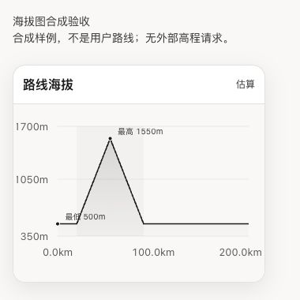
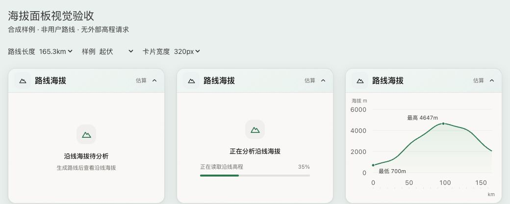
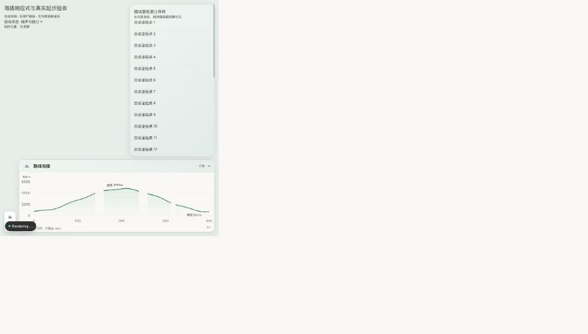
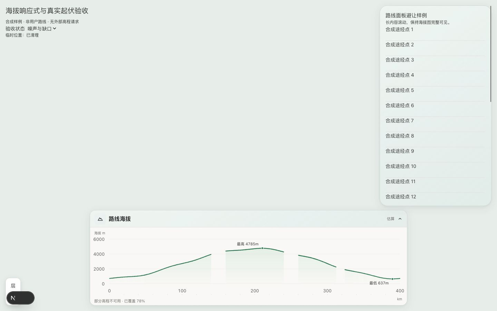
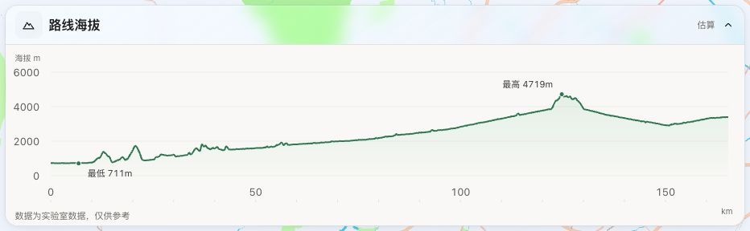
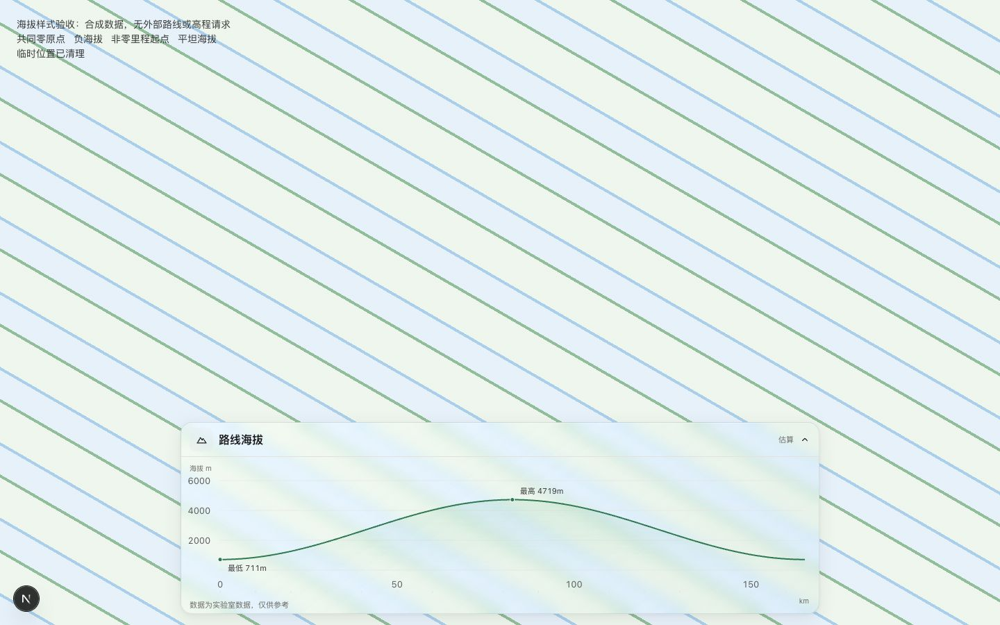
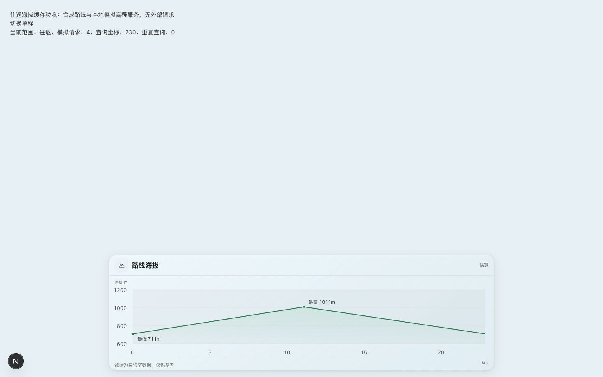
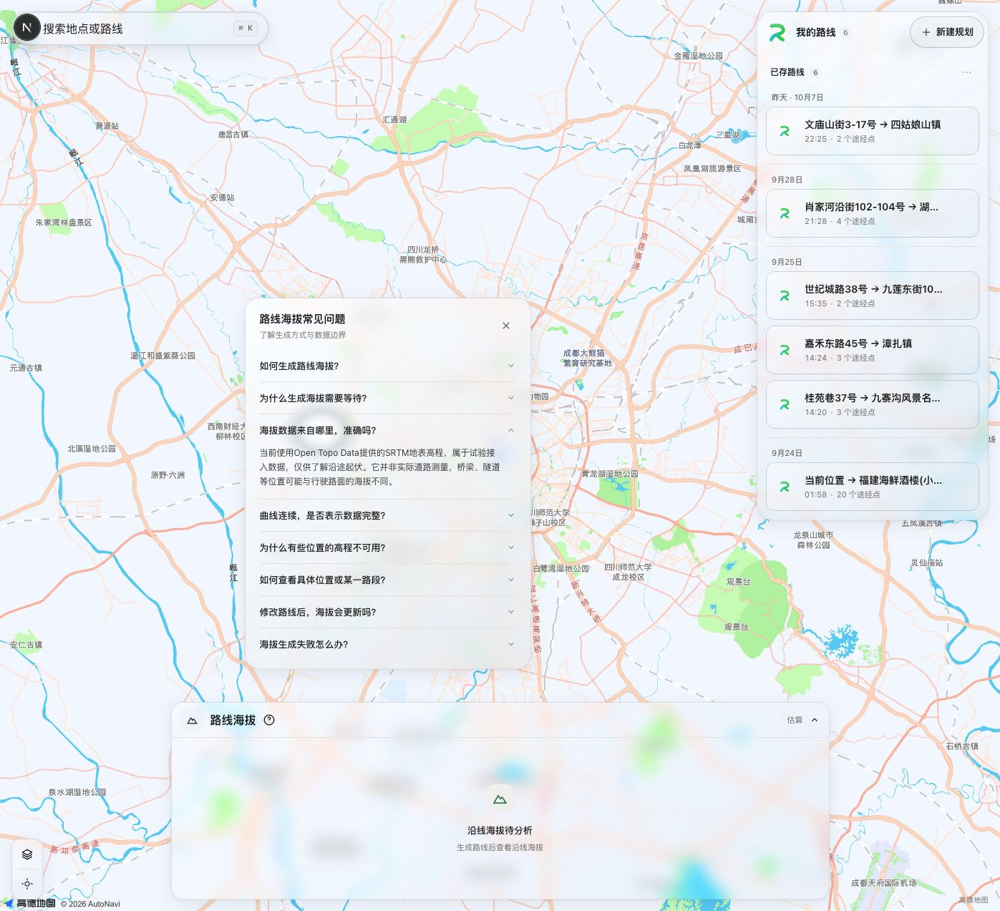
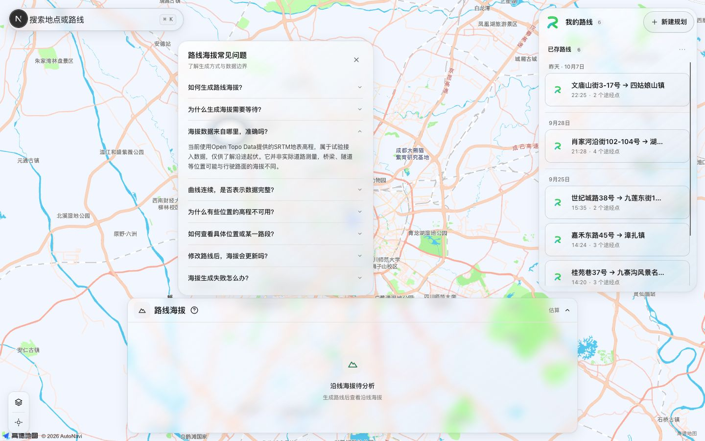

# 路线起伏与持续坡段分析迭代准备与实现记录

当前状态：桌面试验实现已完成；合成算法、异步隔离、浏览器交互与生产构建已有证据。真实道路参考剖面、来源生产许可、共享限流及正式性能验收未完成。下方原准备记录保留历史；新增实现记录说明本次交付与边界。

## 目标与范围

将任意区间海拔与持续长坡需求落为[需求与设计基线](../需求文档/路线海拔与持续坡段分析需求_V1.0.md)，同步MVP、UI、组件规范及AI工作入口，供后续迭代使用。本次只交付文档，页面、算法和高程接入均未实现。

## 问题与根因

现有`ElevationPanel`仅接收`hasRoute`并显示静态占位。原需求有曲线和累计指标，但未明确任意沿线区间、跨控制点长坡、坡段位置和顺序。AB相隔200km且净高差为0，端点差无法反映几十公里的连续升降。

## 关键决策与需求变化

- AC沿原A→B→C查询，支持控制点与任意沿线位置；净高差不能替代持续坡段分析。
- 展示坡段长度、位置、升降与多尺度坡度，不加入电耗、回收量、续航或充电百分比预测。
- 跨控制点长坡连续，选区裁剪后重新统计；缺失/低可信度区域断开，重复经过与去返程保持独立位置。
- 按WWDC25的内容/控制层级与直接反馈设计，沿用单层玻璃、系统字体、灰阶、既有动效；图表可读，内部不叠加滤镜、不新增红绿危险分级。
- 桌面卡片组合范围、曲线、摘要与单个坡段详情，悬停不平移、主动查看才聚焦；H5延续隐藏边界，后续另立入口需求。
- 数据来源与长坡参数为候选/试验，待小范围验证，不将官方文档能力或演示数据写成生产实现。

## 降级策略

高程失败只影响卡片。未知区间不补零、不跨缺口统计；地表估算不是精确桥隧路面，不声称完整识别道路结构。几何变化后清理旧坡段联动，迟到响应不能覆盖新路线。

## 成本与执行范围

修改6份中文文档，无运行代码、依赖、数据下载、安装、提交、push或部署。后续实际查询先说明样例数量与成本，收费、安装、大型数据下载或服务部署遵守明确授权门禁。

## 验证结果

- 只读预检：初始工作树干净，文档路径未命中忽略规则。
- 已读取AI/Web入口、相关产品/UI/组件规范及现有卡片和路线契约，并核查Apple官方WWDC25与图表资料。
- 未构建应用或做浏览器验收；本次无运行代码变化，文档检查不能代替高程精度、坡度或LCP/CLS验收。
- 独立文档复核已完成，结果见下方交付检查记录。

## 已知边界与下一阶段

高程国内访问、授权、坐标转换、垂直基准、桥隧证据和长坡阈值待验证。按专项需求第12节先完成小范围数据可行性，再实现领域算法与桌面卡片；ELEV验收全部通过前，功能保持待完成。

## 交付检查记录

- 6份文档的17处相对链接均有效，代码块闭合与换行格式通过；新增文档的空白和表格结构已检查。
- 正式规范与专项需求在任意沿线选区、沿原路线、跨点长坡、车辆计算排除、桌面/H5边界及待实现状态上保持一致；MVP、UI和组件文档版本分别更新为V0.16、V1.17和V1.22。
- 独立核对4组连续合成剖面数值：全程0–200km累计升降各1050m；0–35km净升450m；30–45km净升450m；30–70km升750m、降450m、净升300m。这里只验证文档示例，算法尚未实现。
- 最终差异格式检查通过，变更范围仅为4份既有文档与2份新文档；未执行commit或push。

## 实现记录（2026-10-07）

### 目标与授权范围

按专项需求实现桌面路线起伏与持续坡段分析。用户在预检汇报后以“go ahead”授权实现，并单独授权本次使用已安装的统一计算机操作插件进行浏览器验证。没有安装依赖、提交、push或部署；未修改用户已有路线方案。浏览器验收使用临时合成页面，明确标注“不是用户路线；无外部高程请求”，验收后已移除。

### 领域、组件与地图职责

- `domain/elevation-analysis`保存有向位置、区间、原始高程、分析样本、质量、持续坡段与集中参数；沿供应商返回的道路折线测距，保留控制点边界和经过序号。AC沿原A→B→C，不请求直达路线；去返程同坐标不去重，跨控制点不重置坡段。
- `infrastructure/elevation-analysis`负责坐标转换、固定来源查询、限流、原始/分析缓存与工作线程；原始结果最多保留4条几何、6小时，服务端坐标缓存24小时且限制30000点。缓存依赖几何、实际采样策略、坐标转换/来源与算法版本；选区复用已加载剖面。
- `useRouteElevationAnalysis`绑定方案、修订、供应商、去返程范围和几何；取消、收起、修改与切换中止在途任务，迟到响应不回写。几何更新后旧剖面不可用，地图联动立即清理。
- `ElevationPanel`是轻量入口，首次展开才分包并查询；视图拆成范围、曲线、摘要与坡段详情。范围、目录和数据说明在同一正文内替换，预留272px异步区域；展开上限320px，短视口与详细内容内部滚动。H5隐藏且不启动任务。
- 全程、工作台已有路段、任意控制点、输入里程和曲线双端选区均可用。裁剪重算累计指标、坡段和窗口；局部查看保留父区间。未知区间断线并使用斜纹，零米/负海拔有效。
- 曲线悬停与方向键仅更新临时位置，按绘制帧节流；选坡段只读高亮，主动“查看此段”才适配地图安全区并局部放大曲线。高德与腾讯采用独立图层，不触发插点、不修改路线、不重建地图；销毁与清理已有适配器测试。

### 参数与算法决策

算法版本为`experimental-v1`，全部集中于`ELEVATION_POLICY`，尚未按真实道路定版。

| 参数 | 当前试验值 | 目的与边界 |
| --- | --- | --- |
| 沿线采样 / 连续样本间隔上限 | 100m / 150m | 保留控制点与端点；已有50m合成对照，真实道路对照待补 |
| 道路连接容差 | 1m | 超出容差标记断点；不画成连续路面 |
| 垂直去噪容差 | 5m | 对连续已知样本进行垂直误差简化，再回填分析样本；绘图抽稀独立 |
| 局部 / 趋势窗口 | 500m / 2km | 窗口坡度明确位置和长度，不称瞬时最大坡度 |
| 方向 / 局部 / 趋势识别坡度 | 0.1% / 0.5% / 0.1% | 候选方向结合多尺度确认，缓长坡不只看全程端点差 |
| 平缓间隔 / 小反向间隔与高度 | ≤500m / ≤200m且≤5m | 有界合并，明显反向和未知区间结束坡段 |
| 重点坡段最小长度 / 净升降 | 5km / 100m | 不把所有起伏强制放入目录；裁剪后允许显示原长坡的较短部分 |
| 异常原始相邻坡度 | >35% | 相邻异常样本降为低可信度；不能替代桥隧识别 |

验证发现逐样本窗口确认会把峰顶附近的边界裁掉，在50m样例中少算50m；已改为多尺度确认整个连续候选，边界与统计由未抽稀分析样本决定。图表先按质量拆分连续片段，再抽稀，避免把绘图点间距误判为数据缺失。选中区间同时使用背景带和加粗线，控制点按完整行驶顺序编号。

### 数据来源与降级

试验来源为[Open Topo Data 公共API](https://www.opentopodata.org/api/)的`srtm30m`、双线性插值；[SRTM数据说明](https://www.opentopodata.org/datasets/srtm/)标记为v3。[USGS产品说明](https://www.usgs.gov/centers/eros/science/usgs-eros-archive-digital-elevation-shuttle-radar-topography-mission-srtm-1)给出WGS84、EGM96、米和约30m水平分辨率，采集时期约为2000年。GCJ-02道路坐标经近似迭代逆解转换后查询，数值参考点校验不等于真实道路定位精度验证。

已做少量公共测试点的真实连接与本地服务转发：上游和本地接口均返回200；记录的直接查询约1163ms、本地两点转发约1523ms。这只证明本次网络可达与批次格式，不证明国内长期可用性、精度或服务SLA，也不是五类真实道路验收。

[公共额度](https://www.opentopodata.org/#public-api)为每批最多100点、每秒1次、每日1000次。本实现单进程串行队列间隔1100ms、日预算950次、等待队列上限12；上游15秒超时，客户端单批40秒超时。1000km以100m采样约101批，公共源冷查询可能超过百秒；页面展示真实批次进度，不伪造完成比例。失败后停止新增批次，已覆盖部分独立展示；全失败仅卡片报错，允许重试。

生产环境默认返回503，须完成公共服务许可/缓存用途复核、五类道路参考剖面及共享限流配置后，再显式设置`ELEVATION_PUBLIC_API_ENABLED=1`。本次未修改环境文件，也没有部署。单进程预算不能约束多实例的合计额度；如生产需求超出公共试验服务，应另选符合额度和数据授权的高程服务。

当前路线契约无可靠桥梁/隧道/高架结构标记，所以统一提示地表估算，不能声称精确道路结构已识别。缺失/低可信度处不补零、不跨缺口统计或合并；低可信度没有确定长坡提示。只向来源发送必要采样坐标，不发送方案名、用户身份；不增加云端路线仓储，响应禁止公共缓存，普通日志不输出坐标或路线。

### 验证证据

| 验证层 | 结果 | 证据范围 |
| --- | --- | --- |
| 高程领域、缓存与来源归一化 | 15项通过 | 200km连续剖面、零高差长坡、反向顺序、50/100m对照、裁剪、噪声、断点、零/负值、返程、抽稀、取消与失败；130001顶点密集道路几何无参数展开溢出 |
| 高程Hook生命周期 | 4项通过 | 未展开零查询、缓存范围、几何/方案/供应商切换、路段同步、收起取消及重试 |
| 高程API | 5项通过 | 正式开关、来源限制、大小与坐标校验、零/负/空值、异常独立降级 |
| 地图包 | 41项通过，构建通过 | 新增两家高程图层生命周期验证；既有算路、返程、取消、道路标注与视野回归 |
| 原路线规划回归 | 8项通过 | 单程/往返补算、取消、失败、缓存、策略与方案隔离 |
| Web | 类型检查、变更文件静态检查、生产构建通过 | 高程分包与工作线程完成打包；构建路由不包含临时演示页面 |

合成样例实测全程累计升降各1050m、净高差0，20–55km与55–90km分别为35km坡段、平均坡度约±3%；30–70km为累计升750m、降450m、净升300m。跨35km控制点不切断长坡；30–45km长度15km、升450m。

本机macOS的Node领域验证：两次收尾测试中，200km/2001样本分析27.32–33.40ms、缓存区间计算1.56–2.23ms；1000km/10001样本分析130.28–160.23ms、缓存区间计算1.75–3.27ms。数值来自本次测试进程，含VM运行成本，不能等同浏览器主线程预算。依据此证据，超过5000样本放入工作线程；线程超时、错误或取消会终止并独立降级。另以130001顶点、约1000km密集折线验证几何处理111ms；几何仍在主线程生成，真实大几何的交互阻塞预算待生产实测。

实际Chrome、本机开发服务、未限速网络的合成页面：1000km/10001样本工作线程分析127ms（含启动和消息往返）；公共高程请求为0，模拟查询101批。200km合成页面观测LCP约856ms、记录到的CLS为0；根工作台一次记录到既有任务面板CLS约0.000269。没有生产模式前后基线、低端设备、帧率和完整公共源首结果耗时，不能据此宣称ELEV-011或全页面CLS=0通过。

浏览器验证覆盖范围输入、双端拖动、方向键逐样本调整与焦点保持、目录顺序、只读高亮、临时定位、主动聚焦及返回父区间。选坡段时高亮跨控制点两条路径，聚焦计数仍为0；主动查看才增加聚焦。30–70km及拖动后的统计随范围改变且模拟请求计数不增加。缺失样例显示覆盖85%、曲线断开和斜纹；390px根工作台隐藏地形入口。地图SDK真实底图的点击联动与系统强制颜色/透明度偏好未作完整浏览器验收，适配器测试和CSS回退不能替代这些项目。

### 正式验收边界与下一阶段

| 专项项 | 本次状态 |
| --- | --- |
| ELEV-001～004 | 算法与合成交互有证据；真实道路及参数定版未完成 |
| ELEV-005、007、008、012 | 请求隔离、降级与地图契约有回归证据，合成页面联动已验证；真实供应商场景完整浏览器复核待补 |
| ELEV-006 | 缺失/低可信度与零/负值处理通过；五类真实道路和独立参考剖面未完成，结构识别数据未接入 |
| ELEV-009、010 | 基础视觉与键盘选区已验证；复杂底图可读性、辅助技术与系统偏好回退实测待补 |
| ELEV-011 | 分包、稳定容器、线程及长样本处理有证据；生产LCP/CLS无回退、首结果及帧率完整验收待补 |
| ELEV-013 | 界面与领域均未引入车辆参数或车辆能耗预测 |

正式启用前需选择有独立参考剖面的平原、盘山、缓长坡、长隧道及桥梁/高架道路，对照50m与100m采样、坐标偏差、累计指标和误报/漏报；复核生产许可/缓存用途并配置共享额度；在生产模式记录设备、网络、冷/热缓存的首结果、选区帧率及LCP/CLS前后基线。相关证据未完成前继续标注试验，专项验收不勾选全部通过。

同步产品基线V0.17、UI规范V1.18、组件规范V1.23及Web工作入口，移除“静态占位/扩展待实现”的过期表述；专项需求保持V1.0并更新真实状态。

最终收尾：共73项相关测试通过；变更文件静态检查、地图包构建、Web类型检查及生产构建通过；19处本地文档链接有效，差异与新增文件无尾随空白。临时合成页面已移除，构建自动改写的`next-env.d.ts`已恢复；没有新增被跟踪的构建目录或被忽略文件变更，未暂存、提交或push。

## 海拔面积图收敛（2026-10-07）

### 目标、范围与授权

用户明确要求“图上做加法，其他展示区域做减法”，暂不设置详情，并指定直接使用已安装的Recharts。本轮确认Web依赖为`recharts ^3.10.1`，保留用户已有的依赖清单与锁文件修改，没有重复安装。用户另行授权本轮使用统一计算机操作插件检查本地页面；未提交、push或部署。

### 关键决策与功能变化

- `ElevationPanel`标题收敛为“路线海拔 · 估算”，收起48px，展开上限276px；加载、错误与图表共用正文尺寸。
- Recharts的`AreaChart`、`Area`、坐标轴、`ReferenceArea`、`ReferenceDot`与`Tooltip`承载图形、读数、极值和坡段信息；保持首次展开后加载，不手写通用绘图/坐标轴/键盘浏览。
- 近黑线条配暖灰低透明渐变，采用线性连接，不用渐变编码坡度或风险。最高/最低点直接标注，平坦样例合并重复极值。
- 长坡用轻量区间带定位，图内提示显示里程、估算海拔、长坡长度和平均坡度；左右方向键也能浏览，地图只显示临时位置。
- 删除当前组件树中的范围编辑、累计升降数字区、坡段目录、固定详情、数据说明入口及操作提示。默认全程，已有地图选段继续同步范围；领域区间/统计/坡段能力保留，无主动聚焦入口。
- `route-elevation-chart-data`只处理展示数据：连续有效区间分别抽稀，保留极值和坡段边界；缺失/低可信度转为空值，已知样本之间的道路断点显式插入空值。统计继续使用完整分析样本。

### 问题与根因

浏览器初验发现悬停读数可见但地图临时位置立即清空。原因是内联Tooltip渲染函数随图表重渲染成为新的组件身份，旧组件卸载触发清理。改用稳定Tooltip组件元素后，悬停及键盘位置更新正常，失焦与收起仍清理位置。

测试文件首次静态检查因临时模块变量名触发Next.js规则，改为`scriptModule`后检查通过。第一次文本替换工具因同一补丁对文件同时删除与新增拒绝执行，拆分操作后完成，未产生部分修改。

### 降级与已知边界

未知区间断开线与填充，取消密集斜纹；不完整时保留一句覆盖提示，图内极值仅代表已覆盖区间。完全失败仍提供短说明与重试。H5继续隐藏海拔入口，不引入新高程任务。

本次没有修改数据来源、采样、去噪、持续坡段识别或地图供应商接口。公共高程仍为地表试验来源；真实桥隧路面精度、生产LCP/CLS、长期额度及完整系统偏好验收沿用前述待验收边界，不把合成图或生产编译成功视为正式数据/性能通过。

### 验证结果

| 项目 | 结果与范围 |
| --- | --- |
| 展示数据回归 | 3项通过：缺失/低可信度与零/负值；道路断点/超长间隔；抽稀保留极值且不修改完整样本 |
| 静态检查 | 本轮4个组件/展示模块及测试文件检查通过 |
| Web生产构建 | Next.js编译、TypeScript及17个页面生成通过；临时验收路由未进入构建 |
| 浏览器合成验收 | 完整、缺失、负海拔、平坦样例；悬停长坡读数、左右键位置更新、收起清理、390px隐藏边界通过；缓存浏览未新增样例查询 |
| 地图联动证据 | 临时样例回调收到对应坐标；未操作用户方案，真实地图供应商完整场景仍待独立复核 |
| 文档同步 | MVP V0.18、UI V1.19、组件V1.24、专项需求V1.1及Web入口同步；沿用专项需求原文件名 |

浏览器验收使用临时合成页面并注记“不是用户路线；无外部高程请求”，验收后已移除。生产构建自动改变的`next-env.d.ts`恢复原开发引用。以下截图仅用于检查视觉层级，不代表真实用户路线或道路数据精度：

## 海拔状态、绿色面积与整值刻度优化（2026-10-07）

### 目标与范围

用户根据无路线、加载和完成三张截图提出视觉优化，并确认中深绿曲线、淡绿面积、整值刻度及数字标签密度方案。本轮仅修改海拔展示、刻度与相关规范，保留进入本轮前已有的未提交修改；不修改高程来源、采样、坡段识别、依赖或地图供应商接口。

### 关键决策与功能变化

- 提取`ElevationAnalysisStatus`，统一空态、模块准备、真实查询进度和失败重试。居中山形图标与主辅文案建立层级，查询进度使用4px圆角细条与百分比，读取Hook提供的`completed/total`，不在视图重复推算批次，不伪造海拔曲线。
- 专用Token：曲线`#34845B`，线宽2px；填充`#64BC83`，透明度从22%向1.5%淡出。单位单独呈现，灰阶文字与浅网格保持可读；图形颜色不编码坡度、危险或路况。
- `route-elevation-chart-axis`负责展示刻度：显示跨度除以25后向上取1／2／5整值，小刻度最多26个；标签以小刻度的1／2／5整值倍数排布，按绘图区宽度保留最多六个。500km小刻度20km、标签100km；1000km小刻度50km、标签250km；165.3km标签0／50／100／150。路线范围保持原始端点，选中路段继续使用全程累计里程。
- 海拔轴使用整值与最多四条浅水平网格，平坦／负海拔不强制零起点；极值标注向图内及上下避让，同海拔平坦样例仅显示一条“海拔”标注。未知区间继续断线、断填充，部分覆盖说明保持可用。
- 保持276px展开卡片、48px标题、首次展开惰性加载与H5隐藏。键盘焦点样式覆盖Recharts实际可聚焦的SVG表面。

### 问题与根因

旧加载态直接使用浏览器原生进度条，形成过重的绿色／灰色矩形；旧横轴固定起点、中点、终点，产生82.7km等不便扫读的分割值。浏览器验收还发现高度为0的辅助轴不会被Recharts绘制，已改成4px轴高并通过实际节点确认小刻度出现，仍由库提供坐标位置与渲染。

### 验证结果

| 项目 | 结果与范围 |
| --- | --- |
| 展示与刻度回归 | 7项通过：原有缺失／断点／抽稀3项，新增500／1000km规则、非整里程与路段口径、短路线／窄面板／异常范围、平坦／负海拔整值轴4项 |
| 静态检查 | Web完整lint通过；类型检查通过 |
| Web生产构建 | Next.js编译、TypeScript与17个页面生成通过；临时验收路由已移除，构建改写的`next-env.d.ts`恢复开发引用 |
| 真实页面 | 当前本地缓存165.3km路线显示绿线、淡绿面积和0／50／100／150标签；未编辑用户控制点或重新触发高程查询 |
| 合成浏览器验收 | 500km为26个小刻度／6个标签；1000km为21个小刻度／5个标签；0.5km标签小数可辨。平坦仅一个极值标注，负海拔、缺失覆盖说明、选段累计口径及240px标签减量通过 |
| 状态与交互 | 空态／加载／图表卡片均320×276px、正文226px；查询6／17显示35%与细圆角条；左右键显示读数与临时位置，失焦后清理；受控390px视口按共享CSS规则隐藏海拔面板 |
| 工作树检查 | 差异空白检查通过，未发现被跟踪的`.next*`、`dist`、`coverage`、`node_modules`或类型缓存；未提交、push或部署 |
| 文档同步 | UI V1.20、组件V1.25、专项需求V1.2与Web入口同步；本主题迭代记录续写 |

### 降级、已知边界与后续建议

保留无路线说明、失败重试、未知高程断开、系统强制颜色与减少透明度回退；不完整数据的极值仍仅代表已覆盖区间。浏览器合成页切换数据、宽度及提示位置时观测到非零布局偏移，同尺寸卡片证据不能替代整页CLS=0验收。本轮没有生产模式LCP／CLS前后对照；首次真实高程读取、低端设备、真实桥隧路面精度与完整系统偏好验收仍沿用前述待验收边界。

合成验收页未读取用户方案，也未请求外部高程，验收完成后移除；以下截图仅展示三种状态的布局与颜色：

## 海拔响应式宽度与单调平滑优化（2026-10-07）

### 目标与范围

用户根据真实路线截图要求平板沿可用宽度铺开、大屏居中且最宽920px，并指出真实折线与此前平滑验收图的差异。只读预检后说明布局与平滑方案、侧栏遮挡风险及验证成本，用户以“go”确认执行。本轮保留既有未提交修改，仅调整展示布局、曲线连接与相关回归和规范。

### 关键决策与功能变化

- 沿用760px手机边界：≤760px隐藏；761–1063px左侧至少72px、右侧至少16px，宽度为`min(920px, 100% - 88px)`；≥1064px以920px水平居中。1064px由920px图表加两侧72px空间推导，不根据设备型号判断。
- 761–1599px时右侧路线面板与海拔图横向范围重叠，侧栏为收起48px／展开上限276px预留空间，垂直间距12px，长内容滚动。≥1600px时920px图表与324px侧栏横向分离，侧栏恢复正常高度。共享展开高度变量，短窗口同步缩减海拔高度；取消高度过渡，避免收起／展开过程中短暂遮挡。
- 连续有效区间从`linear`改为`monotoneX`单调平滑，仍设置`connectNulls=false`。只柔化样本之间的连接，不改变原始读数、极值、累计升降或持续坡段统计；缺失和低可信度区间继续断线、断填充。
- 此前合成验收主要使用平滑数学曲线，真实路线存在细小起伏、噪声与高程缺口，线性连接使两者视觉差异明显。本轮增加4001点、交替噪声、40km缺口及独立极值的样例，明确验证真实数据形态相关的展示边界。

### 验证结果

| 项目 | 结果与范围 |
| --- | --- |
| 展示与刻度回归 | 8项通过；新增密集噪声与未知缺口回归，保留极值与缺口边缘，原始样本及统计不变 |
| 静态检查与构建 | Web完整lint通过；生产编译、TypeScript与17个页面生成通过，临时路由已移除，构建改写的`next-env.d.ts`恢复开发引用 |
| 手机边界 | 760px隐藏；761px显示宽673px，左72px、右16px，与地图工具间距12px |
| 平板与居中边界 | 834px宽746px；1024px宽920px；1064px起左右空间相等，居中偏差为0 |
| 桌面与短窗口 | 1440／1600／1920px图表均宽920px且居中；1024×400px侧栏高度80px、内容滚动，图表与侧栏无重叠 |
| 收放与状态 | 834×900px下收起／展开均与侧栏保持12px；空态、加载、失败、平坦、负海拔与选段共用卡片尺寸；平坦仅一个海拔标注 |
| 曲线与缺口 | 密集噪声样例产生平滑曲线路径，缺口仍断开；选段保留全程累计里程，键盘读数显示临时位置，失焦后清理 |
| 真实页面只读复核 | 本地缓存约329km往返路线卡片宽920px并居中，曲线采用平滑连接且保留缺口；未修改用户控制点或触发新的高程查询 |
| 文档同步 | UI V1.21、组件V1.26、专项需求V1.3与Web入口同步；本主题迭代记录续写 |

### 已知边界与验收证据

平滑连接不会消除真实细小起伏或数据噪声，也不会补齐未知海拔。生产模式LCP／CLS前后对照、真实道路高程精度及完整系统偏好仍待独立验收，本轮编译与浏览器几何检查不替代这些证据。

以下截图来自明确标记“合成样例、非用户路线、无外部高程请求”的临时验收页，包含密集起伏与78%覆盖缺口，并使用生产图表及布局样式。截图用于核对响应式宽度、侧栏避让和曲线形态；验收页已移除，浏览器视口已恢复。

## 海拔缺口连接与参考文案（2026-10-07）

### 目标、诊断与范围

用户在了解缺口原因后明确要求连接曲线，并将“部分高程不可用 · 已覆盖81%”替换为“数据为实验室数据，仅供参考”。该指令授权本轮直接执行；覆盖之前“未知区间断线断填充”的展示决策。本轮只修改图表连接、提示文案及相关规范，不调整数据来源、查询、异常阈值、领域分析或布局。

诊断发现断点既可能来自服务返回空值，也可能来自批次查询失败后停止后续查询、相邻原始高差对应坡度超过35%被标记低可信度，以及道路断开／采样距离超过150m。覆盖率统计的是连续有效里程，不能等同于“未查询到海拔的点占比”。截图本身不足以确认某一真实缺口的具体来源。

### 关键决策、功能变化与降级

- `RouteElevationChart`设置Recharts `connectNulls=true`，有效点使用`monotoneX`跨缺口连接，淡绿面积同步连续；仍保留空值与道路断点，不插值补写海拔，不跨缺口统计升降或合并坡段。
- `ElevationAnalysisView`所有成功图表常驻用户指定文案“数据为实验室数据，仅供参考”，移除底部覆盖率。文案是展示调整，实际数据仍来自试验性公共地表高程，未引入新的实验室来源。
- 缺失点悬停仍显示“高程不可用”，屏幕阅读器说明缺口连接为视觉过渡、极值只代表有效数据；无可用结果时仍使用失败提示与重试，不生成虚构曲线。
- 数据转换回归继续检查空值与统计隔离；原测试名称中“不会被面积图连接”改为“保留供读数识别的空值”，使名称对应其实际断言范围。

### 验证结果与边界

| 项目 | 结果与范围 |
| --- | --- |
| 相关回归 | 已有8项展示数据／刻度回归通过，空值、极值与统计样本保留；未新增重复实现的测试 |
| 静态检查与构建 | 本轮3个修改模块静态检查通过；Web生产编译、TypeScript与17个页面生成通过，构建改写的`next-env.d.ts`恢复开发引用 |
| 浏览器真实页面 | 当前本地缓存约165km单程路线：曲线与面积各只有一段连续路径，包含1400段平滑连接，宽度920px；底部文案完全匹配用户指定文本 |
| 文档同步 | UI V1.22、组件V1.27、专项需求V1.4及Web入口同步，前述迭代保留历史决策 |

当前页只读核对，未调整用户路线、未重新发起高程查询。曲线连接是视觉过渡，不能替代实际测量；生产LCP／CLS与真实道路高程精度仍沿用已有独立验收边界。本轮不提交、push或部署。

下图截取当前本地路线的海拔卡片，仅用于核对连续曲线与参考文案：

## 海拔毛玻璃、鼠标焦点与共同原点优化（2026-10-07）

### 目标、范围与问题根因

用户要求取消悬停变米白的效果、让内容与标题使用同一毛玻璃、移除图表蓝色选中框，并询问合并原点处两个“0”。本轮按该明确修改指令执行，只调整海拔样式与重复刻度标签，保留既有工作树修改。

标题米白来自海拔按钮的通用悬停规则，正文不透光来自其单独设置的实色背景。已有图表只定制了`:focus-visible`，鼠标点击后的普通`:focus`仍会显示浏览器默认蓝色轮廓。两处“0”分别为公里与海拔标签，仅在共同零原点时可省略重复文本。

### 关键决策、功能变化与降级

- 移除海拔按钮悬停底色，面板关闭指针跟随高光；正文透明，统一透出外层既有10px模糊与160%饱和度玻璃，不增加滤镜、尺寸状态或依赖。
- 图表普通`:focus`清除默认轮廓，`:focus-visible`继续使用冷灰键盘焦点；保留Recharts可访问性层、左右方向键、提示读数与临时位置清理。
- 里程起点与海拔轴下限同时为零时，只保留横轴原点的“0”；不调整刻度、网格、范围、样本或统计。负海拔、非零里程起点及平坦非零海拔保留必要标签。
- 减少透明度、增强对比度、强制颜色及不支持滤镜时沿用既有降级。正式需求V1.5、UI V1.23与组件V1.28同步更新。

### 独立验证结果

| 项目 | 结果与范围 |
| --- | --- |
| 静态检查 | 修改图表模块ESLint通过；在Web目录明确执行非增量TypeScript检查通过；差异空白检查通过 |
| 已有回归 | 8项海拔展示数据与刻度回归通过，未新增重复实现的测试 |
| 悬停与材质 | 1440×900px下标题实际处于悬停时背景仍透明，面板高光值为0；正文透明，外层为10px模糊与160%饱和度，卡片仍为920×276px |
| 鼠标与键盘 | 鼠标点击图表时焦点存在、轮廓为none；Tab进入图表后冷灰2px提示保留，方向键正常显示里程／海拔读数并触发临时位置联动，切换样例后清理 |
| 原点边界 | 正常样例只显示一个0；负海拔样例保留纵轴-200／0／200／400，非零里程样例保留纵轴0，平坦样例保留450／500／550及单一海拔极值标注 |
| 正式工作台 | 未加载用户路线时，展开真实`ElevationPanel`后显示空态；正文透明且外层玻璃有效，加载前后固定展开高度276px |
| 验收清理 | 临时合成验收路由已移除，截图保留；未更改用户方案、未为样式验证查询路线或高程 |

本轮未重复完整生产构建；改动未涉及依赖、采样与领域规则。截图使用真实图表组件与生产样式，但数据与背景均为本地合成样例；不能替代真实路线精度、生产LCP／CLS或真机性能验收。

## 往返海拔增量查询与缓存切换（2026-10-08）

### 目标、范围与根因

用户询问开启往返为何再次加载海拔，在了解真实返程需要算路、海拔可复用后，确认实施“保留真实返程算路、复用去程读数、只查询新增位置、合并有向分析”。本轮仅修改海拔缓存基础设施、Hook缓存投影、查询进度展示和相关回归；往返算路、道路采样、数据来源与坡段阈值不变，保留已有工作树修改。

原始／分析缓存以整条有向几何为键，单程扩为往返后键变化，导致全部样本再次进入客户端批次请求。服务端虽已有坐标缓存，仍有重复客户端请求与0%加载占位；部分批次失败后，原实现不保留成功批次到客户端缓存。

### 关键决策与功能变化

- `profile-cache`按`ElevationProvider`实例隔离缓存，原始位置读数使用来源版本与精确坐标为键，6小时有效、最多30000个位置；完整原始／分析缓存继续最多4份。跨方案、方向和几何复用的是位置读数，不合并路线经过位置。
- 新几何先填入仍有效的读数，对未缓存坐标去重后每100点查询一批，再分别回填每次经过的原始样本。里程、路段、经过序号及道路断点保留，合并后重新执行有向质量与坡段分析，不使用绘图抽稀数据替代领域样本。
- 成功批次立即缓存，后续失败保留可用结果；完整分析仅在无查询失败时缓存。取消检查先于批次回填，迟到结果不污染缓存。主动重试清除当前采样坐标旧读数并使该来源实例的完整分析失效；来源异常、数量异常及无效数值不入缓存。
- 组合新几何时，完整缓存有效期不超过被复用读数的最早到期时间，不因往返切换延长旧读数有效期。
- Hook同步读取当前几何的有效完整分析，切回单程或已查询的往返时直接显示曲线；进度按实际新增独立坐标批次统计，无查询但需分析时显示“正在整理海拔曲线”。完整分析缓存命中时不再显示0%占位。
- 专项需求V1.6、UI V1.24、组件V1.29与Web入口同步。客户端新增缓存均为内存缓存，不新增本地持久化、依赖或外部服务。

### 独立验证结果

| 项目 | 结果与范围 |
| --- | --- |
| 缓存回归 | 新增7项通过：真实单程扩为往返仅查询新增位置；相同坐标反向经过无新请求且上下坡独立；重复经过／零米／负值／空值；部分失败恢复与主动重试；取消迟到与来源实例隔离；到期与不续期；来源／数值／数量异常 |
| Hook与领域回归 | 5项Hook与15项领域回归通过，共27项；新增Hook验证切回已缓存范围时同步保留正确曲线，无额外请求 |
| 静态检查 | 修改模块及相关测试ESLint通过，Web非增量TypeScript检查通过，差异空白检查通过 |
| 生产构建 | 编译、TypeScript与17个页面生成通过；临时验收路由已移除，构建自动改写的`next-env.d.ts`恢复原开发引用 |
| 实际浏览器 | 1440×900px下真实`ElevationAnalysisView`配合本地模拟来源：单程2批／113坐标；首次往返仅追加2批／117坐标，共230坐标，重复查询0；随后单程／往返切换保持4批、230坐标且直接显示曲线，无加载占位 |
| 有向统计 | 浏览器单程约11.1km上坡；往返保留原上坡并增加约11.8km下坡，均使用实际合成折线而非旋转去程图形 |
| 清理与证据 | 未加载或修改用户方案，未请求外部路线或高程；临时验收页已移除，保留合成验收截图 |

首次回归中有一处断言因隔离执行环境数组原型不同而失败；将返回数组转换到测试环境后通过。该问题属于测试数据比较方式，未通过重复运行掩盖产品错误。

### 降级与已知边界

同一路面反向采样位置可能因累计距离网格不同而不完全重合；本轮只复用精确坐标，不做近邻匹配或插值伪造读数，新位置仍需真实查询。缓存过期、页面刷新、来源实例变化或主动重试可能再次查询。部分失败沿用缺失读数与现有提示，不把失败缓存成完整成功分析；服务端共享限流、多实例缓存、真实道路精度与生产LCP／CLS仍需独立验收。

以下为明确标记合成路线和本地模拟来源的验收页，不是用户真实路线，也不作为道路精度或外部额度验证：

## 标题问号与海拔FAQ帮助（2026-10-08）

### 目标、范围与关键决策

用户确认此前整理的8条FAQ，并要求在海拔标题右侧增加问号，点击打开符合现有WWDC视觉风格的帮助浮层。本轮仅修改海拔入口、帮助展示、共享问号图标及规范；保持进入本轮前已有的路线目录、样式和文档修改，不安装依赖、不调整查询或分析算法。

现有标题整行是收放按钮，直接把帮助按钮嵌入会形成嵌套交互。新增`RouteElevationHelp`与收放按钮同级，18px圆形线性问号保持44×44px点击区，使用原有图标系统。帮助在桌面无路线、收起、加载、失败与成功状态均可访问，不依赖Recharts加载或高程结果。

长FAQ使用非模态帮助浮层与原生details，逐条展开、默认收起，保留8条生成／等待／来源／曲线连接／不可用读数／查看路段／缓存更新／失败说明。浮层最大400px宽、20px圆角、单层overlay玻璃，标题15px、问题13px、正文12px，复用灰阶及系统偏好回退。通过Portal移至body，避免海拔面板overflow裁切及祖先玻璃叠加；不添加遮罩，不改变地图或海拔卡片高度。

浮层只在打开时测量问号和自身位置、监听外部点击／焦点与尺寸变化，优先向上打开，与入口间隔8px，视口边距至少16px，高度按上下可用空间限制、最多560px，超出内容内部滚动。再次点击、关闭按钮、点击外部或焦点移出均可关闭；Esc停止冒泡、只关闭FAQ并归还问号焦点。卡片收放或切至H5时卸载帮助状态，清理监听器与ResizeObserver。

### 问题、修正与降级

短窗口初验发现仅按视口高度限制浮层会覆盖问号。改为按入口上下较大的可用空间限制高度后，761×400px浮层为400×314px、距顶部16px，与问号间隔8px，入口可再次点击关闭。长内容保留原生键盘与滚动能力，不增加焦点锁定。材料透明度、对比度与强制颜色沿用共享实色回退，减少动态效果时关闭淡入和箭头过渡。

### 独立验证结果与边界

| 项目 | 结果与范围 |
| --- | --- |
| 静态检查 | 新帮助组件、海拔入口与共享图标ESLint通过，差异空白检查通过 |
| 生产构建 | 最终源码编译、TypeScript与17个页面生成通过；修正短窗口后重新验证，构建改写的`next-env.d.ts`恢复开发引用 |
| 实际页面 | 标题问号44×44px，8条问题可独立展开；打开帮助不改变约165km缓存路线与海拔展开状态 |
| 键盘与关闭 | Enter打开帮助，Tab进入关闭按钮，Enter展开原生问题；关闭按钮／Esc归还问号焦点，Esc不收起图表；点击图表底部参考文案可关闭帮助 |
| 响应式 | 834×900px浮层在视口内；761×400px内容滚动且入口不被覆盖，再次点击问号关闭；760×400px卡片隐藏、帮助入口与浮层卸载 |
| 无路线／收起 | 新验收标签页未加载用户路线；问号可打开帮助，海拔保持收起，未挂载海拔查询视图 |
| 清理与文档 | 临时浏览器页已关闭，视口覆盖恢复；MVP V0.19、UI V1.25、组件V1.30、专项需求V1.7与Web入口同步 |

本轮没有修改用户路线或重新生成高程；只增加用户主动打开的帮助内容和定位监听，未新增依赖、缓存、持久化或外部数据源。固定入口与Portal不会通过文档流推动海拔或地图布局；正式LCP／CLS和完整系统偏好仍须独立实测，不能将浏览器几何与构建成功写成性能验收通过。不提交、push或部署。

后续用户要求问号再向左移10px，并希望展开答案时向下增加高度。问号CSS左偏移改为114px；定位改为预留最大展开高度、固定顶边，避免原ResizeObserver每次按当前高度对齐底边导致浮层向上顶。1397×1273px浏览器中展开来源说明：顶边始终416px，高度445→519px，底边向下增长74px；视口空间用满后内部滚动。最终模块静态检查、生产编译与TypeScript再次通过。恢复页面焦点到body／html不再自动关闭FAQ，外部控件焦点与点击关闭保持可用。

以下为未加载用户路线的实际验收标签页中的FAQ与标题入口截图，仅核对帮助内容、入口间距与视觉层级：

## FAQ浮层吸附与共享Popover（2026-10-08）

### 目标、根因与范围

用户指出FAQ浮层与问号分离，要求参考Ant Design的多方位吸附，并明确授权安装Popover依赖与浏览器插件验收。上轮为了保持答案向下增长，以最大展开高度计算顶边，但外框按实际内容收缩，导致收起状态的底边与问号之间留出空隙。

本轮新增`@radix-ui/react-popover`与无领域依赖的共享`components/ui/popover.tsx`，替换海拔帮助中的手写Portal定位、ResizeObserver和外部事件监听；保持已有路线目录、样式及其他工作树修改，FAQ内容、海拔数据及查询规则不变。

### 关键决策、变化与降级

- 使用非模态Popover承载可操作FAQ；共享组件提供12种方位，默认间距8px、视口边距16px，Radix负责翻转、平移、尺寸／滚动跟随和交互清理。帮助默认topLeft，横向偏移-12px，锚点脱离时隐藏。
- 为同时满足紧贴入口和答案向下展开，外框固定520px且不超过当前方位可用高度，答案在固定外框内向下展开，超出内容滚动。取消“外部预留最大高度但外框自动收缩”的定位方式。
- 原生details、44px问号与关闭区、单层玻璃、系统偏好降级保留。关闭按钮／Esc归还问号焦点，Esc不收起海拔；页面焦点恢复到body／html不关闭FAQ。
- 同步MVP V0.20、UI V1.26、组件V1.31、专项需求V1.8与Web入口。

### 验证结果与已知边界

| 项目 | 结果与范围 |
| --- | --- |
| 静态与构建 | Popover、帮助与海拔入口ESLint通过；最终正式源码生产编译、TypeScript和17个页面生成通过；恢复构建自动改写的next-env开发引用 |
| 入口吸附 | 原窗口及834×900px、1440×900px实际页面均保持8px间距；展开来源说明前后外框高度520px、顶边不变，答案在内部向下展开 |
| 短窗口与H5 | 761×400px实际浮层顶部16px、高度315px、入口间距8px、正文可滚动；760×400px帮助入口与浮层卸载 |
| 四边碰撞 | 共享组件本地合成锚点分别验证topLeft→bottom/start、bottomRight→top/end、leftTop→right/start、rightBottom→left/end，均保持8px间距且处于视口内；不是用户路线或数据验收 |
| 键盘与关闭 | Enter打开，关闭按钮及Esc归还问号焦点；Esc后海拔仍展开；外部版权文字点击和再次点击问号均关闭帮助 |
| 清理 | 临时合成验收路由与标签页已移除，视口覆盖已恢复；未加载、修改用户方案或查询外部路线／高程 |

验证中首次合成页以双下划线命名，Next.js将其视为私有目录而返回404；改用普通临时路由完成验证后移除。FAQ原生summary在浏览器DOM快照中为generic，调整验收定位为准确文字后通过，没有修改产品语义。

固定外框与body Portal不推动地图文档流；新增依赖的生产LCP／CLS影响仍需独立性能验收。12种方位属于共享组件API，浏览器专项覆盖四边翻转和两种边缘对齐，未将其表述为全部12种逐一截图验收。不提交、push或部署。

以下为1440×900px实际工作台无路线状态的帮助吸附截图：

