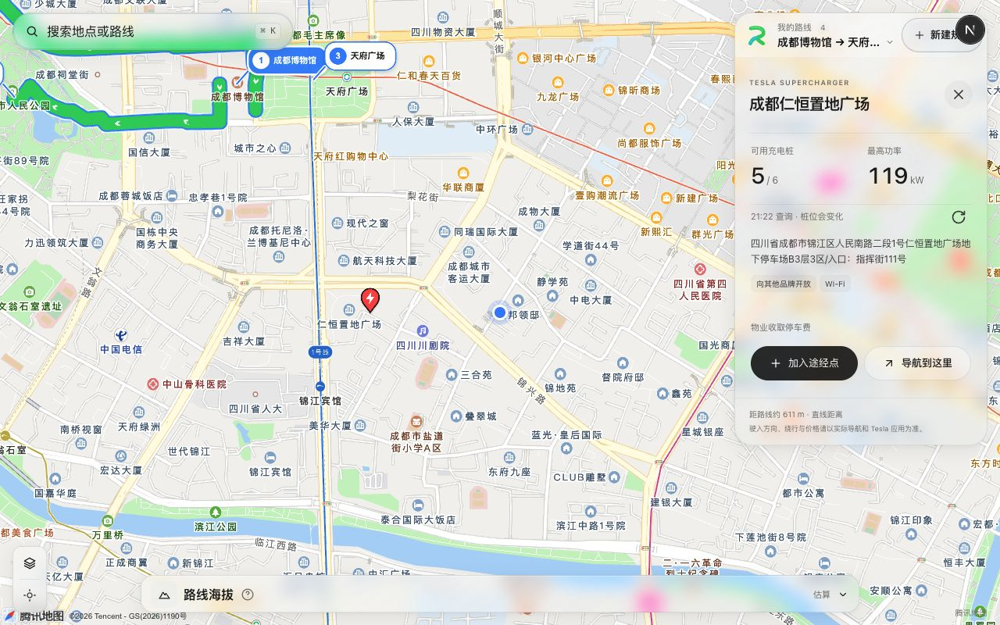

# 腾讯充电站图钉整数尺寸修复

日期：2026-10-09。状态：本地修复完成，未提交、未推送、未部署。

## 目标与根因

用户切换腾讯地图后，SDK 报 `MultiMarker.styles` 的 normal／selected 样式 `MarkerStyle.width` 无效。`setChargingStations` 无论站点是否为空都会设置两种样式；共享图钉使用 `44×2/3=29.333…px` 宽度，腾讯 SDK 的实际尺寸校验拒绝该值。报错来源是充电站图钉样式，不是路段高亮或高程折线。

## 修复范围与决定

仅修改地图包 `charging-station-marker.ts` 的共享视觉输出。画布宽高向上取整为 30×36px，并将 SVG viewBox 从 44×54 扩为 45×54；新增部分为右侧留白，图形本体仍按 2/3 比例绘制。尖端锚点仍为 `(22×2/3,50×2/3)`，普通态与选中态共享尺寸和锚点，选中态继续仅改变描边。

两家适配器自动获得同一有效视觉契约，不增加 DOM、业务请求、依赖或地图重建；不直接取整 SDK 参数后拉伸已有 SVG，也不隐藏错误或关闭图层。点位地理坐标、路段选中与保持视野规则均不变。

[腾讯官方 MarkerStyle 文档](https://lbs.qq.com/webApi/javascriptGL/glDoc/glDocMarker) 说明宽高控制图片尺寸，anchor 以图片左上角为原点并始终对应地理位置。本次整数限制结论来自实际 SDK 报错与修复复核，官方该页仅标注宽高类型为 Number。

## 验证

- 新增 Vitest 契约回归，普通／选中两例修复前均因非整数宽度失败；修复后通过，同时核验 viewBox、图形比例和尖端锚点不偏移。
- 地图包 ES2019 编译与既有 41 项测试通过。
- Web Lint、含类型检查的隔离生产构建通过。
- 新开本地页面，从高德切换腾讯，等待实际腾讯 SDK 完成加载；再主动加载已有公开地点验收方案，开启超充图层，实际返回 2 座站点。点击成都仁恒置地广场进入选中态和站点详情，连续检查浏览器 error 日志为空，未再出现 MarkerStyle 错误。

## 边界与降级

此次不改变服务额度、站点查询与算路降级。样式有效性与返回站点数量独立；服务失败仍沿用设施查询错误状态。真实 LCP／CLS 采样未执行，不由构建通过推断达标。
