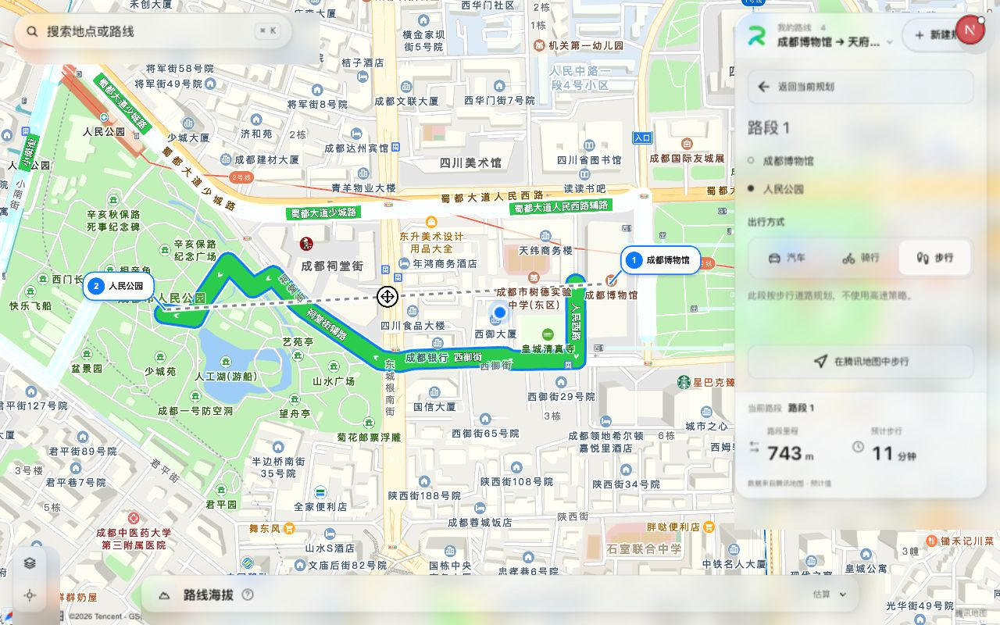
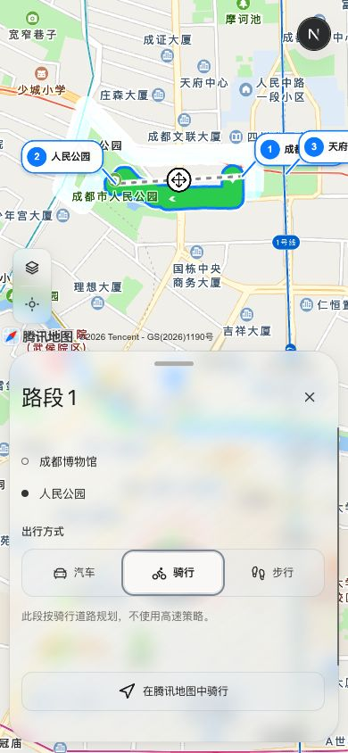
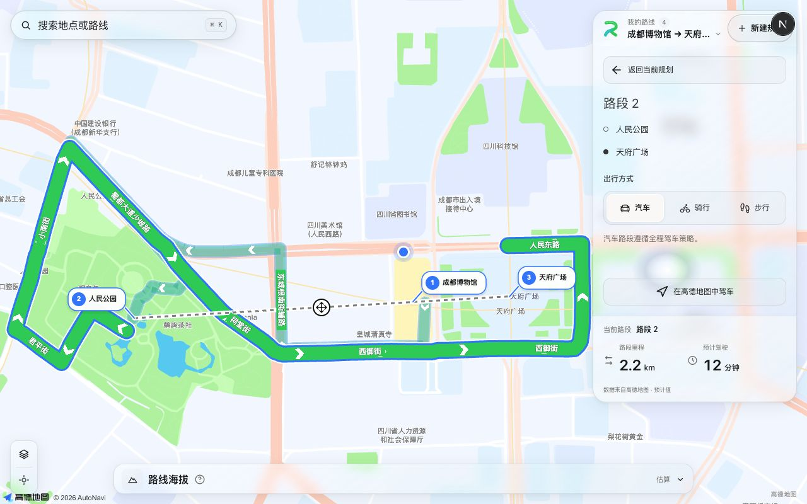

# 路段高亮与混合出行方式

日期：2026-10-09。状态：本地实现、自动化验证与真实浏览器验收完成，未提交、未推送、未部署。

## 需求与范围

点击路段时应能在地图上明确看到所选道路；每段默认汽车，并可独立选择骑行、步行。用户已授权使用 roadbook-apple-design-review 技能并确认实施及内置浏览器验证。此次混合出行扩展覆盖产品文档旧版仅汽车的限制。

## 交互决定

- 路段连接显示方式图标与名称。点击后进入当前面板的路段详情，保留手机档位；详情显示真实起终点及汽车／骑行／步行三项原生单选。
- 三项控件使用系统字体、浅灰底、暖白选中表面、线性图标及 44px 点击高度，支持方向键和清晰焦点。Esc 退出详情并恢复全程道路的普通样式，保持视野，不增加持续动画或额外模糊。
- 选中线三层整体置顶，线宽为 22／18／12px，其他有效道路保持 30% 不透明度。选择、切换和取消路段均保持当前地图中心与缩放，仅更新覆盖物高亮与详情。方式重算后仍保留当前观察视野。
- 腾讯原有统一边距不能避让非对称面板，现按实际尺寸和墨卡托投影计算视野，向下取整缩放再重新计算中心；避免 SDK 缩放取整使端点落到面板边缘。
- 方式变化后重新计算该段道路与耗时，保留详情和已开启往返。更新中显示旧结果提示与灰色虚线，失败保留用户方式并提供重试，不静默回退汽车。

## 领域与基础设施

`RoutePlan.legTravelModes` 按稳定的有向相邻连接保存非默认方式，旧方案默认汽车；插点子段继承方式，删除／排序清理失效连接，返程单独配置。修订、暂存、缩略失效和算路身份同步更新。

地图领域新增 `calculateRoute`，保留旧驾车接口兼容。高德分别调用汽车、步行 v3 和骑行 v4；腾讯分别调用 driving、walking、bicycling。代理校验坐标与模式、服务端签名，非汽车不传高速策略。步骑红绿灯信息缺失时不虚构。导航参数与所选方式一致。

每个供应商适配器缓存最多 128 个成功路段、有效期 5 分钟；键包含有向端点、坐标、方式及适用策略。改单段复用其他成功道路，失败不缓存，取消和迟到结果隔离，不增加新依赖。

## 验证证据

- 地图包 ES2019 编译通过，原有 41 项测试通过。
- Web 的 9 个测试文件、32 项测试通过，覆盖方式继承与清理、保存恢复、返程持续、失败重试、迟到隔离、真实代理契约、缓存过期和 PC／H5 视野。
- Web 类型检查、Lint、隔离生产构建通过；最后手机占位高度修改后再次生产构建通过。差异空白检查通过。
- 使用成都博物馆、人民公园、天府广场三个公开地点创建独立验收方案；原有路线未改动。新验收方案保留在本地“我的路线”。
- 高德真实路段：汽车 1.2km／10 分钟，骑行 1.7km／7 分钟，步行 842m／11 分钟，道路随方式变化。方向键切换与 radio 焦点下 Esc 返回均通过。
- 腾讯真实路段：骑行 699m／4 分钟，步行 743m／11 分钟。修正视野后整段及两个端点位于右侧面板外。
- 腾讯往返方案将返程改为步行后仍保持往返，列表显示“返回起点 · 步行”，总里程 2.8km／26 分钟；刷新重载后骑行等非默认配置仍能恢复。
- 桌面 1280×800 详情高 428px；手机 390×844、320×844 详情高 338px，三个选项均高 44px，无横向溢出。手机切换前后面板位置与高度一致。加载占位已按实测尺寸校正，反馈区固定 60px。

## 边界与后续

- 实际 LCP、CLS 尚未进行性能采样，不能由固定占位、构建或尺寸检查宣称达标。外部地图入口已核验 URI 参数，未调用手机端地图应用。
- 腾讯“高速优先”驾车策略原本不支持，此轮不扩展它；真实腾讯验收使用“不走高速”，步骑不受驾车策略限制。
- 首次验收时腾讯 SDK 曾出现超充点位 MultiMarker.styles 的 MarkerStyle.width 属性提示；后续用户反馈已单独修复，见 [腾讯充电站图钉整数尺寸修复](2026-10-09-腾讯充电站图钉整数尺寸修复.md)。
- 沿用现有地图请求队列和节流。新增步骑需要供应商账号对应服务可用；失败显示服务错误并支持重试。
- 生产数据库、部署、安装、删除既有路线及 Git 提交／推送均未执行。

## 同轮体验修正：选段保持视野

用户要求点击路段不突然放大 zoom，保持当前视野。根因为 `RouteMap` 曾按选段调用 `fitCoordinates`，取消时又主动恢复全程边界。现移除选段聚焦引用及对应适配；方式重算期间记录新几何为已检查，防止退出详情时补触发全程适配。高亮、插点引导和真实交通方式保留；方案加载与新增点位仍遵循原有视野规则。无需新增依赖、算路请求或地图实例。

验证：Lint、含类型检查的隔离生产构建及差异空白检查通过。实际高德页面按“路段 1 → Esc 取消 → 路段 2”操作，三个控制点的 DOM 锚点位置始终保持 `(654.905,479.258)`、`(212.83,505.088)`、`(807.764,470.508)` 像素，高亮随选择变化。此轮仅修改 Web 的共享选段逻辑，地图包未修改；前述两家地图与手机截图为初次验收记录，原自动聚焦行为已被本节覆盖。真实性能采样边界仍按上文。

